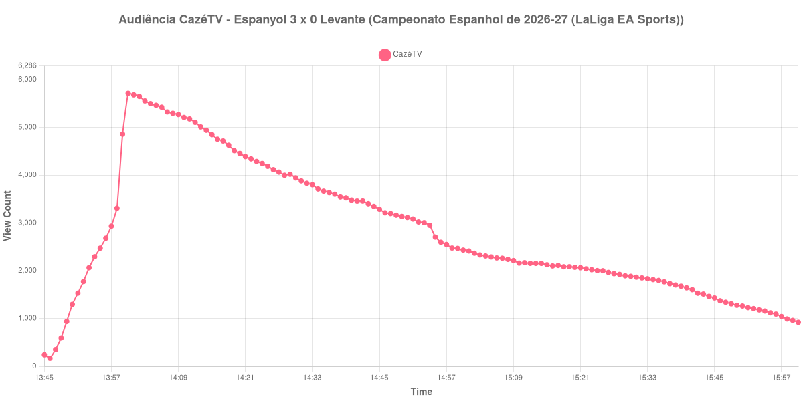

+++
date = 2026-08-20T07:16:00-03:00
draft = false
title = "Confira como foi a audiência de Espanyol X Levante na CazéTV - 16-08-2026"
author = 'Instituto Cambacica de Audiência'
summary = "Veja como foi a menor audiência da rodada de estreia do Campeonato Espanhol na CazéTV, numa curva que desce do apito inicial ao fim da medição"
tags = ['YouTube', 'Analytics', 'Audiência', 'CazeTV', 'Espanyol', 'Levante', 'LaLiga']
categories = ['Audiência']
campeonatos = ['LaLiga 2026']
data_evento = 2026-08-16
+++

Neste texto, vamos informar os resultados da audiência em tempo real obtidos pela CazéTV, durante a transmissão de Espanyol X Levante, jogo válido pela 1ª rodada do Campeonato Espanhol de 2026-27 (LaLiga EA Sports), no RCDE Stadium, em Cornellà de Llobregat, em 16/08/2026. O Espanyol venceu por 3 a 0, com dois gols de Roberto Fernández ainda no primeiro tempo, aos 5 e aos 40 minutos, e um de Tyrhys Dolan aos 80, na etapa final. O Levante não marcou, e o jogo foi a estreia das duas equipes no campeonato.

A audiência começou a ser medida às 16/08/2026 13:45:55 (Horário de Brasília), com a transmissão já no ar. Como a coleta começou menos de duas horas antes do apito inicial, o gráfico e os números abaixo partem do primeiro registro disponível. A medição terminou antes de completar duas horas após o apito final, de modo que o recorte vai até o último dado coletado. Os principais pontos da audiência são (em aparelhos conectados):

* **Início da Medição (13:45:55): 241**
* **Início da partida (14:00:55): 5.714**
* Após o gol de Roberto Fernández, do Espanyol, aos 5 minutos do primeiro tempo (14:05:55): 5.463
* Após o segundo gol de Roberto Fernández, aos 40 minutos do primeiro tempo (14:40:55): 3.476
* **Final do primeiro tempo (14:47:55): 3.197**
* Durante o intervalo (14:55:55): 2.705
* **Início do segundo tempo (15:02:55): 2.367**
* Após o gol de Tyrhys Dolan, do Espanyol, aos 35 minutos do segundo tempo (15:37:55): 1.728
* **Final da partida (15:52:55): 1.205**
* **Final da Medição (16:00:55): 918**

O pico de audiência foi às 14:00:55, no apito inicial, com **5.714** aparelhos conectados simultâneos.

Um aviso é necessário sobre a leitura desta curva: aqui o intervalo não aparece como vale. A audiência cai de forma contínua do início ao fim da medição, sem qualquer recuperação depois da pausa, e a única aceleração da queda ocorre entre 14h54 e 14h59, dentro da janela em que o intervalo era esperado. A pausa, portanto, se manifesta como um degrau na descida, e não como a depressão seguida de retomada que costuma marcar o meio das partidas e que em outras medições nos permite ancorar horários pela própria curva. Os marcos listados acima vêm da cronologia do jogo, confirmada em fonte independente, e não do desenho do gráfico.

O restante da medição confirma esse esvaziamento constante. O máximo foi registrado no próprio apito inicial, 5.714 aparelhos conectados, e a partir dali nem os gols do Espanyol seguraram a curva: depois do primeiro de Roberto Fernández o contador marcava 5.463, e depois do segundo, 3.476. Entre o fim do primeiro tempo e o fundo da pausa a perda foi de 15%, de 3.197 para 2.705 aparelhos conectados; no segundo tempo, de 49%, dos 2.367 do recomeço aos 1.205 do apito final. Em escala, é a 36ª das 40 medições deste lote e a menor das seis transmissões da rodada espanhola: o pico médio das outras cinco foi de 118.879 aparelhos conectados, e esta partida ficou 95% abaixo dessa média. No mesmo domingo e no mesmo canal, a CazéTV exibiu [PSG X Lens](/posts/2026-08-16-psg-x-lens-cazetv/), que chegou a 236.087 aparelhos conectados — esta medição ficou 98% abaixo desse número —, e [Mirassol X Flamengo](/posts/2026-08-16-mirassol-x-flamengo-cazetv/), que alcançou 2.307.249.

No gráfico a seguir, mostramos a evolução da audiência entre o primeiro registro da medição e o último registro coletado:

Para você verificar os metadados desta medição, você pode consultar o [repositório contendo o CSV com os dados e com os prints do minuto a minuto da medição](https://github.com/institutocambacica/audiencias_08_20_08_2026/tree/main/2026-08-16_espanyol-x-levante_Cs6Tt47QRuM).

---

*Para mais informações sobre nossa metodologia, visite nossa página [Sobre](/sobre).*
