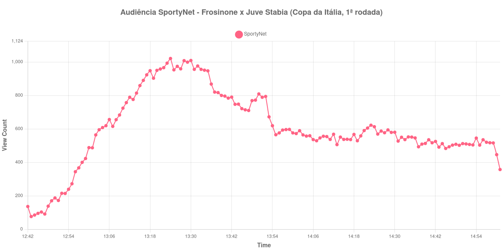

+++
date = 2026-08-20T07:04:00-03:00
draft = false
title = "Confira como foi a audiência de Frosinone X Juve Stabia na SportyNet - 16-08-2026"
author = 'Instituto Cambacica de Audiência'
summary = "Veja como foi a menor audiência de futebol que medimos neste lote, na rodada de abertura da Copa da Itália pela SportyNet"
tags = ['YouTube', 'Analytics', 'Audiência', 'SportyNet', 'Frosinone', 'Juve Stabia', 'Copa da Italia']
categories = ['Audiência']
+++

Neste texto, vamos informar os resultados da audiência em tempo real obtidos pela SportyNet, durante a transmissão de Frosinone X Juve Stabia, partida da 1ª rodada da Copa da Itália, em 16/08/2026. O canal levou ao ar sete jogos dessa rodada de abertura, e esta é a medição de menor porte entre todas elas. A cronologia do jogo não apareceu em nenhuma fonte independente que consultamos e, sem ela, não há placar nem gols a relatar: o que segue é apenas o que a curva de audiência registrou, do primeiro ao último minuto de coleta.

A audiência começou a ser medida às 16/08/2026 12:42:55 (Horário de Brasília), com a live já no ar. Como a coleta começou menos de duas horas antes do apito inicial, o gráfico e os números abaixo partem do primeiro registro disponível. A medição terminou antes de completar duas horas após o apito final, de modo que o recorte vai até o último dado coletado. Os horários de início e de fim de cada tempo listados abaixo foram ancorados na própria curva de audiência, pelo vale que o intervalo produz, e não em fonte externa. Os principais pontos da audiência são (em aparelhos conectados):

* **Início da Medição (12:42:55): 136**
* **Início da partida (13:08:55): 655**
* **Final do primeiro tempo (13:55:55): 565**
* Durante o intervalo (14:03:55): 564
* **Início do segundo tempo (14:10:55): 554**
* **Final da partida (15:00:55): 446**
* **Final da Medição (15:01:55): 357**

O pico de audiência foi às 13:24:55, ainda no primeiro tempo, com **1.021** aparelhos conectados simultâneos.

O intervalo quase não deixa marca nesta curva. A audiência sai de 565 aparelhos conectados no fim do primeiro tempo, passa por 564 no meio da pausa e volta a 554 no recomeço — o vale que nos serviu de âncora para os horários é, aqui, raso o bastante para quase se confundir com a oscilação normal da série. O desenho geral é de descida quase contínua a partir do máximo, alcançado ainda no primeiro tempo: dos 554 aparelhos conectados do início do segundo tempo para os 446 do apito final, a perda é de 19%, e o último dado coletado, às 15:01:55, marca 357.

Em escala, esta é a menor audiência de futebol do lote: 1.021 aparelhos conectados no pico, 39ª posição entre as 40 medições deste lote. Entre as sete transmissões da 1ª rodada da Copa da Itália, também fica em último: as outras seis tiveram pico médio de 10.181 aparelhos conectados, e esta ficou 90% abaixo dessa média. No mesmo dia e no mesmo canal, [Real Madrid X Schalke 04](/posts/2026-08-16-real-madrid-x-schalke-04-sportynet/) chegou a 229.060 aparelhos conectados e [Liverpool X Como](/posts/2026-08-16-liverpool-x-como-sportynet/), a 118.349 — a mesma grade, no mesmo dia, operando em patamares inteiramente distintos.

No gráfico a seguir, mostramos a evolução da audiência entre o primeiro registro da medição e o último registro coletado:

Para você verificar os metadados desta medição, você pode consultar o [repositório contendo o CSV com os dados e com os prints do minuto a minuto da medição](https://github.com/institutocambacica/audiencias_08_20_08_2026/tree/main/2026-08-16_frosinone-x-juve-stabia_dTOlH54augQ).

---

*Para mais informações sobre nossa metodologia, visite nossa página [Sobre](/sobre).*
