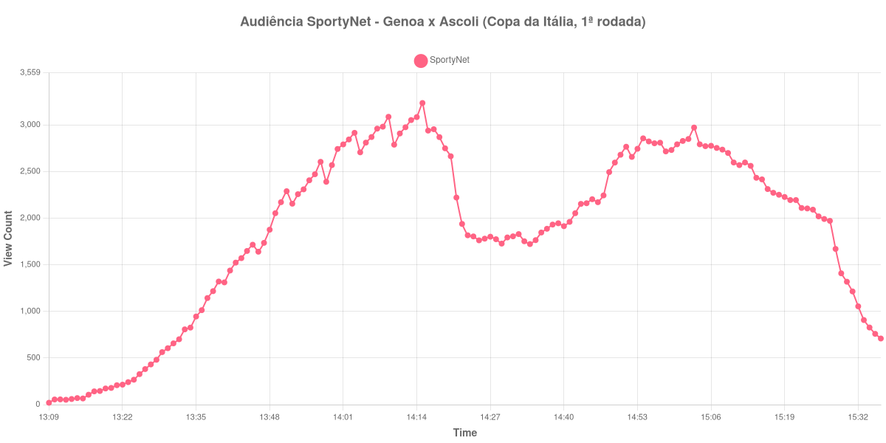

+++
date = 2026-08-20T07:08:00-03:00
draft = false
title = "Confira como foi a audiência de Genoa X Ascoli na SportyNet - 16-08-2026"
author = 'Instituto Cambacica de Audiência'
summary = "Veja como foi a audiência da primeira rodada da Copa da Itália na SportyNet, numa medição em que o intervalo desenhou o vale mais fundo da curva"
tags = ['YouTube', 'Analytics', 'Audiência', 'SportyNet', 'Genoa', 'Ascoli', 'Copa da Italia']
categories = ['Audiência']
canais = ['SportyNet']
campeonatos = ['Copa da Italia 2026']
data_evento = 2026-08-16
+++

Neste texto, vamos informar os resultados da audiência em tempo real obtidos pela SportyNet, durante a transmissão de Genoa X Ascoli, partida da 1ª rodada da Copa da Itália, em 16/08/2026. É uma das medições que fizemos na rodada de abertura da competição italiana, todas no mesmo canal, e uma das menores deste lote em número de aparelhos conectados. Não conseguimos confirmar a cronologia da partida em fonte independente, de modo que este texto se limita ao que a própria medição registra.

A audiência começou a ser medida às 16/08/2026 13:09:55 (Horário de Brasília), com a transmissão já no ar. Como a coleta começou menos de duas horas antes do apito inicial, o gráfico e os números abaixo partem do primeiro registro disponível. A medição terminou antes de completar duas horas após o apito final, de modo que o recorte vai até o último dado coletado. Os horários de início e de fim de cada tempo listados abaixo foram ancorados na própria curva de audiência, pelo vale que o intervalo produz, e não em fonte externa. Os principais pontos da audiência são (em aparelhos conectados):

* **Início da Medição (13:09:55): 20**
* **Início da partida (13:31:55): 657**
* **Final do primeiro tempo (14:18:55): 2.869**
* Durante o intervalo (14:26:55): 1.780
* **Início do segundo tempo (14:33:55): 1.752**
* **Final da partida (15:23:55): 2.104**
* **Final da Medição (15:36:55): 709**

O pico de audiência foi às 14:15:55, nos minutos finais do primeiro tempo, com **3.235** aparelhos conectados simultâneos.

O traço mais nítido desta curva é o intervalo. A audiência cai de 2.869 aparelhos conectados no fim do primeiro tempo para 1.780 no fundo da pausa, uma perda de 38%, e é justamente essa depressão que nos permitiu ancorar os horários da partida sem fonte externa. O segundo tempo recuperou parte do que fora perdido: dos 1.752 aparelhos do recomeço aos 2.104 do apito final, um crescimento de 20%. Mas a transmissão nunca voltou ao patamar anterior à pausa, e o máximo da medição ficou antes do intervalo, e não no fim do jogo — o desenho oposto ao das partidas de maior apelo, em que a audiência costuma se acumular até os minutos finais.

Em escala, esta é uma medição pequena: ela ocupa a 38ª posição entre as 40 deste lote. As outras seis transmissões da mesma rodada da Copa da Itália tiveram pico médio de 9.812 aparelhos conectados, e os 3.235 daqui ficam 67% abaixo dessa média. A distância para o que a própria SportyNet transmitiu no mesmo dia é ainda maior: [Real Madrid X Schalke 04](/posts/2026-08-16-real-madrid-x-schalke-04-sportynet/) chegou a 229.060 aparelhos conectados, e os 3.235 desta medição ficam 99% abaixo desse número. É a diferença entre um amistoso de pré-temporada com um clube de alcance global e a primeira rodada de uma copa nacional entre times de divisões diferentes, no mesmo canal e com poucas horas de intervalo.

No gráfico a seguir, mostramos a evolução da audiência entre o primeiro registro da medição e o último registro coletado:

Para você verificar os metadados desta medição, você pode consultar o [repositório contendo o CSV com os dados e com os prints do minuto a minuto da medição](https://github.com/institutocambacica/audiencias_08_20_08_2026/tree/main/2026-08-16_genoa-x-ascoli_E8SXHVqOieU).

---

*Para mais informações sobre nossa metodologia, visite nossa página [Sobre](/sobre).*
