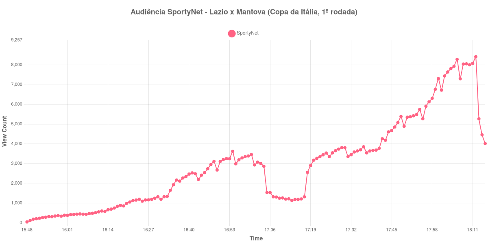

+++
date = 2026-08-20T07:28:00-03:00
draft = false
title = "Confira como foi a audiência de Lazio X Mantova na SportyNet - 16-08-2026"
author = 'Instituto Cambacica de Audiência'
summary = "Veja como foi a audiência de uma partida da Copa da Itália na SportyNet, com o vale de intervalo mais fundo de toda a rodada"
tags = ['YouTube', 'Analytics', 'Audiência', 'SportyNet', 'Lazio', 'Mantova', 'Copa da Italia']
categories = ['Audiência']
campeonatos = ['Copa da Italia 2026']
data_evento = 2026-08-16
+++

Neste texto, vamos informar os resultados da audiência em tempo real obtidos pela SportyNet, durante a transmissão de Lazio X Mantova, partida da 1ª rodada da Copa da Itália, em 16/08/2026. Foi a última das transmissões da competição que o canal levou ao ar naquela data, já no fim da tarde, e uma das sete que acompanhamos na rodada inteira. A cronologia da partida não pôde ser confirmada em fonte independente e, por isso, não há placar, gols nem escalações neste texto — o que apresentamos é a leitura da própria curva de audiência.

A audiência começou a ser medida às 16/08/2026 15:48:55 (Horário de Brasília), com a transmissão já iniciada. Como a coleta começou menos de duas horas antes do apito inicial, o gráfico e os números abaixo partem do primeiro registro disponível. A medição terminou antes de completar duas horas após o apito final, de modo que o recorte vai até o último dado coletado. Os horários de início e de fim de cada tempo listados abaixo foram ancorados na própria curva de audiência, pelo vale que o intervalo produz, e não em fonte externa. Os principais pontos da audiência são (em aparelhos conectados):

* **Início da Medição (15:48:55): 47**
* **Início da partida (16:11:55): 556**
* **Final do primeiro tempo (16:58:55): 3.354**
* Durante o intervalo (17:06:55): 1.537
* **Início do segundo tempo (17:13:55): 1.130**
* **Final da partida (18:03:55): 7.642**
* **Final da Medição (18:15:55): 4.018**

O pico de audiência foi às 18:12:55, já no pós-jogo, com **8.415** aparelhos conectados simultâneos.

O acidente mais marcado desta medição é o intervalo. Do fim do primeiro tempo, com 3.354 aparelhos conectados, a curva cai para 1.537 no meio da pausa — 54% a menos — e continua descendo até os 1.130 do recomeço. É o vale mais fundo das sete transmissões que medimos nesta rodada, e foi justamente essa profundidade que permitiu fixar o começo e o fim de cada tempo sem recorrer a fonte externa: uma queda dessa magnitude não se confunde com ruído da série. Nenhuma outra medição da Copa da Itália neste lote perdeu tanta audiência entre o apito do intervalo e o recomeço.

O que vem depois é o movimento oposto, e na mesma proporção. Dos 1.130 aparelhos conectados do início do segundo tempo aos 7.642 do apito final, a audiência cresceu 576%, o maior avanço de segundo tempo que registramos nesta rodada. E ela não parou no apito: o máximo da série, 8.415 aparelhos conectados, veio depois do fim da partida, e só então a curva cedeu, fechando em 4.018 no último registro, às 18:15:55. Em escala, ainda assim, a medição é modesta — 34ª entre as 40 do lote, com pico 6% abaixo da média de 8.949 aparelhos conectados apurada nas outras seis transmissões que a SportyNet fez dessa rodada.

No gráfico a seguir, mostramos a evolução da audiência entre o primeiro registro da medição e o último registro coletado:

Para você verificar os metadados desta medição, você pode consultar o [repositório contendo o CSV com os dados e com os prints do minuto a minuto da medição](https://github.com/institutocambacica/audiencias_08_20_08_2026/tree/main/2026-08-16_lazio-x-mantova_xfqwTzgy2sI).

---

*Para mais informações sobre nossa metodologia, visite nossa página [Sobre](/sobre).*
