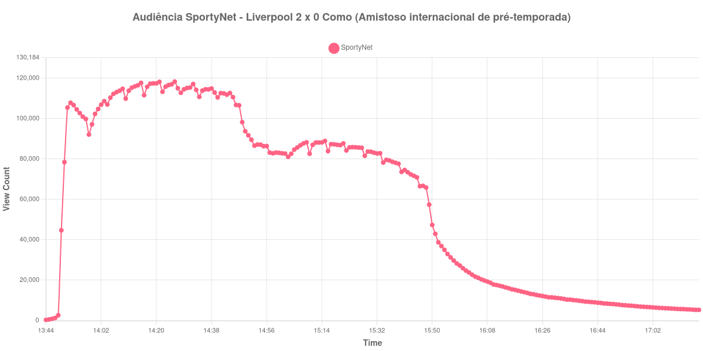

+++
date = 2026-08-20T07:12:00-03:00
draft = false
title = "Confira como foi a audiência de Liverpool X Como na SportyNet - 16-08-2026"
author = 'Instituto Cambacica de Audiência'
summary = "Veja como foi a audiência do amistoso de Anfield na SportyNet, numa curva que subiu de repente antes do apito inicial e caiu durante todo o segundo tempo"
tags = ['YouTube', 'Analytics', 'Audiência', 'SportyNet', 'Liverpool', 'Como', 'Amistoso']
categories = ['Audiência']
canais = ['SportyNet']
campeonatos = ['Amistosos 2026']
data_evento = 2026-08-16
+++

Neste texto, vamos informar os resultados da audiência em tempo real obtidos pela SportyNet, durante a transmissão de Liverpool X Como, último amistoso de pré-temporada do Liverpool antes da estreia no Campeonato Inglês, em Anfield, em 16/08/2026. Os dois clubes se enfrentaram duas vezes no mesmo dia: horas antes houve um jogo a portas fechadas, em dois tempos de 35 minutos, que terminou sem gols e não foi transmitido. A partida medida aqui é a de Anfield, e terminou em 2 a 0 para o Liverpool, com gols de Cody Gakpo aos 23 minutos do primeiro tempo e de Jérémy Jacquet aos 44, na estreia do francês.

A audiência começou a ser medida às 16/08/2026 13:44:55 (Horário de Brasília), com a transmissão já no ar. Como a coleta começou menos de duas horas antes do apito inicial, o gráfico e os números abaixo partem do primeiro registro disponível. A medição terminou antes de completar duas horas após o apito final, de modo que o recorte vai até o último dado coletado. Os principais pontos da audiência são (em aparelhos conectados):

* **Início da Medição (13:44:55): 343**
* **Início da partida (14:00:55): 102.365**
* Após o gol de Cody Gakpo, do Liverpool, aos 23 minutos do primeiro tempo (14:23:55): 115.824
* Após o gol de Jérémy Jacquet, do Liverpool, aos 44 minutos do primeiro tempo (14:44:55): 112.686
* Durante o intervalo (14:52:55): 86.605
* **Início do segundo tempo (14:59:55): 83.170**
* **Final da partida (15:52:55): 38.757**
* **Final da Medição (17:17:55): 5.314**

O pico de audiência foi às 14:26:55, poucos minutos depois do primeiro gol, ainda no primeiro tempo, com **118.349** aparelhos conectados simultâneos.

O primeiro dado da janela, às 13:44:55, registra 343 aparelhos conectados. Dezesseis minutos depois, no apito inicial, já são 102.365. Um movimento dessa magnitude em tão pouco tempo não é público chegando para a partida. O canal mantinha outras transmissões em paralelo naquele domingo, e o que o degrau registra são aparelhos que trocaram de live assim que a anterior terminou. A partir daí a curva se comporta de forma convencional: sobe até o máximo de 118.349 aparelhos conectados às 14:26:55, logo após o gol de Gakpo, e não volta a esse patamar.

O segundo tempo é uma descida contínua, de 83.170 aparelhos conectados no recomeço para 38.757 no apito final, uma perda de 53% sem nenhum lance que a interrompa — os dois gols já haviam saído antes do intervalo. O pós-jogo segue o mesmo caminho: trinta minutos depois do fim restavam 13.234 aparelhos conectados, 34% do que havia no encerramento, e uma hora depois, 7.662, ou 20%. Em escala, os 118.349 do pico colocam a medição na 16ª posição entre as 40 do lote, 29% acima da média dos outros seis amistosos internacionais que acompanhamos, de 91.637 aparelhos conectados. No mesmo canal e no mesmo dia, ficou 48% abaixo de [Real Madrid X Schalke 04](/posts/2026-08-16-real-madrid-x-schalke-04-sportynet/), que chegou a 229.060 aparelhos conectados, e 503% acima de [Confiança X Maringá](/posts/2026-08-16-confianca-x-maringa-sportynet/), com 19.618.

No gráfico a seguir, mostramos a evolução da audiência entre o primeiro registro da medição e o último registro coletado:

Para você verificar os metadados desta medição, você pode consultar o [repositório contendo o CSV com os dados e com os prints do minuto a minuto da medição](https://github.com/institutocambacica/audiencias_08_20_08_2026/tree/main/2026-08-16_liverpool-x-como_6UszAo5vEkg).

---

*Para mais informações sobre nossa metodologia, visite nossa página [Sobre](/sobre).*
