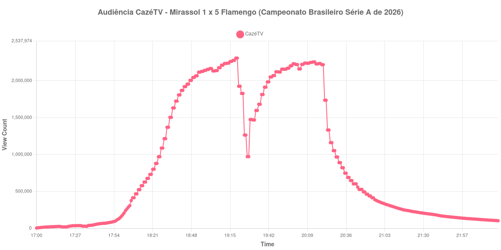

+++
date = 2026-08-20T07:32:00-03:00
draft = false
title = "Confira como foi a audiência de Mirassol X Flamengo na CazéTV - 16-08-2026"
author = 'Instituto Cambacica de Audiência'
summary = "Veja como foi a audiência da goleada do Flamengo em Mirassol na CazéTV, na medição em que o máximo veio no apito do intervalo"
tags = ['YouTube', 'Analytics', 'Audiência', 'CazeTV', 'Mirassol', 'Flamengo', 'Brasileirao']
categories = ['Audiência']
campeonatos = ['Brasileirao 2026']
data_evento = 2026-08-16
+++

Neste texto, vamos informar os resultados da audiência em tempo real obtidos pela CazéTV, durante a transmissão de Mirassol X Flamengo, partida válida pela 23ª rodada do Campeonato Brasileiro Série A de 2026, no Estádio José Maria de Campos Maia, o Maião, em Mirassol, em 16/08/2026. O jogo terminou em 1 a 5. Jorge Carrascal abriu o placar aos 22 minutos do primeiro tempo; na etapa final, Luiz Araújo ampliou aos 8, Pedro marcou duas vezes, aos 11 e aos 21, e Samuel Lino fez o quinto aos 29. João Victor descontou para o Mirassol aos 32 minutos do segundo tempo. Não houve cartões vermelhos.

A audiência começou a ser medida às 16/08/2026 17:00:55 (Horário de Brasília), antes do apito inicial. Como a coleta começou menos de duas horas antes do apito inicial, o gráfico e os números abaixo partem do primeiro registro disponível. Os principais pontos da audiência são (em aparelhos conectados):

* **Início da Medição (17:00:55): 4.262**
* **Início da partida (18:30:55): 1.215.385**
* Após o gol de Jorge Carrascal, do Flamengo, aos 22 minutos do primeiro tempo (18:52:55): 2.067.244
* **Final do primeiro tempo (19:18:55): 2.275.675**
* Durante o intervalo (19:26:55): 1.264.121
* **Início do segundo tempo (19:33:55): 1.597.571**
* Após o gol de Luiz Araújo, do Flamengo, aos 8 minutos do segundo tempo (19:40:55): 1.912.995
* Após o gol de Pedro, do Flamengo, aos 11 minutos do segundo tempo (19:43:55): 2.051.233
* Após o gol de Pedro, do Flamengo, aos 21 minutos do segundo tempo (19:53:55): 2.156.804
* Após o gol de Samuel Lino, do Flamengo, aos 29 minutos do segundo tempo (20:01:55): 2.220.149
* Após o gol de João Victor, do Mirassol, aos 32 minutos do segundo tempo (20:04:55): 2.160.128
* **Final da partida (20:22:55): 1.736.474**
* **Final da Medição (22:22:55): 103.097**

O pico de audiência foi às 19:19:55, no apito que encerrou o primeiro tempo, com **2.307.249** aparelhos conectados simultâneos.

O máximo desta medição não veio no fim do jogo, e sim no apito do intervalo: 2.307.249 aparelhos conectados às 19:19:55, um minuto depois dos 2.275.675 registrados no fim do primeiro tempo. A pausa desfez boa parte disso, com queda de 44%, de 2.275.675 para 1.264.121 aparelhos conectados. O segundo tempo retomou a subida, e cada gol do Flamengo aparece como um degrau — 1.912.995, 2.051.233, 2.156.804 e 2.220.149 —, mas a curva nunca voltou ao patamar anterior à pausa, e o saldo entre o recomeço e o apito final ficou em 9%, dos 1.597.571 aos 1.736.474 aparelhos conectados. O gol do Mirassol, aos 32 do segundo tempo, é o único marco da etapa final em que a audiência recua em relação ao anterior: 2.160.128 contra 2.220.149.

Poucas transmissões deste lote chegaram a esse patamar. É o terceiro maior pico entre as 40 medições do período, atrás apenas de Flamengo x Cruzeiro (3.412.036) e Cruzeiro x Flamengo (2.457.680), ambos na ge tv. No mesmo dia e no mesmo canal, [PSG X Lens](/posts/2026-08-16-psg-x-lens-cazetv/) chegou a 236.087 aparelhos conectados e [Racing Club X Villarreal](/posts/2026-08-16-racing-club-x-villarreal-cazetv/), a 75.433: os 2.307.249 daqui ficam 877% e 2.959% acima, respectivamente. Dentro da mesma 23ª rodada, [Atlético-MG X Grêmio](/posts/2026-08-16-atletico-mg-x-gremio-getv/) teve pico de 447.564 aparelhos conectados, e esta transmissão ficou 416% acima disso. Depois do apito final o esvaziamento foi rápido: 438.983 aparelhos conectados meia hora depois, 25% dos 1.736.474 do fim do jogo, e 228.910 uma hora depois, ou 13%.

No gráfico a seguir, mostramos a evolução da audiência entre o primeiro registro da medição e duas horas após o seu encerramento:

Para você verificar os metadados desta medição, você pode consultar o [repositório contendo o CSV com os dados e com os prints do minuto a minuto da medição](https://github.com/institutocambacica/audiencias_08_20_08_2026/tree/main/2026-08-16_mirassol-x-flamengo_XAzonbmE2aw).

---

*Para mais informações sobre nossa metodologia, visite nossa página [Sobre](/sobre).*
