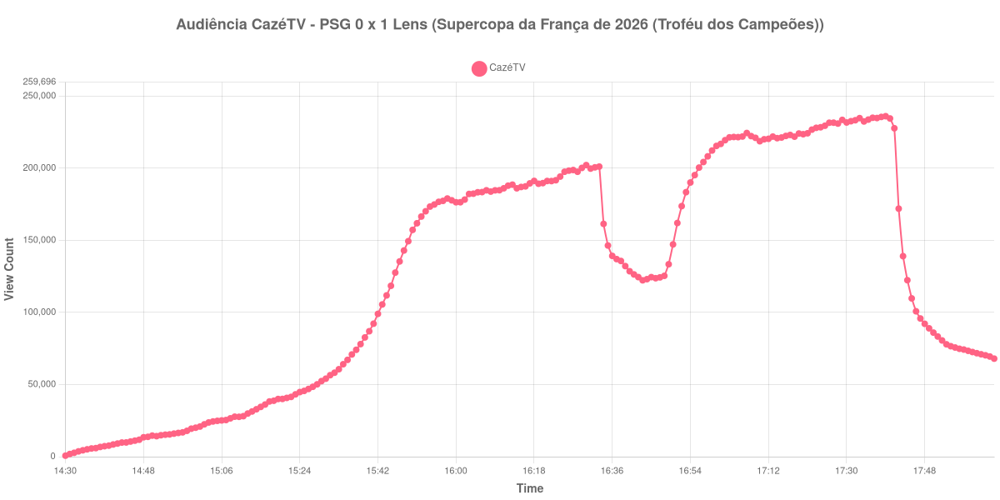

+++
date = 2026-08-20T07:24:00-03:00
draft = false
title = "Confira como foi a audiência de PSG X Lens na CazéTV - 16-08-2026"
author = 'Instituto Cambacica de Audiência'
summary = "Veja como foi a audiência da final da Supercopa da França na CazéTV, no título inédito que o Lens conquistou em casa"
tags = ['YouTube', 'Analytics', 'Audiência', 'CazeTV', 'PSG', 'Lens', 'Supercopa da Franca']
categories = ['Audiência']
+++

Neste texto, vamos informar os resultados da audiência em tempo real obtidos pela CazéTV, durante a transmissão de PSG X Lens, final da Supercopa da França de 2026, disputada no Stade Bollaert-Delelis, em Lens, em 16/08/2026, diante de um público de 38.223. Ao contrário do que sugere a ordem dos times no título da transmissão, o mandante era o Lens: o placar foi de 0 a 1 na ordem PSG X Lens, com o time da casa conquistando o título inédito. Florian Thauvin marcou aos 32 minutos do primeiro tempo, e o Lens ainda terminou o jogo com um a menos, após a expulsão de Kyllian Antonio aos 39.

A audiência começou a ser medida às 16/08/2026 14:30:55 (Horário de Brasília), com a transmissão já no ar. Como a coleta começou menos de duas horas antes do apito inicial, o gráfico e os números abaixo partem do primeiro registro disponível. A medição terminou antes de completar duas horas após o apito final, de modo que o recorte vai até o último dado coletado. Os principais pontos da audiência são (em aparelhos conectados):

* **Início da Medição (14:30:55): 685**
* **Início da partida (15:45:55): 118.479**
* Após o gol de Florian Thauvin, do Lens, aos 32 minutos do primeiro tempo (16:17:55): 189.512
* Após a expulsão de Kyllian Antonio, do Lens, aos 39 minutos do primeiro tempo (16:24:55): 194.212
* **Final do primeiro tempo (16:31:55): 199.763**
* Durante o intervalo (16:39:55): 132.149
* **Início do segundo tempo (16:46:55): 123.749**
* Após a expulsão de Nuno Mendes, do PSG, aos 42 minutos do segundo tempo (17:29:55): 233.540
* **Final da partida (17:37:55): 234.829**
* **Final da Medição (18:04:55): 67.974**

O pico de audiência foi às 17:39:55, logo após o apito final, com **236.087** aparelhos conectados simultâneos.

Das seis medições internacionais que fizemos em 15 e 16 de agosto, esta é a única de uma partida oficial, e a curva se distingue justamente por onde termina. Nos cinco amistosos de pré-temporada nenhum máximo caiu depois do apito final; aqui ele cai, às 17:39:55, com 236.087 aparelhos conectados, já com o jogo encerrado e o título definido. O trajeto até lá também é diferente. O intervalo custou 34%, de 199.763 aparelhos conectados no fim do primeiro tempo para 132.149 no fundo da pausa — e o segundo tempo recuperou toda ela, dos 123.749 do recomeço aos 234.829 do apito final, um crescimento de 90%, com a expulsão de Nuno Mendes já encontrando 233.540 aparelhos conectados.

Com 236.087 aparelhos conectados no pico, esta é a décima maior medição do lote de 40 e a maior das seis partidas internacionais que cobrimos naqueles dois dias. Dentro da própria CazéTV, porém, o mesmo domingo trazia um jogo de outra ordem de grandeza: [Mirassol X Flamengo](/posts/2026-08-16-mirassol-x-flamengo-cazetv/), pelo Brasileirão, chegou a 2.307.249 aparelhos conectados, e a final francesa fica 90% abaixo desse valor. Na outra ponta da grade, [Racing Club X Villarreal](/posts/2026-08-16-racing-club-x-villarreal-cazetv/), pela primeira rodada de LaLiga, marcou 75.433 aparelhos conectados no mesmo canal, e esta medição está 213% acima. O esvaziamento posterior é rápido: meia hora depois do apito final restavam 67.974 aparelhos conectados, 29% do que havia no encerramento.

No gráfico a seguir, mostramos a evolução da audiência entre o primeiro registro da medição e o último registro coletado:

Para você verificar os metadados desta medição, você pode consultar o [repositório contendo o CSV com os dados e com os prints do minuto a minuto da medição](https://github.com/institutocambacica/audiencias_08_20_08_2026/tree/main/2026-08-16_psg-x-lens_rlPrTsnFKr4).

---

*Para mais informações sobre nossa metodologia, visite nossa página [Sobre](/sobre).*
