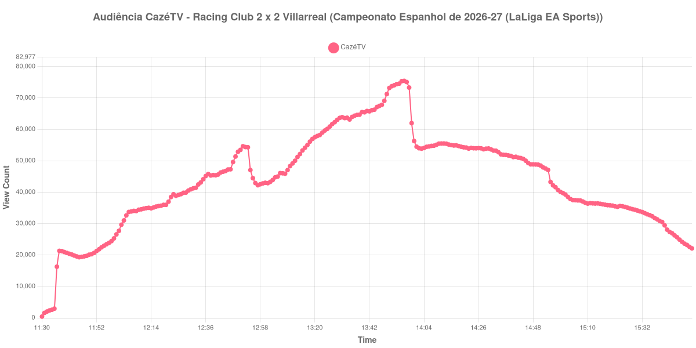

+++
date = 2026-08-20T07:00:00-03:00
draft = false
title = "Confira como foi a audiência de Racing Club X Villarreal na CazéTV - 16-08-2026"
author = 'Instituto Cambacica de Audiência'
summary = "Veja como foi a audiência do retorno do Racing de Santander à elite espanhola na CazéTV, num segundo tempo sem gols que mesmo assim fez a curva subir"
tags = ['YouTube', 'Analytics', 'Audiência', 'CazeTV', 'Racing Club', 'Villarreal', 'LaLiga']
categories = ['Audiência']
canais = ['CazeTV']
campeonatos = ['LaLiga 2026']
data_evento = 2026-08-16
+++

Neste texto, vamos informar os resultados da audiência em tempo real obtidos pela CazéTV, durante a transmissão de Racing Club X Villarreal, jogo da 1ª rodada do Campeonato Espanhol de 2026-27 (LaLiga EA Sports), disputado nos Campos de Sport de El Sardinero, em Santander, em 16/08/2026. O mandante, que aparece no título como Racing Club, é o Real Racing Club de Santander. A partida terminou 2 a 2: Andrés Martín abriu o placar de pênalti aos 21 minutos, Sergio Martínez ampliou aos 34, e o Villarreal empatou ainda no primeiro tempo, com Pape Gueye aos 45 e Nicolas Pépé aos 46.

A audiência começou a ser medida às 16/08/2026 11:30:55 (Horário de Brasília), com a transmissão já no ar. Como a coleta começou menos de duas horas antes do apito inicial, o gráfico e os números abaixo partem do primeiro registro disponível. Os principais pontos da audiência são (em aparelhos conectados):

* **Início da Medição (11:30:55): 401**
* **Início da partida (12:00:55): 26.570**
* Após o gol de pênalti de Andrés Martín, do Racing de Santander, aos 21 minutos do primeiro tempo (12:21:55): 36.982
* Após o gol de Sergio Martínez, do Racing de Santander, aos 34 minutos do primeiro tempo (12:34:55): 43.116
* Após o gol de Pape Gueye, do Villarreal, aos 45 minutos do primeiro tempo (12:45:55): 47.228
* Após o gol de Nicolas Pépé, do Villarreal, aos 46 minutos do primeiro tempo (12:46:55): 47.294
* **Final do primeiro tempo (12:51:55): 54.624**
* Durante o intervalo (12:59:55): 42.793
* **Início do segundo tempo (13:06:55): 46.073**
* **Final da partida (13:52:55): 74.046**
* **Final da Medição (15:52:55): 22.117**

O pico de audiência foi às 13:56:55, poucos minutos depois do apito final, com **75.433** aparelhos conectados simultâneos.

Os quatro gols saíram todos no primeiro tempo, e ainda assim foi o segundo que sustentou a audiência. A primeira etapa avançou em degraus, de 26.570 aparelhos conectados no apito a 54.624 no seu encerramento: 36.982 depois do pênalti de Andrés Martín, 43.116 depois do gol de Sergio Martínez, 47.228 e 47.294 nos dois empates do Villarreal, que saíram com pouco mais de um minuto de diferença. O intervalo tirou 22% da audiência, de 54.624 para 42.793 aparelhos conectados. Depois dele, sem nenhum gol para registrar, a curva cresceu 61%, de 46.073 no recomeço para 74.046 no apito final, e só encontrou o máximo depois que o jogo acabou.

A cauda do pós-jogo acompanha esse desenho. Meia hora após o fim da partida, às 14:22:55, a transmissão ainda reunia 53.884 aparelhos conectados, 73% do valor do apito final; uma hora depois, às 14:52:55, eram 47.898, ou 65%. A audiência, portanto, não se desfez com o apito final neste jogo, que marcava a volta do Racing de Santander à primeira divisão depois de 14 anos. A escala, porém, fica distante do que a CazéTV levou ao ar no mesmo domingo: os 75.433 aparelhos conectados daqui estão 68% abaixo do pico de [PSG X Lens](/posts/2026-08-16-psg-x-lens-cazetv/), de 236.087, e 97% abaixo do de [Mirassol X Flamengo](/posts/2026-08-16-mirassol-x-flamengo-cazetv/), de 2.307.249. Na rodada espanhola, cujas outras cinco medições tiveram pico médio de 104.935 aparelhos conectados, esta ficou 28% abaixo.

No gráfico a seguir, mostramos a evolução da audiência entre o primeiro registro da medição e duas horas após o seu encerramento:

Para você verificar os metadados desta medição, você pode consultar o [repositório contendo o CSV com os dados e com os prints do minuto a minuto da medição](https://github.com/institutocambacica/audiencias_08_20_08_2026/tree/main/2026-08-16_racing-club-x-villarreal_rK3SqvB6X74).

---

*Para mais informações sobre nossa metodologia, visite nossa página [Sobre](/sobre).*
