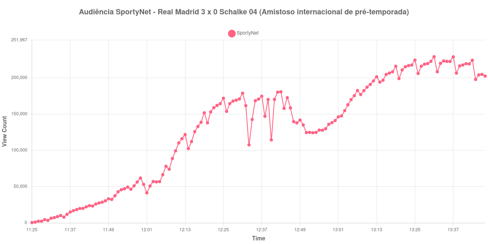

+++
date = 2026-08-20T06:56:00-03:00
draft = false
title = "Confira como foi a audiência de Real Madrid X Schalke 04 na SportyNet - 16-08-2026"
author = 'Instituto Cambacica de Audiência'
summary = "Veja como foi a audiência do amistoso comemorativo da Veltins-Arena na SportyNet, a maior medição do canal em todo o lote"
tags = ['YouTube', 'Analytics', 'Audiência', 'SportyNet', 'Real Madrid', 'Schalke 04', 'Amistoso']
categories = ['Audiência']
canais = ['SportyNet']
campeonatos = ['Amistosos 2026']
data_evento = 2026-08-16
+++

Neste texto, vamos informar os resultados da audiência em tempo real obtidos pela SportyNet, durante a transmissão de Real Madrid X Schalke 04, amistoso internacional que marcou os 25 anos da Veltins-Arena, em Gelsenkirchen, em 16/08/2026. Apesar da ordem dos times no título da transmissão, o mandante era o Schalke 04, que recebeu o Real Madrid em casa e perdeu por 3 a 0. Kylian Mbappé abriu o placar aos 6 minutos do primeiro tempo, Dean Huijsen ampliou aos 20 e Carlos Espí fechou a conta aos 12 minutos do segundo tempo. Era o último teste de pré-temporada dos dois times.

A audiência começou a ser medida às 16/08/2026 11:25:55 (Horário de Brasília), com a transmissão já no ar. Como a coleta começou menos de duas horas antes do apito inicial, o gráfico e os números abaixo partem do primeiro registro disponível. A medição terminou antes de completar duas horas após o apito final, de modo que o recorte vai até o último dado coletado; neste caso a coleta se encerrou às 13:47:55, antes mesmo do apito final, e por isso não há registro do fim da partida na lista. Os principais pontos da audiência são (em aparelhos conectados):

* **Início da Medição (11:25:55): 391**
* **Início da partida (12:00:55): 53.052**
* Após o gol de Kylian Mbappé, do Real Madrid, aos 6 minutos do primeiro tempo (12:06:55): 66.387
* Após o gol de Dean Huijsen, do Real Madrid, aos 20 minutos do primeiro tempo (12:20:55): 137.860
* **Final do primeiro tempo (12:43:55): 180.685**
* Durante o intervalo (12:51:55): 124.476
* **Início do segundo tempo (12:58:55): 135.887**
* Após o gol de Carlos Espí, do Real Madrid, aos 12 minutos do segundo tempo (13:14:55): 194.045
* **Final da Medição (13:47:55): 202.389**

O pico de audiência foi às 13:31:55, na reta final do segundo tempo, com **229.060** aparelhos conectados simultâneos.

Poucas medições deste lote sobem com tanta regularidade. A curva parte de 391 aparelhos conectados no primeiro registro disponível, já marca 53.052 no apito inicial e encontra a audiência num patamar mais alto a cada gol do Real Madrid: 66.387 depois do de Mbappé, 137.860 depois do de Huijsen, 194.045 depois do de Espí. O intervalo é a única interrupção nítida, e é cara: a audiência cai 31%, de 180.685 aparelhos conectados no fim do primeiro tempo para 124.476 no fundo da pausa. O segundo tempo devolve tudo e vai além, até o máximo de 229.060 aparelhos conectados às 13:31:55, muito acima dos 53.052 do apito inicial. Como a coleta parou antes do fim do jogo, o desfecho aparece apenas em parte: no último dado disponível a audiência já recuava para 202.389.

Esta é a maior audiência que a SportyNet registrou em todo o lote de 40 medições, e por margem larga. Ela ocupa a 11ª posição geral e fica 213% acima da média dos outros seis amistosos internacionais do conjunto, de 73.185 aparelhos conectados. No mesmo canal e no mesmo dia, [Liverpool X Como](/posts/2026-08-16-liverpool-x-como-sportynet/) chegou a 118.349 aparelhos conectados, valor sobre o qual esta medição está 94% acima; para [Confiança X Maringá](/posts/2026-08-16-confianca-x-maringa-sportynet/), pela Série C, que marcou 19.618, a diferença chega a 1068%. Um amistoso de pré-temporada, portanto, rendeu ao canal a maior curva de todo o período que acompanhamos, acima de qualquer partida oficial que ele transmitiu nesses dias.

No gráfico a seguir, mostramos a evolução da audiência entre o primeiro registro da medição e o último registro coletado:

Para você verificar os metadados desta medição, você pode consultar o [repositório contendo o CSV com os dados e com os prints do minuto a minuto da medição](https://github.com/institutocambacica/audiencias_08_20_08_2026/tree/main/2026-08-16_real-madrid-x-schalke-04_HZ66HrN9QIk).

---

*Para mais informações sobre nossa metodologia, visite nossa página [Sobre](/sobre).*
