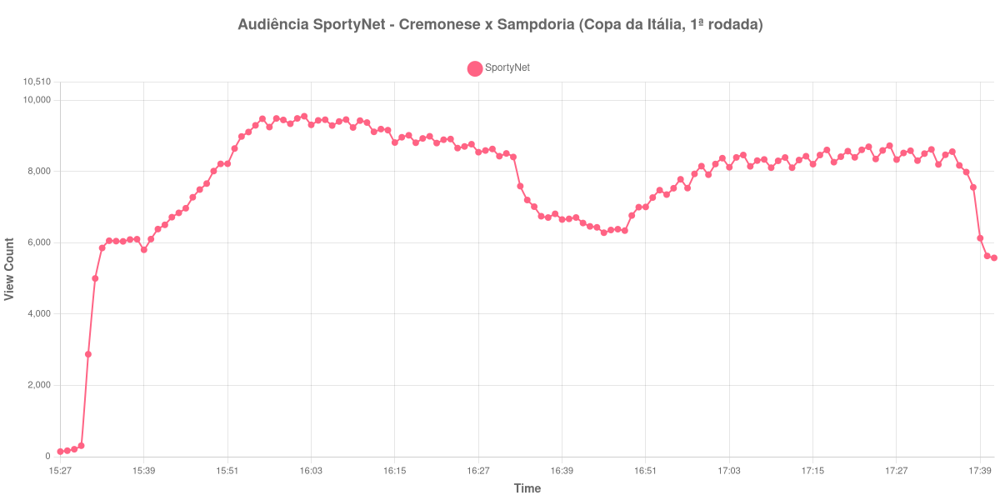

+++
date = 2026-08-20T07:56:00-03:00
draft = false
title = "Confira como foi a audiência de Cremonese X Sampdoria na SportyNet - 17-08-2026"
author = 'Instituto Cambacica de Audiência'
summary = "Veja como foi a audiência de uma transmissão da Copa da Itália que já começou formada e se manteve estável do apito inicial ao final"
tags = ['YouTube', 'Analytics', 'Audiência', 'SportyNet', 'Cremonese', 'Sampdoria', 'Copa da Italia']
categories = ['Audiência']
canais = ['SportyNet']
campeonatos = ['Copa da Italia 2026']
data_evento = 2026-08-17
+++

Neste texto, vamos informar os resultados da audiência em tempo real obtidos pela SportyNet, durante a transmissão de Cremonese X Sampdoria, partida da 1ª rodada da Copa da Itália, em 17/08/2026. É uma das quatro medições que fizemos nessa competição em 17/08, todas no mesmo canal e em janelas que se sobrepõem ao longo do dia. Sem cronologia confirmada em fonte independente, o texto não traz placar, gols nem qualquer informação sobre a partida além do que a audiência registrou.

A audiência começou a ser medida às 17/08/2026 15:27:55 (Horário de Brasília), já com a transmissão no ar. Como a coleta começou menos de duas horas antes do apito inicial, o gráfico e os números abaixo partem do primeiro registro disponível. A medição terminou antes de completar duas horas após o apito final, de modo que o recorte vai até o último dado coletado. Os horários de início e de fim de cada tempo listados abaixo foram ancorados na própria curva de audiência, pelo vale que o intervalo produz, e não em fonte externa. Os principais pontos da audiência são (em aparelhos conectados):

* **Início da Medição (15:27:55): 143**
* **Início da partida (15:41:55): 6.387**
* **Final do primeiro tempo (16:28:55): 8.592**
* Durante o intervalo (16:36:55): 6.748
* **Início do segundo tempo (16:43:55): 6.463**
* **Final da partida (17:33:55): 8.201**
* **Final da Medição (17:41:55): 5.579**

O pico de audiência foi às 16:02:55, ainda no primeiro tempo, com **9.554** aparelhos conectados simultâneos.

Ao contrário do que se vê nas outras transmissões desta rodada, aqui a audiência já estava formada quando a bola rolou. Entre o primeiro registro, às 15:27:55, com 143 aparelhos conectados, e o apito inicial, às 15:41:55, com 6.387, a curva subiu quase tudo o que subiria. O máximo da medição, 9.554 aparelhos conectados, veio pouco depois, às 16:02:55, e o restante da partida transcorreu num patamar estreito: nenhum dos marcos seguintes ficou abaixo de 6.463 nem acima de 8.592 aparelhos conectados. Foi essa estabilidade, e não um pico isolado, que sustentou o resultado da transmissão.

Os dois movimentos que a curva tem também são contidos. O intervalo custou 21%: os 8.592 aparelhos conectados do apito que fechou a primeira etapa viraram 6.748 no meio da pausa. E o segundo tempo devolveu o que fora perdido, dos 6.463 do recomeço aos 8.201 do apito final, um avanço de 27%. No conjunto da 1ª rodada da Copa da Itália, isso põe a medição acima da média da própria rodada: as outras seis transmissões registraram pico médio de 8.759 aparelhos conectados, e os 9.554 daqui ficam 9% acima. A comparação com o resto da grade do canal, porém, mantém a proporção conhecida: [Ferroviária X Paysandu](/posts/2026-08-17-ferroviaria-x-paysandu-sportynet/), no mesmo dia e na mesma SportyNet, chegou a 128.634 aparelhos conectados, e esta medição ficou 93% abaixo disso.

No gráfico a seguir, mostramos a evolução da audiência entre o primeiro registro da medição e o último registro coletado:

Para você verificar os metadados desta medição, você pode consultar o [repositório contendo o CSV com os dados e com os prints do minuto a minuto da medição](https://github.com/institutocambacica/audiencias_08_20_08_2026/tree/main/2026-08-17_cremonese-x-sampdoria_ssxSvT5CYBk).

---

*Para mais informações sobre nossa metodologia, visite nossa página [Sobre](/sobre).*
