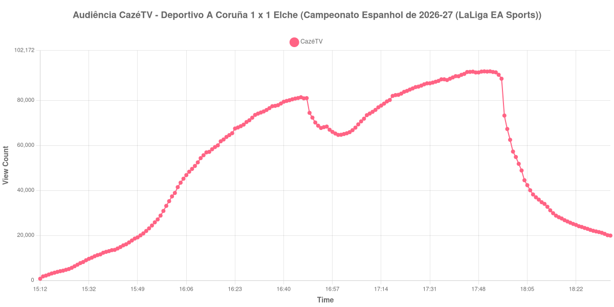

+++
date = 2026-08-20T07:52:00-03:00
draft = false
title = "Confira como foi a audiência de Deportivo A Coruña X Elche na CazéTV - 17-08-2026"
author = 'Instituto Cambacica de Audiência'
summary = "Veja como foi a audiência do retorno do Deportivo à elite espanhola na CazéTV, numa curva que só encontrou o seu máximo no apito final"
tags = ['YouTube', 'Analytics', 'Audiência', 'CazeTV', 'Deportivo A Coruna', 'Elche', 'LaLiga']
categories = ['Audiência']
canais = ['CazeTV']
campeonatos = ['LaLiga 2026']
data_evento = 2026-08-17
+++

Neste texto, vamos informar os resultados da audiência em tempo real obtidos pela CazéTV, durante a transmissão de Deportivo A Coruña X Elche, confronto da 1ª rodada do Campeonato Espanhol de 2026-27 (LaLiga EA Sports), no Abanca-Riazor, em A Coruña, em 17/08/2026. O jogo marcava o retorno do Deportivo à primeira divisão, depois do acesso em segundo lugar na LaLiga Hypermotion 2025/26, e terminou 1 a 1: Pierre-Emerick Aubameyang marcou aos 21 minutos, em sua estreia pelo clube galego, e Marc Aguado empatou para o Elche aos 76.

A audiência começou a ser medida às 17/08/2026 15:12:55 (Horário de Brasília), com a transmissão já no ar. Como a coleta começou menos de duas horas antes do apito inicial, o gráfico e os números abaixo partem do primeiro registro disponível. A medição terminou antes de completar duas horas após o apito final, de modo que o recorte vai até o último dado coletado. Nesta sessão a ferramenta perdeu a cadência de 60 segundos e passou a registrar uma amostra a cada quatro minutos; os horários citados são os das amostras efetivamente coletadas. Os principais pontos da audiência são (em aparelhos conectados):

* **Início da Medição (15:12:55): 737**
* **Início da partida (16:00:55): 35.206**
* Após o gol de Pierre-Emerick Aubameyang, do Deportivo A Coruña, aos 21 minutos do primeiro tempo (16:21:55): 64.551
* **Final do primeiro tempo (16:46:55): 81.374**
* Durante o intervalo (16:54:55): 68.096
* **Início do segundo tempo (17:01:55): 65.031**
* Após o gol de Marc Aguado, do Elche, aos 31 minutos do segundo tempo (17:33:55): 88.271
* **Final da partida (17:52:55): 92.883**
* **Final da Medição (18:34:55): 19.910**

O pico de audiência foi às 17:52:55, no apito final, com **92.883** aparelhos conectados simultâneos.

O máximo desta medição coincide com o apito final, e o caminho até lá é quase todo de subida. Entre o apito inicial e o fim da primeira etapa, a audiência saltou de 35.206 para 81.374 aparelhos conectados, com 64.551 já registrados logo depois do gol de Aubameyang. A parada do meio do jogo reduziu a audiência em 16%, de 81.374 para 68.096 aparelhos conectados, e o segundo tempo devolveu a perda com folga: cresceu 43%, de 65.031 no recomeço para os 92.883 do apito final. O empate do Elche, aos 31 minutos daquela etapa, não interrompeu a subida — o contador registrava 88.271 logo depois do gol e continuou a avançar até o fim da partida.

O contraste aparece no que veio depois do apito. Meia hora após o fim do jogo, às 18:22:55, restavam 24.653 aparelhos conectados, 27% do que a transmissão marcava no encerramento da partida, e o último dado coletado, às 18:34:55, registra 19.910 — uma dispersão rápida, que a janela cortada não chega a acompanhar até o fim. Convém lembrar também que a coleta perdeu a cadência de um minuto em parte desta sessão, de modo que o traçado do gráfico se apoia em amostras mais espaçadas do que o habitual. Em escala, os 92.883 aparelhos conectados do pico colocam a medição na 19ª posição entre as 40 do lote, a apenas 8% da média de picos das outras cinco transmissões da rodada espanhola, 101.445 aparelhos conectados: é, das seis, a que mais se aproximou da média da competição.

No gráfico a seguir, mostramos a evolução da audiência entre o primeiro registro da medição e o último registro coletado:

Para você verificar os metadados desta medição, você pode consultar o [repositório contendo o CSV com os dados e com os prints do minuto a minuto da medição](https://github.com/institutocambacica/audiencias_08_20_08_2026/tree/main/2026-08-17_deportivo-a-coruna-x-elche_iwYFDKlrYWw).

---

*Para mais informações sobre nossa metodologia, visite nossa página [Sobre](/sobre).*
