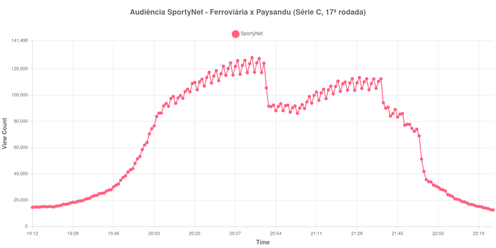

+++
date = 2026-08-20T08:04:00-03:00
draft = false
title = "Confira como foi a audiência de Ferroviária X Paysandu na SportyNet - 17-08-2026"
author = 'Instituto Cambacica de Audiência'
summary = "Veja como foi a audiência de um jogo da Série C na SportyNet, numa curva que atingiu o máximo antes do intervalo e recuou no segundo tempo"
tags = ['YouTube', 'Analytics', 'Audiência', 'SportyNet', 'Ferroviaria', 'Paysandu', 'Serie-C']
categories = ['Audiência']
canais = ['SportyNet']
campeonatos = ['Serie C 2026']
data_evento = 2026-08-17
+++

Neste texto, vamos informar os resultados da audiência em tempo real obtidos pela SportyNet, durante a transmissão de Ferroviária X Paysandu, partida da 17ª rodada do Campeonato Brasileiro Série C, em 17/08/2026. Foi a última das quatro partidas dessa rodada que medimos e a única em que a audiência atingiu o máximo ainda no primeiro tempo, um desenho que se afasta do que vimos nas outras três. Sem cronologia confirmada em fonte independente, o relato abaixo cobre a curva de audiência, e não o andamento do jogo.

A audiência começou a ser medida às 17/08/2026 19:12:55 (Horário de Brasília), com o canal já no ar. Como a coleta começou menos de duas horas antes do apito inicial, o gráfico e os números abaixo partem do primeiro registro disponível. A medição terminou antes de completar duas horas após o apito final, de modo que o recorte vai até o último dado coletado. Os horários de início e de fim de cada tempo listados abaixo foram ancorados na própria curva de audiência, pelo vale que o intervalo produz, e não em fonte externa. Os principais pontos da audiência são (em aparelhos conectados):

* **Início da Medição (19:12:55): 14.575**
* **Início da partida (19:59:55): 62.119**
* **Final do primeiro tempo (20:46:55): 124.694**
* Durante o intervalo (20:54:55): 88.179
* **Início do segundo tempo (21:01:55): 90.530**
* **Final da partida (21:51:55): 74.689**
* **Final da Medição (22:25:55): 12.560**

O pico de audiência foi às 20:44:55, nos minutos finais do primeiro tempo, com **128.634** aparelhos conectados simultâneos.

Esta curva se distingue das outras três medições da mesma rodada pelo lugar do máximo. A transmissão já começou grande — 14.575 aparelhos conectados no primeiro registro, 62.119 no apito inicial — e cresceu de forma acelerada até dois minutos antes do fim do primeiro tempo, quando alcançou o ponto mais alto de toda a medição. O intervalo então custou 29% da audiência, de 124.694 aparelhos conectados no fim da etapa inicial para 88.179 no fundo da pausa, e o segundo tempo não reverteu essa perda: dos 90.530 aparelhos conectados do recomeço aos 74.689 do apito final, houve queda de 17%, e o fim de jogo ficou bem abaixo do patamar do primeiro tempo. Meia hora depois do apito final, às 22:21:55, restavam 14.350 aparelhos conectados, 19% do que havia quando a partida terminou.

O contraste de escala com o resto da programação do dia é grande. A SportyNet exibiu naquela segunda-feira uma série de jogos da primeira rodada da Copa da Itália, e todos ficaram muito atrás: [Pisa X Empoli](/posts/2026-08-17-pisa-x-empoli-sportynet/) chegou a 19.954 aparelhos conectados e [Sassuolo X Cesena](/posts/2026-08-17-sassuolo-x-cesena-sportynet/) a 10.258, o que coloca esta partida 545% acima da primeira e ainda mais distante da segunda. Na 17ª rodada da Série C, é a segunda maior das quatro medições, 77% acima do pico médio de 72.704 aparelhos conectados das outras três, e no lote de 40 medições ela ocupa a 15ª posição, superando todos os jogos de LaLiga que medimos no mesmo período com uma única exceção.

No gráfico a seguir, mostramos a evolução da audiência entre o primeiro registro da medição e o último registro coletado:

Para você verificar os metadados desta medição, você pode consultar o [repositório contendo o CSV com os dados e com os prints do minuto a minuto da medição](https://github.com/institutocambacica/audiencias_08_20_08_2026/tree/main/2026-08-17_ferroviaria-x-paysandu_0FAayW_Wvrg).

---

*Para mais informações sobre nossa metodologia, visite nossa página [Sobre](/sobre).*
