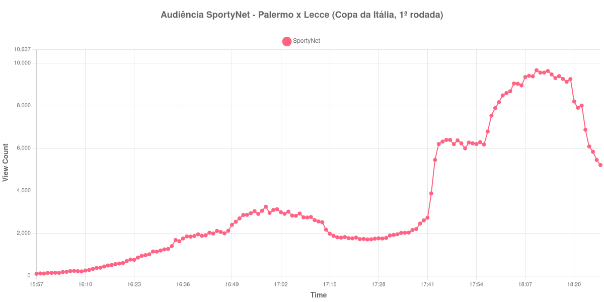

+++
date = 2026-08-20T08:00:00-03:00
draft = false
title = "Confira como foi a audiência de Palermo X Lecce na SportyNet - 17-08-2026"
author = 'Instituto Cambacica de Audiência'
summary = "Veja como a audiência desta partida da Copa da Itália só se formou no segundo tempo e se desfez logo depois do apito final"
tags = ['YouTube', 'Analytics', 'Audiência', 'SportyNet', 'Palermo', 'Lecce', 'Copa da Italia']
categories = ['Audiência']
+++

Neste texto, vamos informar os resultados da audiência em tempo real obtidos pela SportyNet, durante a transmissão de Palermo X Lecce, partida da 1ª rodada da Copa da Itália, em 17/08/2026. Foi a mais longa das medições que fizemos nessa rodada, com 151 registros, e a que continuou por mais tempo depois do apito final, indo até as 18:27:55. É também, por isso, a que melhor mostra o que acontece com a audiência quando a partida acaba. Como não foi possível confirmar a cronologia do jogo em fonte independente, o texto não traz placar nem gols.

A audiência começou a ser medida às 17/08/2026 15:57:55 (Horário de Brasília), com a live já em curso. Como a coleta começou menos de duas horas antes do apito inicial, o gráfico e os números abaixo partem do primeiro registro disponível. A medição terminou antes de completar duas horas após o apito final, de modo que o recorte vai até o último dado coletado. Os horários de início e de fim de cada tempo listados abaixo foram ancorados na própria curva de audiência, pelo vale que o intervalo produz, e não em fonte externa. Os principais pontos da audiência são (em aparelhos conectados):

* **Início da Medição (15:57:55): 98**
* **Início da partida (16:17:55): 509**
* **Final do primeiro tempo (17:04:55): 3.019**
* Durante o intervalo (17:12:55): 2.556
* **Início do segundo tempo (17:19:55): 1.824**
* **Final da partida (18:09:55): 9.383**
* **Final da Medição (18:27:55): 5.208**

O pico de audiência foi às 18:10:55, no apito final, com **9.670** aparelhos conectados simultâneos.

Praticamente toda a audiência desta transmissão se formou no segundo tempo. No recomeço, às 17:19:55, havia 1.824 aparelhos conectados, menos do que no fim do primeiro tempo, com 3.019, e menos do que no meio do intervalo, com 2.556 — o fundo da curva não coincide com a pausa, mas com os primeiros minutos depois dela. Dali até o apito final, às 18:09:55, o contador foi a 9.383 aparelhos conectados, um crescimento de 414%, e o máximo da série veio um registro depois, com 9.670. A partida terminou, portanto, no momento de maior audiência.

A desmontagem foi tão rápida quanto a subida. Como a coleta seguiu até 18:27:55, dá para acompanhá-la registro a registro: dos 9.670 aparelhos conectados do pico, às 18:10:55, restavam 5.208 no último dado coletado, sem que a curva encontrasse qualquer patamar intermediário no caminho. É o mesmo desenho de [Pisa X Empoli](/posts/2026-08-17-pisa-x-empoli-sportynet/), medida no mesmo dia e no mesmo canal, embora em outra escala: lá o pico foi de 19.954 aparelhos conectados, e esta medição ficou 52% abaixo disso. No ranking do lote de 40 medições, Palermo X Lecce ocupa a 32ª posição.

No gráfico a seguir, mostramos a evolução da audiência entre o primeiro registro da medição e o último registro coletado:

Para você verificar os metadados desta medição, você pode consultar o [repositório contendo o CSV com os dados e com os prints do minuto a minuto da medição](https://github.com/institutocambacica/audiencias_08_20_08_2026/tree/main/2026-08-17_palermo-x-lecce_g5f-_8CsXFE).

---

*Para mais informações sobre nossa metodologia, visite nossa página [Sobre](/sobre).*
