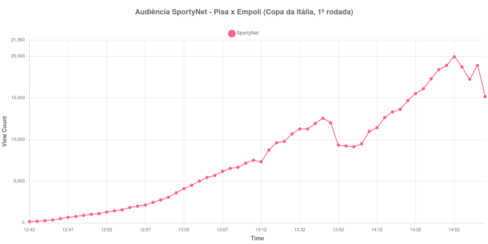

+++
date = 2026-08-20T07:44:00-03:00
draft = false
title = "Confira como foi a audiência de Pisa X Empoli na SportyNet - 17-08-2026"
author = 'Instituto Cambacica de Audiência'
summary = "Veja como foi a maior audiência da rodada de abertura da Copa da Itália na SportyNet, registrada com a cadência de coleta reduzida"
tags = ['YouTube', 'Analytics', 'Audiência', 'SportyNet', 'Pisa', 'Empoli', 'Copa da Italia']
categories = ['Audiência']
campeonatos = ['Copa da Italia 2026']
data_evento = 2026-08-17
+++

Neste texto, vamos informar os resultados da audiência em tempo real obtidos pela SportyNet, durante a transmissão de Pisa X Empoli, partida da 1ª rodada da Copa da Itália, em 17/08/2026. De todas as transmissões que o canal fez dessa rodada, esta foi a de maior audiência. É também uma das duas em que a ferramenta de coleta perdeu a cadência de um minuto, o que se traduz num gráfico com menos pontos que o habitual. A partida não teve cronologia confirmada por fonte independente, o que exclui deste texto placar, gols e escalações.

A audiência começou a ser medida às 17/08/2026 12:42:55 (Horário de Brasília). Como a coleta começou menos de duas horas antes do apito inicial, o gráfico e os números abaixo partem do primeiro registro disponível. A medição terminou antes de completar duas horas após o apito final, de modo que o recorte vai até o último dado coletado. Nesta sessão a ferramenta perdeu a cadência de 60 segundos e passou a registrar uma amostra a cada quatro minutos; os horários citados são os das amostras efetivamente coletadas. Os horários de início e de fim de cada tempo listados abaixo foram ancorados na própria curva de audiência, pelo vale que o intervalo produz, e não em fonte externa. Os principais pontos da audiência são (em aparelhos conectados):

* **Início da Medição (12:42:55): 148**
* **Início da partida (12:53:55): 1.450**
* **Final do primeiro tempo (13:40:55): 11.935**
* Durante o intervalo (13:48:55): 12.004
* **Início do segundo tempo (13:56:55): 9.231**
* **Final da partida (14:44:55): 18.400**
* **Final da Medição (15:08:55): 15.161**

O pico de audiência foi às 14:52:55, logo depois do apito final, com **19.954** aparelhos conectados simultâneos.

Vale começar pelo que o gráfico não mostra. Esta medição tem 60 registros, bem menos que as demais da rodada, porque a amostragem caiu para uma leitura a cada quatro minutos. Isso não afeta os valores: cada ponto continua sendo uma leitura direta do contador, e os números da lista acima são exatamente os que o contador exibia naqueles horários. O que muda é a resolução. Entre uma amostra e a seguinte pode haver até quatro minutos, e qualquer oscilação curta dentro dessa janela — o tipo de subida que um lance decisivo costuma produzir — simplesmente não aparece na curva. O traçado que você vê é mais suave do que o traçado real.

O vale do intervalo, que costuma ser a marca mais nítida dessas curvas, aparece aqui deslocado: entre o fim do primeiro tempo, com 11.935 aparelhos conectados, e o meio da pausa, com 12.004, a audiência subiu 1%, em vez de cair; o fundo só veio no recomeço, às 13:56:55, com 9.231. Dali em diante a curva subiu sem interrupção, até 18.400 aparelhos conectados no apito final — um avanço de 99% sobre o recomeço — e chegou ao máximo de 19.954 já com a partida encerrada. É a maior audiência da 1ª rodada da Copa da Itália e a 27ª medição entre as 40 do lote: o pico ficou 184% acima dos 7.026 aparelhos conectados de pico médio das outras seis transmissões da rodada.

No gráfico a seguir, mostramos a evolução da audiência entre o primeiro registro da medição e o último registro coletado:

Para você verificar os metadados desta medição, você pode consultar o [repositório contendo o CSV com os dados e com os prints do minuto a minuto da medição](https://github.com/institutocambacica/audiencias_08_20_08_2026/tree/main/2026-08-17_pisa-x-empoli_gKgxWoBNkNw).

---

*Para mais informações sobre nossa metodologia, visite nossa página [Sobre](/sobre).*
