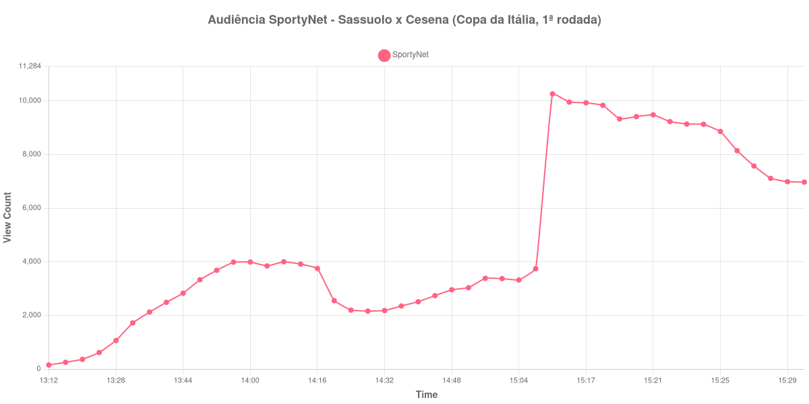

+++
date = 2026-08-20T07:48:00-03:00
draft = false
title = "Confira como foi a audiência de Sassuolo X Cesena na SportyNet - 17-08-2026"
author = 'Instituto Cambacica de Audiência'
summary = "Veja como foi a audiência de uma transmissão da Copa da Itália registrada com a menor quantidade de amostras de toda a rodada"
tags = ['YouTube', 'Analytics', 'Audiência', 'SportyNet', 'Sassuolo', 'Cesena', 'Copa da Italia']
categories = ['Audiência']
+++

Neste texto, vamos informar os resultados da audiência em tempo real obtidos pela SportyNet, durante a transmissão de Sassuolo X Cesena, partida da 1ª rodada da Copa da Itália, em 17/08/2026. Das sete medições que fizemos nessa rodada, é a que tem menos amostras: 46 registros entre o primeiro e o último minuto de coleta, porque a ferramenta passou a amostrar a cada quatro minutos em vez de a cada um. Não houve confirmação da cronologia do jogo em fonte independente, e por isso o texto descreve apenas a audiência.

A audiência começou a ser medida às 17/08/2026 13:12:55 (Horário de Brasília), com a transmissão já aberta. Como a coleta começou menos de duas horas antes do apito inicial, o gráfico e os números abaixo partem do primeiro registro disponível. A medição terminou antes de completar duas horas após o apito final, de modo que o recorte vai até o último dado coletado. Nesta sessão a ferramenta perdeu a cadência de 60 segundos e passou a registrar uma amostra a cada quatro minutos; os horários citados são os das amostras efetivamente coletadas. Os horários de início e de fim de cada tempo listados abaixo foram ancorados na própria curva de audiência, pelo vale que o intervalo produz, e não em fonte externa. Os principais pontos da audiência são (em aparelhos conectados):

* **Início da Medição (13:12:55): 149**
* **Início da partida (13:28:55): 1.061**
* **Final do primeiro tempo (14:16:55): 3.747**
* Durante o intervalo (14:24:55): 2.195
* **Início do segundo tempo (14:32:55): 2.179**
* **Final da partida (15:21:55): 9.479**
* **Final da Medição (15:30:55): 6.969**

O pico de audiência foi às 15:12:55, nos minutos finais da partida, com **10.258** aparelhos conectados simultâneos.

Esta medição e a de [Pisa X Empoli](/posts/2026-08-17-pisa-x-empoli-sportynet/) saíram da mesma sessão de coleta, com a mesma cadência degradada, e as duas curvas terminam do mesmo jeito: subindo até o fim da partida e alcançando o máximo por ali. O que as separa é a escala. Os 10.258 aparelhos conectados do pico daqui ficam 49% abaixo dos 19.954 de Pisa X Empoli, ainda que ambas estejam acima da média da rodada — as outras seis transmissões da 1ª rodada da Copa da Itália tiveram pico médio de 8.642 aparelhos conectados, e esta ficou 19% acima. No lote de 40 medições, Sassuolo X Cesena é a 31ª.

Dentro da partida, o desenho é o de uma audiência que só se constitui no segundo tempo. O intervalo custou 41%: dos 3.747 aparelhos conectados marcados ao fim da primeira etapa restaram 2.195 no meio da pausa, e o recomeço não recuperou nada, ficando em 2.179 às 14:32:55. Daí até o apito final, às 15:21:55, o contador chegou a 9.479, um crescimento de 335%, com o máximo da série registrado ainda antes do fim do jogo. Depois disso a audiência cedeu para 6.969 no último dado coletado, às 15:30:55. Com quatro minutos entre uma amostra e a seguinte, convém ler essa subida como uma tendência, e não como o traçado exato do que aconteceu minuto a minuto.

No gráfico a seguir, mostramos a evolução da audiência entre o primeiro registro da medição e o último registro coletado:

Para você verificar os metadados desta medição, você pode consultar o [repositório contendo o CSV com os dados e com os prints do minuto a minuto da medição](https://github.com/institutocambacica/audiencias_08_20_08_2026/tree/main/2026-08-17_sassuolo-x-cesena_EqwhPxkUAb0).

---

*Para mais informações sobre nossa metodologia, visite nossa página [Sobre](/sobre).*
