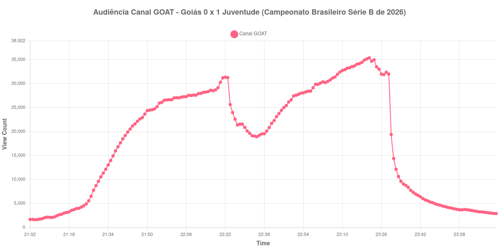

+++
date = 2026-08-20T08:12:00-03:00
draft = false
title = "Confira como foi a audiência de Goiás X Juventude no Canal GOAT - 18-08-2026"
author = 'Instituto Cambacica de Audiência'
summary = "Veja como foi a audiência de um jogo da Série B no Canal GOAT, único canal com uma só medição em todo o lote"
tags = ['YouTube', 'Analytics', 'Audiência', 'Canal-GOAT', 'Goias', 'Juventude', 'Serie-B']
categories = ['Audiência']
canais = ['Canal GOAT']
campeonatos = ['Serie B 2026']
data_evento = 2026-08-18
+++

Neste texto, vamos informar os resultados da audiência em tempo real obtidos pelo Canal GOAT, durante a transmissão de Goiás X Juventude, jogo da 23ª rodada do Campeonato Brasileiro Série B de 2026, disputado no Estádio Hailé Pinheiro, o Serrinha, em Goiânia, em 18/08/2026. A partida terminou em 0 a 1, com gol de Fábio Lima, do Juventude, aos 43 minutos do segundo tempo. Foi o único gol da noite, e ele saiu no trecho mais assistido de toda a transmissão: o lance que decidiu o jogo coincide com o ponto mais alto da medição.

A audiência começou a ser medida às 18/08/2026 21:02:55 (Horário de Brasília), com a transmissão já no ar. Como a coleta começou menos de duas horas antes do apito inicial, o gráfico e os números abaixo partem do primeiro registro disponível. A medição terminou antes de completar duas horas após o apito final, de modo que o recorte vai até o último dado coletado. Os principais pontos da audiência são (em aparelhos conectados):

* **Início da Medição (21:02:55): 1.669**
* **Início da partida (21:35:55): 13.951**
* **Final do primeiro tempo (22:21:55): 31.227**
* Durante o intervalo (22:29:55): 21.547
* **Início do segundo tempo (22:36:55): 19.248**
* Após o gol de Fábio Lima, do Juventude, aos 43 minutos do segundo tempo (23:20:55): 35.174
* **Final da partida (23:27:55): 31.885**
* **Final da Medição (00:13:55): 2.900**

O pico de audiência foi às 23:21:55, no minuto seguinte ao gol do Juventude, com **35.383** aparelhos conectados simultâneos.

A curva desta transmissão tem um desenho simples e um detalhe fora do comum. O simples é o percurso: o intervalo custou 31% da audiência, de 31.227 aparelhos conectados no fim do primeiro tempo para 21.547 no fundo da pausa, e o segundo tempo devolveu com folga o que fora perdido, de 19.248 no recomeço a 31.885 no apito final, um crescimento de 66%. O detalhe é que a queda não parou no intervalo: o recomeço, às 22:36:55, foi registrado abaixo do próprio fundo da pausa, e só a partir dali a audiência voltou a subir. O gol de Fábio Lima marca o topo da curva — 35.174 aparelhos conectados no minuto seguinte ao lance, 35.383 no minuto seguinte a esse — e o apito final já pega a transmissão em queda.

Depois do jogo a dispersão é rápida: às 23:57:55, meia hora após o apito final, restavam 3.774 aparelhos conectados, 12% do que havia no fim da partida. Em escala, esta é a única medição que fizemos no Canal GOAT em todo o lote de 40, e a menor das três da 23ª rodada da Série B: [Náutico X Ceará](/posts/2026-08-18-nautico-x-ceara-getv/), no mesmo dia, e [Fortaleza X São Bernardo](/posts/2026-08-19-fortaleza-x-sao-bernardo-sportynet/), no dia seguinte, tiveram pico médio de 130.887 aparelhos conectados, e os 35.383 daqui ficam 73% abaixo dessa média. No conjunto do lote, a partida ocupa a 26ª posição entre as 40 medições.

No gráfico a seguir, mostramos a evolução da audiência entre o primeiro registro da medição e o último registro coletado:

Para você verificar os metadados desta medição, você pode consultar o [repositório contendo o CSV com os dados e com os prints do minuto a minuto da medição](https://github.com/institutocambacica/audiencias_08_20_08_2026/tree/main/2026-08-18_goias-x-juventude_X12CHQq8NzY).

---

*Para mais informações sobre nossa metodologia, visite nossa página [Sobre](/sobre).*
