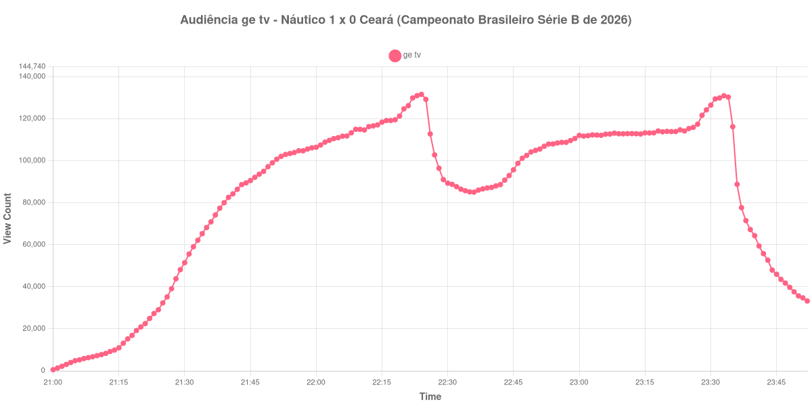

+++
date = 2026-08-20T08:08:00-03:00
draft = false
title = "Confira como foi a audiência de Náutico X Ceará na ge tv - 18-08-2026"
author = 'Instituto Cambacica de Audiência'
summary = "Veja como foi a audiência de um jogo da Série B na ge tv, num primeiro tempo esticado que empurrou o vale do intervalo para bem depois do usual"
tags = ['YouTube', 'Analytics', 'Audiência', 'GETV', 'Nautico', 'Ceara', 'Serie-B']
categories = ['Audiência']
canais = ['GETV']
campeonatos = ['Serie B 2026']
data_evento = 2026-08-18
+++

Neste texto, vamos informar os resultados da audiência em tempo real obtidos pela ge tv, durante a transmissão de Náutico X Ceará, jogo da 23ª rodada do Campeonato Brasileiro Série B de 2026, no Estádio dos Aflitos, em Recife, em 18/08/2026. A partida terminou em 1 a 0 para o Náutico, com gol de Léo Índio aos 53 minutos do primeiro tempo: a etapa inicial durou 53 minutos, esticada pelo atendimento ao goleiro Richard, do Ceará, que levou uma pancada na cabeça e quase saiu pelo protocolo de concussão, e o gol saiu no último lance dessa etapa.

A audiência começou a ser medida às 18/08/2026 21:00:55 (Horário de Brasília), quando a transmissão já estava no ar. Como a coleta começou menos de duas horas antes do apito inicial, o gráfico e os números abaixo partem do primeiro registro disponível. A medição terminou antes de completar duas horas após o apito final, de modo que o recorte vai até o último dado coletado. Como o primeiro tempo se estendeu, o intervalo aparece na medição bem depois do usual, e o horário do fim da partida listado abaixo já considera esses minutos extras, que nenhuma fonte independente registrou. Os principais pontos da audiência são (em aparelhos conectados):

* **Início da Medição (21:00:55): 534**
* **Início da partida (21:30:55): 51.462**
* Após o gol de Léo Índio, do Náutico, aos 53 minutos do primeiro tempo (22:23:55): 130.963
* Durante o intervalo (22:31:55): 88.759
* **Início do segundo tempo (22:38:55): 86.601**
* **Final da partida (23:28:55): 121.614**
* **Final da Medição (23:52:55): 33.234**

O pico de audiência foi às 22:24:55, no minuto seguinte ao gol e ainda dentro do primeiro tempo, com **131.581** aparelhos conectados simultâneos.

O que organiza esta curva é a duração da etapa inicial. Como o primeiro tempo durou 53 minutos, a subida contínua da transmissão teve mais tempo para acontecer antes da primeira pausa: de 51.462 aparelhos conectados no apito inicial a 130.963 no minuto seguinte ao gol de Léo Índio, às 22:23:55, com o máximo da medição um minuto depois. O vale que o intervalo desenha, e que costuma aparecer logo depois dos 45 minutos de jogo, aqui só se forma às 22:31:55, com 88.759 aparelhos conectados, mais de uma hora depois do apito inicial das 21:30:55 — é essa depressão deslocada que usamos para posicionar o recomeço. Entre um ponto e outro, a audiência cai de 130.963 para 88.759 aparelhos conectados: o gol e a pausa aconteceram praticamente juntos, e a curva registra os dois efeitos em sequência imediata.

O segundo tempo recuperou parte do que a pausa levou, mas não tudo: de 86.601 aparelhos conectados no recomeço a 121.614 no apito final, um crescimento de 40% que ainda deixa o fim de jogo abaixo do pico do primeiro tempo. Em escala, é a maior das três medições da 23ª rodada da Série B: [Goiás X Juventude](/posts/2026-08-18-goias-x-juventude-canal-goat/), na mesma noite, e [Fortaleza X São Bernardo](/posts/2026-08-19-fortaleza-x-sao-bernardo-sportynet/), um dia depois, tiveram pico médio de 82.788 aparelhos conectados, e os 131.581 daqui ficam 59% acima dessa média. No lote de 40 medições, a partida ocupa a 13ª posição.

No gráfico a seguir, mostramos a evolução da audiência entre o primeiro registro da medição e o último registro coletado:

Para você verificar os metadados desta medição, você pode consultar o [repositório contendo o CSV com os dados e com os prints do minuto a minuto da medição](https://github.com/institutocambacica/audiencias_08_20_08_2026/tree/main/2026-08-18_nautico-x-ceara_Xa4YI5FNU0Y).

---

*Para mais informações sobre nossa metodologia, visite nossa página [Sobre](/sobre).*
