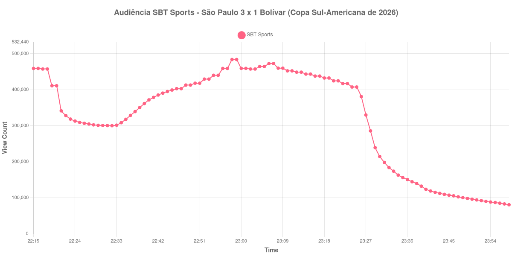

+++
date = 2026-08-20T08:16:00-03:00
draft = false
title = "Confira como foi a audiência de São Paulo X Bolívar na SBT Sports - 18-08-2026"
author = 'Instituto Cambacica de Audiência'
summary = "Veja como foi a audiência da volta das oitavas da Sul-Americana na SBT Sports, numa medição que começou com a partida já em andamento"
tags = ['YouTube', 'Analytics', 'Audiência', 'SBT-Sports', 'Sao Paulo', 'Bolivar', 'Sul-Americana']
categories = ['Audiência']
+++

Neste texto, vamos informar os resultados da audiência em tempo real obtidos pela SBT Sports, durante a transmissão de São Paulo X Bolívar, jogo de volta das oitavas de final da Copa Sul-Americana de 2026, disputado no MorumBIS, em São Paulo, em 18/08/2026. O São Paulo venceu por 3 a 1, com gols de Luciano aos 18 minutos do primeiro tempo, de Jonathan Calleri, de pênalti, aos 23 minutos do segundo, e de Sabino aos 31; Dairon Asprilla fez o gol do Bolívar aos 16 minutos da etapa final. Com 4 a 2 no agregado, o São Paulo avançou às quartas de final, diante de 42.087 presentes.

A audiência começou a ser medida às 18/08/2026 22:15:55 (Horário de Brasília), cerca de 45 minutos depois do apito inicial, que fora às 21:30: o primeiro registro disponível já marca 459.242 aparelhos conectados. A coleta começou com a partida já em andamento, de modo que o primeiro registro não é o começo da transmissão e o pico apurado é o máximo da janela medida, não necessariamente o da transmissão inteira. A medição terminou antes de completar duas horas após o apito final, de modo que o recorte vai até o último dado coletado. Não há, portanto, marcos de início de partida nem de fim de primeiro tempo nesta lista. Os principais pontos da audiência são (em aparelhos conectados):

* **Início da Medição (22:15:55): 459.242**
* Durante o intervalo (22:23:55): 318.591
* **Início do segundo tempo (22:30:55): 300.977**
* Após o gol de Dairon Asprilla, do Bolívar, aos 16 minutos do segundo tempo (22:48:55): 413.058
* Após o gol de pênalti de Jonathan Calleri, do São Paulo, aos 23 minutos do segundo tempo (22:55:55): 440.164
* Após o gol de Sabino, do São Paulo, aos 31 minutos do segundo tempo (23:03:55): 457.611
* **Final da partida (23:22:55): 417.138**
* **Final da Medição (23:58:55): 80.741**

O pico de audiência foi às 22:58:55, no segundo tempo, logo depois do gol de pênalti de Jonathan Calleri, com **484.036** aparelhos conectados simultâneos.

Como a coleta alcançou a transmissão com o jogo em andamento, o que esta curva descreve é essencialmente o segundo tempo, e ele foi de subida. Do recomeço, com 300.977 aparelhos conectados, a audiência chegou a 417.138 no apito final, um avanço de 39%, e cada gol deixou a sua marca: 413.058 depois do de Dairon Asprilla, 440.164 depois do pênalti de Jonathan Calleri e 457.611 depois do de Sabino. O máximo, porém, ficou entre os dois últimos gols, e não no fim do jogo: dos 484.036 aparelhos conectados do pico aos 417.138 do apito final, a curva recua no trecho derradeiro. Vale repetir que esse máximo é o da janela medida; o que a transmissão registrou antes das 22:15:55 não entrou nesta coleta.

No conjunto do lote, os 484.036 aparelhos conectados colocam esta transmissão na quinta posição entre as 40 medições e no topo do que a SBT Sports rendeu no período. Em relação à ida, [Bolívar X São Paulo](/posts/2026-08-11-bolivar-x-sao-paulo-sbt-sports/), em La Paz, o ganho é de 26%: 484.036 contra 382.867 aparelhos conectados. É o mesmo sentido observado no outro confronto de ida e volta que medimos neste lote, o das oitavas da Libertadores, em que a volta também superou a ida. Os dois jogos com o Bolívar ficaram acima das medições anteriores do canal, [Santos X Universidad Central](/posts/2026-07-28-santos-x-universidad-central-sbt-sports/), com 307.826 aparelhos conectados, e [Universidad Central X Santos](/posts/2026-07-21-universidad-central-x-santos-sbt-sports/), com 211.795. Depois do apito final, restavam 92.084 aparelhos conectados meia hora mais tarde, 22% dos 417.138 do fim da partida.

No gráfico a seguir, mostramos a evolução da audiência entre o primeiro registro da medição e o último registro coletado:

Para você verificar os metadados desta medição, você pode consultar o [repositório contendo o CSV com os dados e com os prints do minuto a minuto da medição](https://github.com/institutocambacica/audiencias_08_20_08_2026/tree/main/2026-08-18_sao-paulo-x-bolivar_woTeBjjKUL0).

---

*Para mais informações sobre nossa metodologia, visite nossa página [Sobre](/sobre).*
