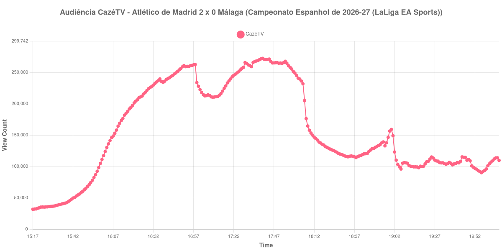

+++
date = 2026-08-20T08:24:00-03:00
draft = false
title = "Confira como foi a audiência de Atlético de Madrid X Málaga na CazéTV - 19-08-2026"
author = 'Instituto Cambacica de Audiência'
summary = "Veja como foi a maior audiência da rodada de estreia do Campeonato Espanhol na CazéTV, numa partida cujo apito inicial a própria curva ajudou a datar"
tags = ['YouTube', 'Analytics', 'Audiência', 'CazeTV', 'Atletico de Madrid', 'Malaga', 'LaLiga']
categories = ['Audiência']
canais = ['CazeTV']
campeonatos = ['LaLiga 2026']
data_evento = 2026-08-19
+++

Neste texto, vamos informar os resultados da audiência em tempo real obtidos pela CazéTV, durante a transmissão de Atlético de Madrid X Málaga, partida da 1ª rodada do Campeonato Espanhol de 2026-27 (LaLiga EA Sports), no Riyadh Air Metropolitano, em Madri, em 19/08/2026. Foi a última das seis partidas da rodada que acompanhamos, já na quarta-feira, e o Atlético de Madrid venceu por 2 a 0, com os dois gols na etapa final: Lee Kang-in abriu o placar aos 70 minutos e Álex Baena ampliou aos 85.

A audiência começou a ser medida às 19/08/2026 15:17:55 (Horário de Brasília), com a transmissão já no ar. Como a coleta começou menos de duas horas antes do apito inicial, o gráfico e os números abaixo partem do primeiro registro disponível. Cabe explicitar aqui uma decisão editorial sobre o horário do jogo: a partida estava marcada para as 16h00 de Brasília, mas a curva situa o apito inicial cerca de nove minutos depois, às 16:09, e foi esse horário que adotamos para todos os marcos. A medição é coerente consigo mesma em dois pontos independentes, o vale do intervalo e a queda brusca do encerramento; com apito às 16h00, o jogo teria acabado às 17h52, momento em que a audiência ainda subia. Os principais pontos da audiência são (em aparelhos conectados):

* **Início da Medição (15:17:55): 31.834**
* **Início da partida (16:09:55): 158.099**
* **Final do primeiro tempo (16:56:55): 261.223**
* Durante o intervalo (17:04:55): 212.593
* **Início do segundo tempo (17:11:55): 211.283**
* Após o gol de Lee Kang-in, do Atlético de Madrid, aos 25 minutos do segundo tempo (17:36:55): 268.243
* Após o gol de Álex Baena, do Atlético de Madrid, aos 40 minutos do segundo tempo (17:51:55): 265.035
* **Final da partida (18:07:55): 176.416**
* **Final da Medição (20:07:55): 109.788**

O pico de audiência foi às 17:40:55, entre os dois gols do Atlético de Madrid, com **272.492** aparelhos conectados simultâneos.

A maior audiência da rodada espanhola que medimos está aqui, e com alguma folga. O pico de 272.492 aparelhos conectados supera em 316% a média dos picos das outras cinco transmissões da competição, 65.523, e coloca a partida na 9ª posição entre as 40 medições deste lote — distante, ainda assim, do topo, ocupado por Flamengo x Cruzeiro, com 3.412.036 aparelhos conectados na ge tv. A escala já se anuncia no ponto de partida: quando a coleta começou, às 15:17:55, a transmissão reunia 31.834 aparelhos conectados, e no apito inicial eram 158.099, patamar que nenhuma das outras cinco partidas da rodada alcançou em momento algum.

O desenho da curva é o de uma audiência que se forma antes do intervalo e depois se acomoda. A subida do primeiro tempo é firme, dos 158.099 aparelhos conectados do apito inicial aos 261.223 do fim da etapa; o intervalo retirou 19%, de 261.223 para 212.593; e o segundo tempo terminou 17% abaixo de onde começou, de 211.283 no recomeço para 176.416 no apito final. Esse recuo, porém, não descreve toda a etapa: entre um ponto e outro está o máximo da medição, e a queda se concentra nos últimos minutos, entre 18h05 e 18h07. No pós-jogo a retenção se manteve alta: meia hora depois do apito, às 18:37:55, ainda havia 115.519 aparelhos conectados, 65% do valor do encerramento; uma hora depois, às 19:07:55, eram 105.273, ou 60%.

No gráfico a seguir, mostramos a evolução da audiência entre o primeiro registro da medição e duas horas após o seu encerramento:

Para você verificar os metadados desta medição, você pode consultar o [repositório contendo o CSV com os dados e com os prints do minuto a minuto da medição](https://github.com/institutocambacica/audiencias_08_20_08_2026/tree/main/2026-08-19_atletico-de-madrid-x-malaga_6aH_p7C1D8w).

---

*Para mais informações sobre nossa metodologia, visite nossa página [Sobre](/sobre).*
