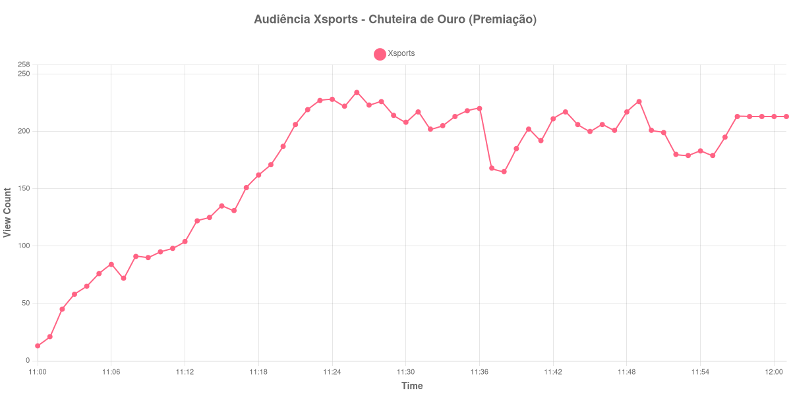

+++
date = 2026-08-20T08:20:00-03:00
draft = false
title = "Confira como foi a audiência da Chuteira de Ouro na Xsports - 19-08-2026"
author = 'Instituto Cambacica de Audiência'
summary = "Veja como foi a audiência da premiação da Chuteira de Ouro na Xsports, a menor de todas as medições deste lote"
tags = ['YouTube', 'Analytics', 'Audiência', 'Xsports', 'Premiacao']
categories = ['Audiência']
canais = ['Xsports']
campeonatos = ['Premiacoes 2026']
data_evento = 2026-08-19
+++

Neste texto, vamos informar os resultados da audiência em tempo real obtidos pela Xsports, durante a transmissão da Chuteira de Ouro, premiação exibida ao vivo em 19/08/2026. Não se trata de um jogo: é a entrega de um prêmio individual, levada ao ar pelo canal na manhã do mesmo dia em que ele transmitiria, à noite, uma partida da Copa Argentina. Como não há jogo, também não há apito inicial, intervalo nem apito final a registrar, e a medição se resume aos dois extremos da janela coletada e ao ponto mais alto que a curva alcançou dentro dela.

A audiência começou a ser medida às 19/08/2026 11:00:55 (Horário de Brasília), com 13 aparelhos conectados no primeiro registro. Não foi possível confirmar a cronologia do evento em fonte independente, de modo que listamos apenas os pontos que a própria medição sustenta. Os principais pontos da audiência são (em aparelhos conectados):

* **Início da Medição (11:00:55): 13**
* **Final da Medição (12:01:55): 213**

O pico de audiência foi às 11:26:55, com **234** aparelhos conectados simultâneos.

Os 234 aparelhos conectados do pico fazem desta a menor das 40 medições do lote, na 40ª posição do ranking. Para dar a dimensão da distância: a maior medição do conjunto, Flamengo x Cruzeiro na ge tv, chegou a 3.412.036 aparelhos conectados simultâneos. São quatro ordens de grandeza entre um número e outro, dentro do mesmo levantamento e na mesma plataforma. O mesmo vale para as outras três maiores do lote — Cruzeiro x Flamengo, com 2.457.680, Mirassol x Flamengo, com 2.307.249, e Palmeiras x Internacional, com 1.208.776 —, todas várias ordens de grandeza acima do que esta transmissão reuniu.

A comparação mais próxima, no entanto, é a que a própria Xsports oferece. Horas depois desta premiação, o canal exibiu [Racing X Belgrano](/posts/2026-08-19-racing-x-belgrano-xsports/), pela Copa Argentina, e o pico ali foi de 3.378 aparelhos conectados: os 234 daqui ficam 93% abaixo desse valor, no mesmo canal e no mesmo dia. Vale notar que a curva da premiação não desaba no encerramento. Ela sai de 13 aparelhos conectados às 11:00:55, chega ao máximo às 11:26:55 e termina em 213 às 12:01:55, perto do topo — uma audiência pequena, mas que permaneceu até o fim do que foi transmitido.

No gráfico a seguir, mostramos a evolução da audiência entre o primeiro registro da medição e o último registro coletado:

Para você verificar os metadados desta medição, você pode consultar o [repositório contendo o CSV com os dados e com os prints do minuto a minuto da medição](https://github.com/institutocambacica/audiencias_08_20_08_2026/tree/main/2026-08-19_chuteira-de-ouro_0aoEZchhGws).

---

*Para mais informações sobre nossa metodologia, visite nossa página [Sobre](/sobre).*
