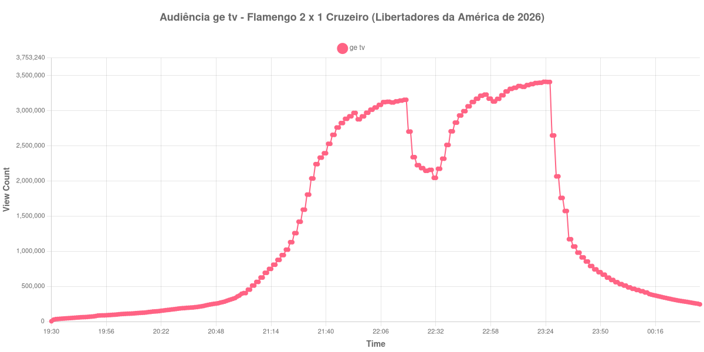

+++
date = 2026-08-20T08:36:00-03:00
draft = false
title = "Confira como foi a audiência de Flamengo X Cruzeiro na ge tv - 19-08-2026"
author = 'Instituto Cambacica de Audiência'
summary = "Veja como foi a audiência da volta das oitavas da Libertadores na ge tv, na noite em que o Flamengo eliminou o Cruzeiro no Maracanã"
tags = ['YouTube', 'Analytics', 'Audiência', 'GETV', 'Flamengo', 'Cruzeiro', 'Libertadores']
categories = ['Audiência']
campeonatos = ['Libertadores 2026']
data_evento = 2026-08-19
+++

Neste texto, vamos informar os resultados da audiência em tempo real obtidos pela ge tv, durante a transmissão de Flamengo X Cruzeiro, jogo de volta das oitavas de final da Libertadores da América de 2026, disputado no Maracanã, no Rio de Janeiro, em 19/08/2026. O Flamengo venceu por 2 a 1, com gols de Giorgian De Arrascaeta aos 35 minutos do primeiro tempo e de Samuel Lino aos 17 minutos do segundo; Lucas Romero descontou para o Cruzeiro aos 6 minutos da etapa final. Com 3 a 2 no agregado, o Flamengo avançou às quartas de final, diante de 72.481 presentes, recorde de público do Maracanã em 2026.

A audiência começou a ser medida às 19/08/2026 19:30:55 (Horário de Brasília), duas horas antes do apito inicial e com a transmissão já no ar. A medição terminou antes de completar duas horas após o apito final, de modo que o recorte vai até o último dado coletado. Os principais pontos da audiência são (em aparelhos conectados):

* **Início da Medição (19:30:55): 3.887**
* **Início da partida (21:30:55): 1.591.758**
* Após o gol de Giorgian De Arrascaeta, do Flamengo, aos 35 minutos do primeiro tempo (22:05:55): 3.083.795
* **Final do primeiro tempo (22:16:55): 3.144.940**
* Durante o intervalo (22:24:55): 2.225.086
* **Início do segundo tempo (22:31:55): 2.045.142**
* Após o gol de Lucas Romero, do Cruzeiro, aos 6 minutos do segundo tempo (22:38:55): 2.513.448
* Após o gol de Samuel Lino, do Flamengo, aos 17 minutos do segundo tempo (22:49:55): 3.124.514
* **Final da partida (23:22:55): 3.398.856**
* **Final da Medição (00:37:55): 244.652**

O pico de audiência foi às 23:23:55, no minuto seguinte ao apito final, com **3.412.036** aparelhos conectados simultâneos.

Esta é a maior audiência das 40 medições do lote, e a curva ajuda a mostrar como ela se formou: cresce praticamente sem interrupção até o último minuto. Do apito inicial, com 1.591.758 aparelhos conectados, a transmissão chegou a 3.144.940 no fim do primeiro tempo. O intervalo custou 29%, de 3.144.940 para 2.225.086 aparelhos conectados, e a etapa final recuperou tudo e mais: de 2.045.142 no recomeço a 3.398.856 no apito final, um crescimento de 66%, o maior entre os quatro jogos de ida e volta que medimos neste lote. O gol de Samuel Lino, que recolocou o Flamengo à frente, é o degrau mais alto da subida, em 3.124.514 aparelhos conectados.

Nenhuma outra transmissão deste lote chegou perto. Os 3.412.036 aparelhos conectados ficam 39% acima dos 2.457.680 de [Cruzeiro X Flamengo](/posts/2026-08-12-cruzeiro-x-flamengo-getv/), a ida no Mineirão, que é a segunda colocada, e ainda mais distantes da terceira e da quarta, Mirassol x Flamengo na CazéTV, com 2.307.249, e Palmeiras x Internacional na ge tv, com 1.208.776. É também o maior número que já registramos em um jogo de clubes, acima dos 3.206.213 de [Corinthians X Vasco](/posts/2025-12-17-corinthians-x-vasco-getv/), em dezembro de 2025, no mesmo canal; entre tudo o que já medimos, só as transmissões de seleções na Copa do Mundo ficaram à frente, como os 24.229.929 de [França X Espanha](/posts/2026-07-14-franca-x-espanha-cazetv/) na CazéTV. No pós-jogo, sobraram 666.544 aparelhos conectados meia hora depois, 20% dos 3.398.856 do fim da partida, e 327.480 uma hora depois, ou 10%.

No gráfico a seguir, mostramos a evolução da audiência entre duas horas antes do início da partida e o último registro coletado:

Para você verificar os metadados desta medição, você pode consultar o [repositório contendo o CSV com os dados e com os prints do minuto a minuto da medição](https://github.com/institutocambacica/audiencias_08_20_08_2026/tree/main/2026-08-19_flamengo-x-cruzeiro_yM9qJJG6gIQ).

---

*Para mais informações sobre nossa metodologia, visite nossa página [Sobre](/sobre).*
