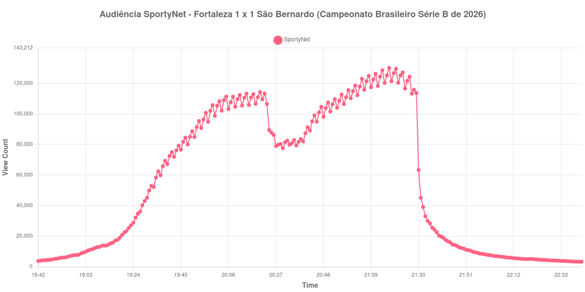

+++
date = 2026-08-20T08:28:00-03:00
draft = false
title = "Confira como foi a audiência de Fortaleza X São Bernardo na SportyNet - 19-08-2026"
author = 'Instituto Cambacica de Audiência'
summary = "Veja como foi a audiência de um jogo da Série B na SportyNet, num segundo tempo sem gols que ainda assim levou a curva ao máximo"
tags = ['YouTube', 'Analytics', 'Audiência', 'SportyNet', 'Fortaleza', 'Sao Bernardo', 'Serie-B']
categories = ['Audiência']
campeonatos = ['Serie B 2026']
data_evento = 2026-08-19
+++

Neste texto, vamos informar os resultados da audiência em tempo real obtidos pela SportyNet, durante a transmissão de Fortaleza X São Bernardo, jogo da 23ª rodada do Campeonato Brasileiro Série B de 2026, disputado na Arena Castelão, em Fortaleza, em 19/08/2026. A partida terminou empatada em 1 a 1, com os dois gols na etapa inicial: Lucas Sasha abriu o placar para o Fortaleza aos 32 minutos e Pedrinho empatou para o São Bernardo aos 43, já perto do intervalo. O segundo tempo não teve gols, e é justamente ele que concentra o crescimento da audiência.

A audiência começou a ser medida às 19/08/2026 18:42:55 (Horário de Brasília), com a live já aberta. Como a coleta começou menos de duas horas antes do apito inicial, o gráfico e os números abaixo partem do primeiro registro disponível. A medição terminou antes de completar duas horas após o apito final, de modo que o recorte vai até o último dado coletado. Os principais pontos da audiência são (em aparelhos conectados):

* **Início da Medição (18:42:55): 3.732**
* **Início da partida (19:30:55): 45.119**
* Após o gol de Lucas Sasha, do Fortaleza, aos 32 minutos do primeiro tempo (20:02:55): 108.310
* Após o gol de Pedrinho, do São Bernardo, aos 43 minutos do primeiro tempo (20:13:55): 110.707
* **Final do primeiro tempo (20:18:55): 106.614**
* Durante o intervalo (20:26:55): 86.258
* **Início do segundo tempo (20:33:55): 79.856**
* **Final da partida (21:22:55): 125.301**
* **Final da Medição (22:42:55): 3.293**

O pico de audiência foi às 21:17:55, nos minutos finais da partida, com **130.192** aparelhos conectados simultâneos.

Os dois gols saíram antes do intervalo, e mesmo assim o trecho mais assistido da transmissão foi o segundo tempo. A etapa inicial subiu depressa, de 45.119 aparelhos conectados no apito inicial a 110.707 depois do empate de Pedrinho, e o intervalo cobrou 19% desse acumulado, de 106.614 no fim do primeiro tempo para 86.258 no fundo da pausa. A queda ainda continuou depois disso: o recomeço, às 20:33:55, foi registrado em 79.856 aparelhos conectados, o menor valor entre o fim do primeiro tempo e o apito final. Dali em diante a curva sobe sem gols para sustentá-la, chega ao máximo cinco minutos antes do apito final e termina o jogo em 125.301 aparelhos conectados, um crescimento de 57% em relação ao recomeço.

Encerrada a partida, a dispersão é acentuada e bem documentada nesta medição, porque a janela seguiu por mais de uma hora: às 21:52:55 restavam 10.795 aparelhos conectados, 9% do que havia no apito final, e às 22:22:55 apenas 4.780, 4%. Em escala, é a segunda maior das três medições da 23ª rodada da Série B neste lote, atrás de [Náutico X Ceará](/posts/2026-08-18-nautico-x-ceara-getv/), na véspera, e à frente de [Goiás X Juventude](/posts/2026-08-18-goias-x-juventude-canal-goat/): as outras duas tiveram pico médio de 83.482 aparelhos conectados, e os 130.192 daqui ficam 56% acima dessa média. No lote de 40 medições, a partida ocupa a 14ª posição.

No gráfico a seguir, mostramos a evolução da audiência entre o primeiro registro da medição e o último registro coletado:

Para você verificar os metadados desta medição, você pode consultar o [repositório contendo o CSV com os dados e com os prints do minuto a minuto da medição](https://github.com/institutocambacica/audiencias_08_20_08_2026/tree/main/2026-08-19_fortaleza-x-sao-bernardo_lXyVex70qEY).

---

*Para mais informações sobre nossa metodologia, visite nossa página [Sobre](/sobre).*
