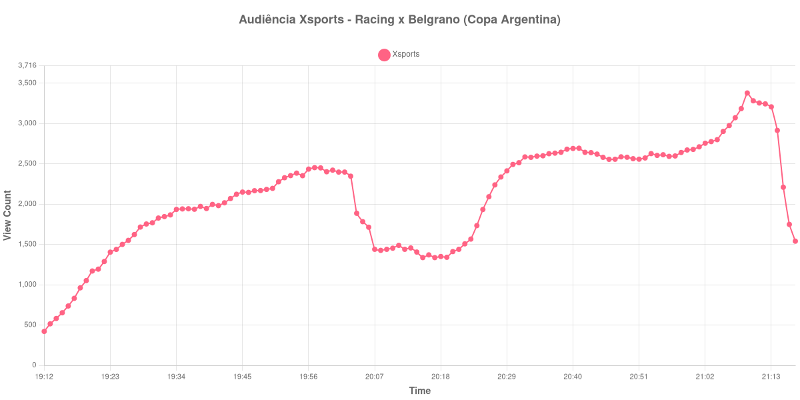

+++
date = 2026-08-20T08:32:00-03:00
draft = false
title = "Confira como foi a audiência de Racing X Belgrano na Xsports - 19-08-2026"
author = 'Instituto Cambacica de Audiência'
summary = "Veja como foi a audiência da Copa Argentina na Xsports, numa medição em que o ponto mais alto veio depois do apito final"
tags = ['YouTube', 'Analytics', 'Audiência', 'Xsports', 'Racing', 'Belgrano', 'Copa Argentina']
categories = ['Audiência']
campeonatos = ['Copa Argentina 2026']
data_evento = 2026-08-19
+++

Neste texto, vamos informar os resultados da audiência em tempo real obtidos pela Xsports, durante a transmissão de Racing X Belgrano, partida da Copa Argentina, em 19/08/2026. O Racing desta medição é o argentino, de Avellaneda, e não o Racing de Santander, que aparece em outra transmissão deste mesmo lote. Sem fonte independente sobre o jogo, este texto não traz placar nem gols: os horários de cada tempo saíram da leitura da própria curva de audiência, e é dela que trata a análise a seguir.

A audiência começou a ser medida às 19/08/2026 19:12:55 (Horário de Brasília), praticamente junto com o início da partida — por isso a lista abaixo não traz um marco separado para o apito inicial. Como a coleta começou menos de duas horas antes do apito inicial, o gráfico e os números abaixo partem do primeiro registro disponível. A medição terminou antes de completar duas horas após o apito final, de modo que o recorte vai até o último dado coletado. Os horários de início e de fim de cada tempo listados abaixo foram ancorados na própria curva de audiência, pelo vale que o intervalo produz, e não em fonte externa. Os principais pontos da audiência são (em aparelhos conectados):

* **Início da Medição (19:12:55): 421**
* **Final do primeiro tempo (19:59:55): 2.401**
* Durante o intervalo (20:07:55): 1.439
* **Início do segundo tempo (20:14:55): 1.405**
* **Final da partida (21:04:55): 2.799**
* **Final da Medição (21:17:55): 1.540**

O pico de audiência foi às 21:09:55, já no pós-jogo, com **3.378** aparelhos conectados simultâneos.

Duas coisas se destacam nesta série. A primeira é o custo do intervalo, 40% da audiência: eram 2.401 aparelhos conectados quando a primeira etapa acabou e 1.439 no ponto mais baixo da parada, o vale que nos serviu para ancorar os horários. A segunda é o que veio depois: dos 1.405 aparelhos do recomeço aos 2.799 do apito final, a audiência praticamente dobrou, um crescimento de 99% no segundo tempo. E a subida não parou com o jogo — o máximo da medição veio depois dele, às 21:09:55, com 3.378 aparelhos conectados, antes de a série cair para os 1.540 do último registro, às 21:17:55.

Esta é a 37ª colocada no ranking de picos das 40 medições e, ainda assim, o maior pico entre os três eventos da Xsports que entraram nesta série. No mesmo 19 de agosto, o canal levou ao ar a [Chuteira de Ouro](/posts/2026-08-19-chuteira-de-ouro-xsports/), premiação cujo máximo ficou em 234 aparelhos conectados: os 3.378 desta partida estão 1.344% acima disso. É a comparação mais próxima de que dispomos, com mesmo canal e mesmo dia. Somadas, as três medições da Xsports no lote acumulam 11.456 aparelhos conectados de pico, e nenhuma delas teve clube brasileiro envolvido.

No gráfico a seguir, mostramos a evolução da audiência entre o primeiro registro da medição e o último registro coletado:

Para você verificar os metadados desta medição, você pode consultar o [repositório contendo o CSV com os dados e com os prints do minuto a minuto da medição](https://github.com/institutocambacica/audiencias_08_20_08_2026/tree/main/2026-08-19_racing-x-belgrano_KRvs4FMDrlc).

---

*Para mais informações sobre nossa metodologia, visite nossa página [Sobre](/sobre).*
