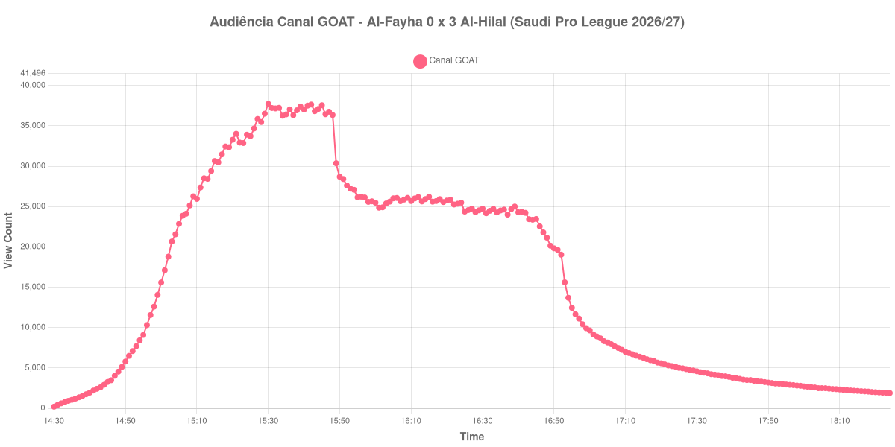

+++
date = 2026-08-24T04:00:00-03:00
draft = false
title = "Confira como foi a audiência de Al-Fayha X Al-Hilal no Canal GOAT - 20-08-2026"
author = 'Instituto Cambacica de Audiência'
summary = "Veja como foi a audiência da segunda rodada do Campeonato Saudita no Canal GOAT, numa curva que alcançou o topo antes do primeiro gol e não voltou mais a ele"
tags = ['YouTube', 'Analytics', 'Audiência', 'Canal-GOAT', 'Al-Fayha', 'Al-Hilal', 'Saudi Pro League']
categories = ['Audiência']
campeonatos = ['Saudi Pro League 2026']
data_evento = 2026-08-20
+++

Neste texto, vamos informar os resultados da audiência em tempo real obtidos pelo Canal GOAT, durante a transmissão de Al-Fayha X Al-Hilal, jogo da 2ª rodada da Saudi Pro League de 2026/27, no Al-Majma'ah Sports City Stadium, em Al-Majmaah, em 20/08/2026. O Al-Fayha era o mandante e perdeu por 3 a 0, com gols de Sergej Milinkovic-Savic aos 31 minutos do primeiro tempo e de Sultan Mandash e Nasser Al-Dawsari no segundo tempo. O público presente não foi divulgado por nenhuma das fontes que consultamos, e por isso não o informamos aqui.

A audiência começou a ser medida às 20/08/2026 14:30:55 (Horário de Brasília). Como a coleta começou menos de duas horas antes do apito inicial, o gráfico e os números abaixo partem do primeiro registro disponível; a medição também terminou antes de completar duas horas após o apito final, de modo que o recorte vai até o último dado coletado. Os principais pontos da audiência são (em aparelhos conectados):

* **Início da Medição (14:30:55): 198**
* **Início da partida (15:00:55): 15.589**
* Após o gol de Sergej Milinkovic-Savic, do Al-Hilal, aos 31 minutos do primeiro tempo (15:31:55): 37.216
* Durante o intervalo (16:01:55): 24.857
* **Início do segundo tempo (16:04:55): 25.611**
* Após o gol de Sultan Mandash, do Al-Hilal, aos 46 minutos do segundo tempo (16:05:55): 26.018
* Após o gol de Nasser Al-Dawsari, do Al-Hilal, aos 88 minutos do segundo tempo (16:47:55): 21.793
* **Final da partida (16:50:55): 19.823**
* **Final da Medição (18:24:55): 1.889**

O pico de audiência foi às 15:30:55, com **37.723** aparelhos conectados simultâneos.

O detalhe que organiza esta curva é a posição do pico. Ele acontece aos trinta minutos do primeiro tempo, no minuto anterior ao gol de Milinkovic-Savic, e a partir dali a transmissão não voltou a esse patamar em nenhum momento das quase quatro horas seguintes. O gol que abriu o placar foi registrado com 37.216 aparelhos conectados, praticamente o mesmo número do topo, e o segundo tempo inteiro correu abaixo disso: de 25.611 aparelhos conectados no recomeço para 19.823 no apito final, uma perda de 23% num período em que o Al-Hilal ainda marcou duas vezes. Uma goleada construída fora de casa, neste caso, não segurou público — encurtou.

O esvaziamento depois do apito final é igualmente rápido: dos 19.823 aparelhos conectados do encerramento restavam 5.580 trinta minutos depois, ou 28%, e 3.180 uma hora depois. Em escala, os 37.723 do pico colocam a partida na 20ª posição entre as 39 medições deste lote, exatamente no meio da tabela, e 62% acima da média das outras cinco transmissões da Saudi Pro League que acompanhamos, de 23.328 aparelhos conectados. Dentro do próprio Canal GOAT, é a 3ª maior das 9 medições do canal: os mesmos 37.723 ficam 103% acima dos 18.607 aparelhos conectados de média das outras oito.

No gráfico a seguir, mostramos a evolução da audiência entre o primeiro registro da medição e o último registro coletado:

Para você verificar os metadados desta medição, você pode consultar o [repositório contendo o CSV com os dados e com os prints do minuto a minuto da medição](https://github.com/institutocambacica/audiencias_20_23_08_2026/tree/main/2026-08-20_al-fayha-x-al-hilal_iVibCajCriA).

---

*Para mais informações sobre nossa metodologia, visite nossa página [Sobre](/sobre).*
