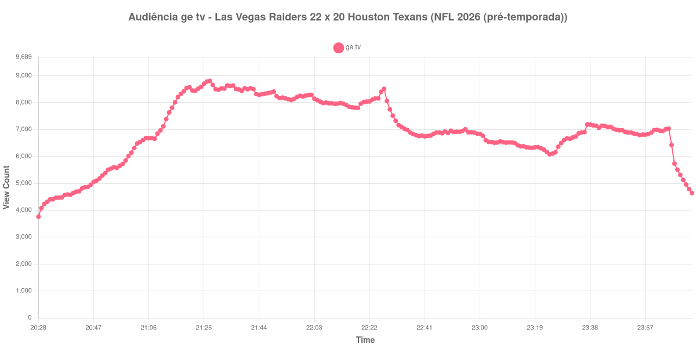

+++
date = 2026-08-24T04:06:00-03:00
draft = false
title = "Confira como foi a audiência de Las Vegas Raiders X Houston Texans na ge tv - 20-08-2026"
author = 'Instituto Cambacica de Audiência'
summary = "Veja como foi a audiência de um jogo de pré-temporada da NFL na ge tv, a curva mais plana de todo o lote"
tags = ['YouTube', 'Analytics', 'Audiência', 'GETV', 'Las Vegas Raiders', 'Houston Texans', 'NFL']
categories = ['Audiência']
campeonatos = ['NFL 2026']
data_evento = 2026-08-20
+++

Neste texto, vamos informar os resultados da audiência em tempo real obtidos pela ge tv, durante a transmissão de Las Vegas Raiders X Houston Texans, jogo da segunda semana da pré-temporada da NFL de 2026, no Reliant Stadium, em Houston, em 20/08/2026. O mandante era o Houston Texans, ao contrário do que a ordem do título da transmissão sugere, e os Raiders venceram por 22 a 20, de virada: os Texans abriram 17 a 0 logo no primeiro quarto e não voltaram a pontuar depois do intervalo, enquanto os visitantes marcaram 12 pontos apenas no último quarto. O público presente não foi divulgado por nenhuma das fontes que consultamos.

A audiência começou a ser medida às 20/08/2026 20:28:55 (Horário de Brasília). Como a coleta começou menos de duas horas antes do apito inicial, o gráfico e os números abaixo partem do primeiro registro disponível; a medição também terminou antes de completar duas horas após o apito final, de modo que o recorte vai até o último dado coletado. Diferentemente do futebol, um jogo da NFL não tem dois tempos de 45 minutos: são quatro quartos e um intervalo curto, de cerca de doze minutos, e a pausa não deixou marca identificável nesta curva — por isso não há um marco de intervalo na lista. Os principais pontos da audiência são (em aparelhos conectados):

* **Início da Medição (20:28:55): 3.761**
* **Início da partida (21:00:55): 6.141**
* **Final da partida (00:03:55): 6.947**
* **Final da Medição (00:13:55): 4.641**

O pico de audiência foi às 21:27:55, ainda no primeiro tempo do jogo, com **8.808** aparelhos conectados simultâneos.

Esta é a curva mais plana de todas as 39 medições do lote, e é isso que a torna interessante. Do apito inicial ao apito final, ao longo de mais de três horas de transmissão, a audiência se moveu entre 6.141 e 8.808 aparelhos conectados — uma faixa estreitíssima para um período tão longo. O jogo teve uma virada de 17 a 0 para 22 a 20, com doze pontos dos Raiders no último quarto, e nem isso alterou o comportamento: o número no encerramento, 6.947 aparelhos conectados, é praticamente o mesmo do apito inicial, 6.141.

A explicação mais provável está na natureza do evento. Pré-temporada da NFL não é competição valendo classificação, e o público que acompanha esse tipo de transmissão parece ser um público de rotina, que liga e fica, em vez de um público de acontecimento, que chega e sai conforme o placar. Em escala, os 8.808 do pico deixam esta medição na 27ª posição entre as 39 do lote e é a menor das três transmissões da ge tv que acompanhamos, 99% abaixo da média de 633.069 aparelhos conectados das outras duas — mas a comparação diz mais sobre o peso do futebol brasileiro no canal do que sobre a NFL.

No gráfico a seguir, mostramos a evolução da audiência entre o primeiro registro da medição e o último registro coletado:

Para você verificar os metadados desta medição, você pode consultar o [repositório contendo o CSV com os dados e com os prints do minuto a minuto da medição](https://github.com/institutocambacica/audiencias_20_23_08_2026/tree/main/2026-08-20_las-vegas-raiders-x-houston-texans_eFxY6C6kgjw).

---

*Para mais informações sobre nossa metodologia, visite nossa página [Sobre](/sobre).*
