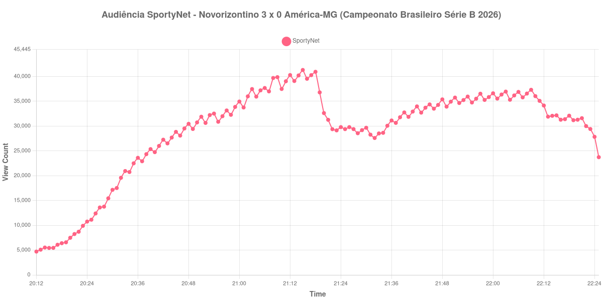

+++
date = 2026-08-24T04:04:00-03:00
draft = false
title = "Confira como foi a audiência de Novorizontino X América-MG na SportyNet - 20-08-2026"
author = 'Instituto Cambacica de Audiência'
summary = "Veja como foi a audiência do jogo que fechou a 23ª rodada da Série B na SportyNet, numa medição que terminou no mesmo minuto do apito final"
tags = ['YouTube', 'Analytics', 'Audiência', 'SportyNet', 'Novorizontino', 'America-MG', 'Serie-B']
categories = ['Audiência']
campeonatos = ['Serie B 2026']
data_evento = 2026-08-20
+++

Neste texto, vamos informar os resultados da audiência em tempo real obtidos pela SportyNet, durante a transmissão de Novorizontino X América-MG, jogo que fechou a 23ª rodada do Campeonato Brasileiro Série B de 2026, no Estádio Dr. Jorge Ismael de Biasi, em Novo Horizonte, em 20/08/2026. O Grêmio Novorizontino, mandante, venceu por 3 a 0, com gols de Patrick aos 22 minutos do primeiro tempo e de Robson e Carlão na etapa final. O público pagante foi de 1.287 pessoas.

A audiência começou a ser medida às 20/08/2026 20:12:55 (Horário de Brasília). Como a coleta começou menos de duas horas antes do apito inicial, o gráfico e os números abaixo partem do primeiro registro disponível; a medição também terminou antes de completar duas horas após o apito final, de modo que o recorte vai até o último dado coletado. Neste caso os dois limites praticamente coincidem — o último registro coletado cai no mesmo minuto em que o árbitro encerrou a partida —, e por isso o fim do jogo e o fim da medição aparecem numa única linha abaixo. Os principais pontos da audiência são (em aparelhos conectados):

* **Início da Medição (20:12:55): 4.706**
* **Início da partida (20:30:55): 17.152**
* Após o gol de Patrick, do Novorizontino, aos 22 minutos do primeiro tempo (20:52:55): 30.638
* Durante o intervalo (21:32:55): 27.598
* **Início do segundo tempo (21:33:55): 28.519**
* Após o gol de Robson, do Novorizontino, aos 80 minutos do segundo tempo (22:08:55): 36.554
* Após o gol de Carlão, do Novorizontino, aos 90 minutos do segundo tempo (22:18:55): 32.094
* **Final da partida e da Medição (22:25:55): 23.730**

O pico de audiência foi às 21:15:55, ainda no primeiro tempo, com **41.313** aparelhos conectados simultâneos.

O que chama atenção nesta curva é como ela reage pouco a uma goleada. O máximo da medição acontece nos minutos finais da etapa inicial, com 41.313 aparelhos conectados, e nenhum dos dois gols do segundo tempo devolve a transmissão a esse patamar: o de Robson, aos 80 minutos, é registrado com 36.554 aparelhos conectados, e o de Carlão, aos 90, já com 32.094 — ou seja, o terceiro gol do time da casa é acompanhado por menos gente do que o segundo. Entre o recomeço e o apito final, o saldo é de queda: de 28.519 para 23.730 aparelhos conectados, 17% a menos. O placar aberto cedo parece ter funcionado mais como permissão para sair do que como convite para ficar.

Vale registrar o contraste entre a audiência e o público no estádio. Foram 1.287 pessoas no Jorjão e mais de trinta mil aparelhos conectados acompanhando pela SportyNet ao longo de boa parte do jogo. Em escala, os 41.313 do pico colocam a partida na 18ª posição entre as 39 medições do lote e 31% abaixo da média das outras duas transmissões da Série B que acompanhamos, de 59.750 aparelhos conectados.

No gráfico a seguir, mostramos a evolução da audiência entre o primeiro registro da medição e o último registro coletado:

Para você verificar os metadados desta medição, você pode consultar o [repositório contendo o CSV com os dados e com os prints do minuto a minuto da medição](https://github.com/institutocambacica/audiencias_20_23_08_2026/tree/main/2026-08-20_novorizontino-x-america-mg_Z3T9nS4S6BI).

---

*Para mais informações sobre nossa metodologia, visite nossa página [Sobre](/sobre).*
