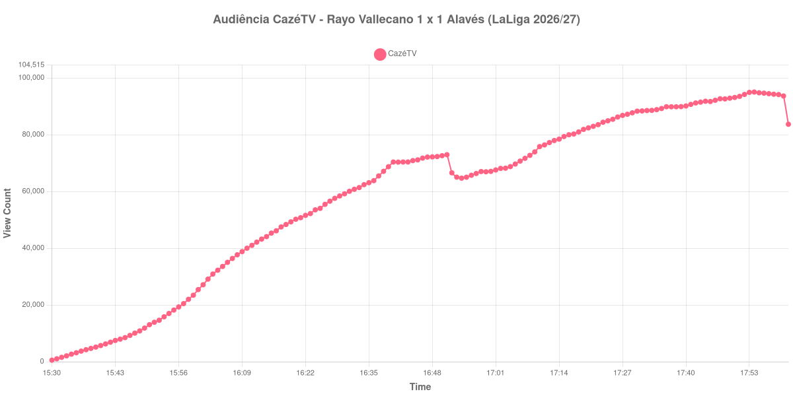

+++
date = 2026-08-24T04:02:00-03:00
draft = false
title = "Confira como foi a audiência de Rayo Vallecano X Alavés na CazéTV - 20-08-2026"
author = 'Instituto Cambacica de Audiência'
summary = "Veja como foi a audiência de um jogo da LaLiga na CazéTV, numa curva que subiu até o apito final e teve o ponto mais alto no último minuto de jogo"
tags = ['YouTube', 'Analytics', 'Audiência', 'CazeTV', 'Rayo Vallecano', 'Alaves', 'LaLiga']
categories = ['Audiência']
canais = ['CazeTV']
campeonatos = ['LaLiga 2026']
data_evento = 2026-08-20
+++

Neste texto, vamos informar os resultados da audiência em tempo real obtidos pela CazéTV, durante a transmissão de Rayo Vallecano X Alavés, jogo da 2ª rodada de LaLiga de 2026/27, em 20/08/2026. A partida terminou empatada em 1 a 1, com gols de Sergio Camello para o Rayo Vallecano e de Mariano Díaz para o Alavés, ambos no segundo tempo. O Rayo Vallecano era o mandante, mas não jogou em casa: a partida foi transferida de Vallecas para o Estádio Municipal de Butarque, em Leganés, por razões de segurança, e o público oficial foi de apenas 4.280 pessoas, número afetado pelo boicote das torcidas organizadas rayistas à mudança de sede.

A audiência começou a ser medida às 20/08/2026 15:30:55 (Horário de Brasília). Como a coleta começou menos de duas horas antes do apito inicial, o gráfico e os números abaixo partem do primeiro registro disponível; a medição também terminou antes de completar duas horas após o apito final, de modo que o recorte vai até o último dado coletado. Os principais pontos da audiência são (em aparelhos conectados):

* **Início da Medição (15:30:55): 530**
* **Início da partida (16:00:55): 25.402**
* Durante o intervalo (16:54:55): 64.670
* **Início do segundo tempo (17:04:55): 68.741**
* Após o gol de Sergio Camello, do Rayo Vallecano, aos 48 minutos do segundo tempo (17:07:55): 71.656
* Após o gol de Mariano Díaz, do Deportivo Alavés, aos 84 minutos do segundo tempo (17:43:55): 91.455
* **Final da partida (17:55:55): 94.750**
* **Final da Medição (18:01:55): 83.660**

O pico de audiência foi às 17:54:55, no último minuto de jogo, com **95.013** aparelhos conectados simultâneos.

Esta é uma curva incomum no conjunto que medimos, e o que a distingue é a direção. Na maioria das transmissões o ponto mais alto aparece em algum momento do primeiro tempo ou logo depois de um gol, e o restante do jogo é uma descida. Aqui acontece o contrário: a audiência sobe do apito inicial ao apito final sem interrupção relevante, de 25.402 aparelhos conectados às 16:00:55 para 94.750 às 17:55:55. Nem o intervalo desfaz o movimento — a queda até 64.670 é modesta, e o recomeço já devolve 68.741, acima do que havia antes da pausa.

O empate tardio explica boa parte do último trecho. O gol de Camello, aos 48 minutos, encontrou a transmissão com 71.656 aparelhos conectados; o de Mariano Díaz, aos 84, já com 91.455 — uma alta de 28% ao longo dos trinta e seis minutos em que o placar esteve aberto por um gol de diferença. O máximo da medição vem no minuto seguinte ao empate, e a queda só começa depois que o árbitro encerra a partida. Em escala, os 95.013 aparelhos conectados do pico colocam esta medição na 12ª posição entre as 39 do lote, mas 74% abaixo da média das outras seis transmissões de LaLiga que acompanhamos, de 366.902 aparelhos conectados — um lembrete de que, dentro da mesma competição e do mesmo canal, o peso dos clubes em campo separa as audiências por ordens de grandeza.

No gráfico a seguir, mostramos a evolução da audiência entre o primeiro registro da medição e o último registro coletado:

Para você verificar os metadados desta medição, você pode consultar o [repositório contendo o CSV com os dados e com os prints do minuto a minuto da medição](https://github.com/institutocambacica/audiencias_20_23_08_2026/tree/main/2026-08-20_rayo-vallecano-x-alaves_bF5BaemOCzQ).

---

*Para mais informações sobre nossa metodologia, visite nossa página [Sobre](/sobre).*
