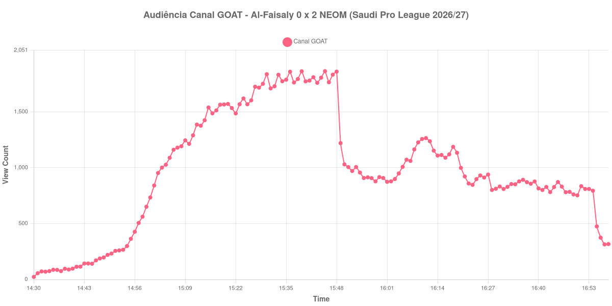

+++
date = 2026-08-24T04:12:00-03:00
draft = false
title = "Confira como foi a audiência de Al-Faisaly X NEOM no Canal GOAT - 21-08-2026"
author = 'Instituto Cambacica de Audiência'
summary = "Veja como foi a audiência da menor transmissão do Canal GOAT no lote, com um pico no primeiro tempo que o resto do jogo não alcançou"
tags = ['YouTube', 'Analytics', 'Audiência', 'Canal-GOAT', 'Al-Faisaly', 'NEOM', 'Saudi Pro League']
categories = ['Audiência']
canais = ['Canal GOAT']
campeonatos = ['Saudi Pro League 2026']
data_evento = 2026-08-21
+++

Neste texto, vamos informar os resultados da audiência em tempo real obtidos pelo Canal GOAT, durante a transmissão de Al-Faisaly X NEOM, jogo da 2ª rodada da Saudi Pro League de 2026/27, no Al-Majma'ah Sports City Stadium, em Al-Majmaah, em 21/08/2026. O Al-Faisaly era o mandante e perdeu por 2 a 0, com os dois gols marcados por Alexandre Lacazette na etapa final. O público presente não foi divulgado por nenhuma das fontes que consultamos.

A audiência começou a ser medida às 21/08/2026 14:30:55 (Horário de Brasília). Como a coleta começou menos de duas horas antes do apito inicial, o gráfico e os números abaixo partem do primeiro registro disponível; a medição também terminou antes de completar duas horas após o apito final, de modo que o recorte vai até o último dado coletado. Os principais pontos da audiência são (em aparelhos conectados):

* **Início da Medição (14:30:55): 23**
* **Início da partida (15:00:55): 734**
* Durante o intervalo (16:01:55): 874
* **Início do segundo tempo (16:03:55): 899**
* Após o gol de Alexandre Lacazette, do NEOM, aos 51 minutos do segundo tempo (16:09:55): 1.227
* Após o gol de Alexandre Lacazette, do NEOM, aos 60 minutos do segundo tempo (16:18:55): 1.187
* **Final da partida (16:44:55): 827**
* **Final da Medição (16:58:55): 317**

O pico de audiência foi às 15:45:55, ainda no primeiro tempo, com **1.864** aparelhos conectados simultâneos.

O traço mais forte desta curva é a distância entre o pico e todo o resto. Os 1.864 aparelhos conectados do máximo, alcançados perto do fim da primeira etapa, são mais do que o dobro de qualquer número registrado depois do intervalo: nem os dois gols de Lacazette, que levaram a transmissão a 1.227 e 1.187 aparelhos conectados, chegam perto disso. O segundo tempo termina praticamente onde começou, de 899 para 827 aparelhos conectados, uma variação de 8% para baixo ao longo de quarenta e cinco minutos em que o placar mudou duas vezes.

Em escala, esta é a menor das seis transmissões da Saudi Pro League que acompanhamos e a 8ª das 9 medições do Canal GOAT, com os 1.864 do pico ficando 94% abaixo dos 30.499 aparelhos conectados de média das outras cinco partidas sauditas. O contraste dentro do próprio canal, no mesmo dia, é o dado mais revelador do conjunto: [Al-Riyadh X Al-Nassr](/posts/2026-08-21-al-riyadh-x-al-nassr-canal-goat/) chegou a 69.463 aparelhos conectados e [Al-Qadsiah X Al-Ittihad](/posts/2026-08-21-al-qadsiah-x-al-ittihad-canal-goat/), a 39.084. Mesma competição, mesma rodada, mesmo canal, mesma tarde — e duas ordens de grandeza de diferença conforme os clubes em campo.

No gráfico a seguir, mostramos a evolução da audiência entre o primeiro registro da medição e o último registro coletado:

Para você verificar os metadados desta medição, você pode consultar o [repositório contendo o CSV com os dados e com os prints do minuto a minuto da medição](https://github.com/institutocambacica/audiencias_20_23_08_2026/tree/main/2026-08-21_al-faisaly-x-neom_q5fdeSpgPQM).

---

*Para mais informações sobre nossa metodologia, visite nossa página [Sobre](/sobre).*
