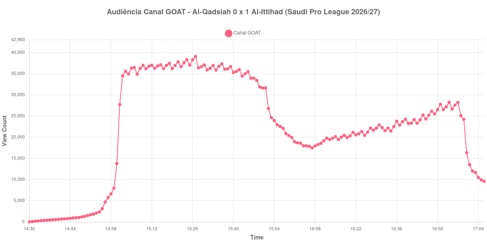

+++
date = 2026-08-24T04:14:00-03:00
draft = false
title = "Confira como foi a audiência de Al-Qadsiah X Al-Ittihad no Canal GOAT - 21-08-2026"
author = 'Instituto Cambacica de Audiência'
summary = "Veja como foi a audiência de um jogo decidido nos acréscimos do primeiro tempo no Canal GOAT, com a curva crescendo enquanto o vencedor jogava com um a menos"
tags = ['YouTube', 'Analytics', 'Audiência', 'Canal-GOAT', 'Al-Qadsiah', 'Al-Ittihad', 'Saudi Pro League']
categories = ['Audiência']
campeonatos = ['Saudi Pro League 2026']
data_evento = 2026-08-21
+++

Neste texto, vamos informar os resultados da audiência em tempo real obtidos pelo Canal GOAT, durante a transmissão de Al-Qadsiah X Al-Ittihad, jogo da 2ª rodada da Saudi Pro League de 2026/27, no Estádio Príncipe Mohammed bin Fahd, em Dammam, em 21/08/2026. O Al-Qadsiah, mandante, perdeu por 1 a 0, com gol de George Ilenikhena nos acréscimos do primeiro tempo. Dois minutos depois do recomeço, aos 47, o Al-Ittihad ficou com um jogador a menos, com a expulsão de Dion Lopy, e ainda assim segurou o resultado. O público presente não foi divulgado por nenhuma das fontes que consultamos.

A audiência começou a ser medida às 21/08/2026 14:30:55 (Horário de Brasília). Como a coleta começou menos de duas horas antes do apito inicial, o gráfico e os números abaixo partem do primeiro registro disponível; a medição também terminou antes de completar duas horas após o apito final, de modo que o recorte vai até o último dado coletado. Os principais pontos da audiência são (em aparelhos conectados):

* **Início da Medição (14:30:55): 25**
* **Início da partida (15:00:55): 13.821**
* Após o gol de George Ilenikhena, do Al-Ittihad, aos 45+1 minutos do primeiro tempo (15:46:55): 33.980
* Durante o intervalo (16:07:55): 17.500
* **Início do segundo tempo (16:08:55): 17.964**
* **Final da partida (16:55:55): 26.674**
* **Final da Medição (17:06:55): 9.583**

O pico de audiência foi às 15:27:55, ainda no primeiro tempo, com **39.084** aparelhos conectados simultâneos.

A leitura mais interessante desta curva está no segundo tempo. Depois de o intervalo derrubar a audiência de 33.980 para 17.500 aparelhos conectados, a partida recomeça com 17.964 e termina com 26.674, uma recuperação de 48%. Isso acontece justamente na etapa em que o Al-Ittihad jogou desfalcado desde os 47 minutos: um jogo de um gol de diferença, com um time a mais em campo até o fim, é exatamente o tipo de situação que segura espectador, e a curva registra esse efeito com clareza.

O pico, porém, ficou para trás. Ele acontece aos vinte e sete minutos da etapa inicial, com 39.084 aparelhos conectados, antes mesmo do gol que decidiu a partida — nem o gol de Ilenikhena nem a expulsão levaram a transmissão de volta a esse patamar. Em escala, é a 2ª maior das 9 medições do Canal GOAT no lote e a 2ª das 6 partidas da Saudi Pro League, com os 39.084 do pico 70% acima dos 23.055 aparelhos conectados de média das outras cinco transmissões sauditas. No mesmo canal e na mesma tarde, [Al-Riyadh X Al-Nassr](/posts/2026-08-21-al-riyadh-x-al-nassr-canal-goat/) chegou a 69.463 aparelhos conectados e [Al-Faisaly X NEOM](/posts/2026-08-21-al-faisaly-x-neom-canal-goat/) parou em 1.864.

No gráfico a seguir, mostramos a evolução da audiência entre o primeiro registro da medição e o último registro coletado:

Para você verificar os metadados desta medição, você pode consultar o [repositório contendo o CSV com os dados e com os prints do minuto a minuto da medição](https://github.com/institutocambacica/audiencias_20_23_08_2026/tree/main/2026-08-21_al-qadsiah-x-al-ittihad_TYHyts1tgxg).

---

*Para mais informações sobre nossa metodologia, visite nossa página [Sobre](/sobre).*
