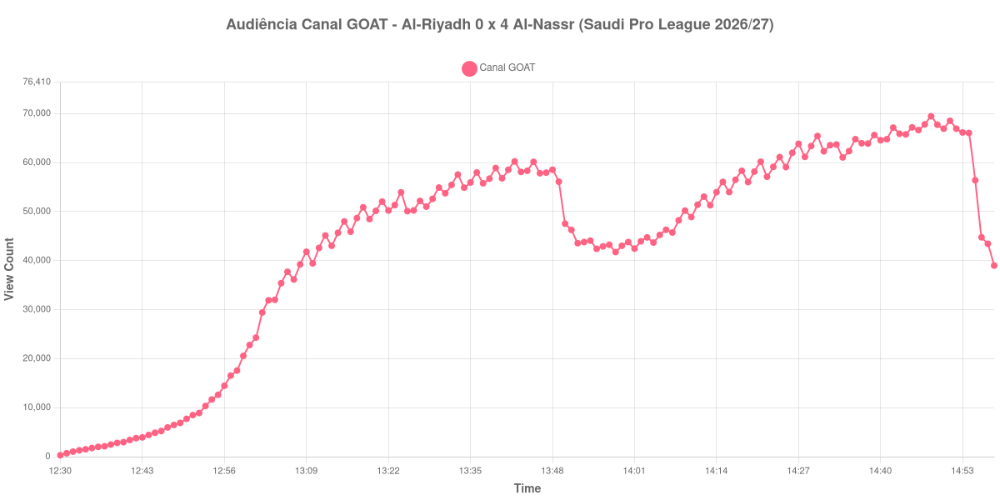

+++
date = 2026-08-24T04:10:00-03:00
draft = false
title = "Confira como foi a audiência de Al-Riyadh X Al-Nassr no Canal GOAT - 21-08-2026"
author = 'Instituto Cambacica de Audiência'
summary = "Veja como foi a audiência do jogo com gol de Cristiano Ronaldo no Canal GOAT, a maior medição do canal em todo o lote"
tags = ['YouTube', 'Analytics', 'Audiência', 'Canal-GOAT', 'Al-Riyadh', 'Al-Nassr', 'Saudi Pro League']
categories = ['Audiência']
campeonatos = ['Saudi Pro League 2026']
data_evento = 2026-08-21
+++

Neste texto, vamos informar os resultados da audiência em tempo real obtidos pelo Canal GOAT, durante a transmissão de Al-Riyadh X Al-Nassr, jogo da 2ª rodada da Saudi Pro League de 2026/27, no Estádio Príncipe Faisal bin Fahd, em Riade, em 21/08/2026. O Al-Riyadh, mandante, perdeu por 4 a 0, com gols de Abdulelah Al-Amri e Angelo Gabriel no primeiro tempo e de João Félix e Cristiano Ronaldo no segundo. O público presente não foi divulgado por nenhuma das fontes que consultamos.

A audiência começou a ser medida às 21/08/2026 12:30:55 (Horário de Brasília). Como a coleta começou menos de duas horas antes do apito inicial, o gráfico e os números abaixo partem do primeiro registro disponível; a medição também terminou antes de completar duas horas após o apito final, de modo que o recorte vai até o último dado coletado. Os principais pontos da audiência são (em aparelhos conectados):

* **Início da Medição (12:30:55): 296**
* **Início da partida (13:00:55): 22.780**
* Após o gol de Abdulelah Al-Amri, do Al-Nassr, aos 18 minutos do primeiro tempo (13:18:55): 50.873
* Após o gol de Angelo Gabriel, do Al-Nassr, aos 45+1 minutos do primeiro tempo (13:46:55): 57.834
* Durante o intervalo (13:58:55): 41.752
* **Início do segundo tempo (14:04:55): 43.688**
* Após o gol de João Félix, do Al-Nassr, aos 58 minutos do segundo tempo (14:17:55): 56.494
* Após o gol de Cristiano Ronaldo, do Al-Nassr, aos 83 minutos do segundo tempo (14:42:55): 67.134
* **Final da partida (14:49:55): 67.732**
* **Final da Medição (14:58:55): 38.989**

O pico de audiência foi às 14:48:55, no minuto anterior ao apito final, com **69.463** aparelhos conectados simultâneos.

Ao contrário do que costuma acontecer numa goleada, aqui a audiência cresceu conforme o placar se abriu. O segundo tempo sai de 43.688 aparelhos conectados no recomeço para 67.732 no apito final, uma alta de 55%, e o máximo da medição chega no penúltimo minuto de jogo. O gol de Cristiano Ronaldo, aos 83 minutos, é o ponto de inflexão visível: os 67.134 aparelhos conectados registrados logo depois dele são quase 19% acima dos 56.494 do gol anterior, de João Félix, e a curva não recua mais até o fim da partida.

Nenhuma outra transmissão do Canal GOAT chegou perto disso no lote. Esta foi a 1ª das 9 medições do canal e também a maior das 6 partidas da Saudi Pro League que acompanhamos, com os 69.463 do pico ficando 309% acima dos 16.980 aparelhos conectados de média das outras cinco partidas sauditas. No mesmo canal e no mesmo dia, a diferença fica ainda mais nítida — o Canal GOAT exibiu [Al-Qadsiah X Al-Ittihad](/posts/2026-08-21-al-qadsiah-x-al-ittihad-canal-goat/), que chegou a 39.084 aparelhos conectados, e [Al-Faisaly X NEOM](/posts/2026-08-21-al-faisaly-x-neom-canal-goat/), com 1.864. Um único nome em campo parece explicar boa parte dessa diferença.

No gráfico a seguir, mostramos a evolução da audiência entre o primeiro registro da medição e o último registro coletado:

Para você verificar os metadados desta medição, você pode consultar o [repositório contendo o CSV com os dados e com os prints do minuto a minuto da medição](https://github.com/institutocambacica/audiencias_20_23_08_2026/tree/main/2026-08-21_al-riyadh-x-al-nassr_CuUKvR-LoXo).

---

*Para mais informações sobre nossa metodologia, visite nossa página [Sobre](/sobre).*
