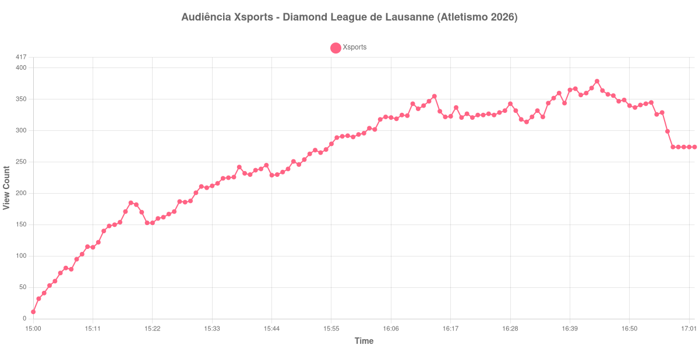

+++
date = 2026-08-24T04:08:00-03:00
draft = false
title = "Confira como foi a audiência da Diamond League de Lausanne na Xsports - 21-08-2026"
author = 'Instituto Cambacica de Audiência'
summary = "Veja como foi a audiência da etapa de Lausanne da Diamond League na Xsports, a menor medição de todo o lote"
tags = ['YouTube', 'Analytics', 'Audiência', 'Xsports', 'Atletismo', 'Lausanne', 'Diamond League']
categories = ['Audiência']
campeonatos = ['Diamond League 2026']
data_evento = 2026-08-21
+++

Neste texto, vamos informar os resultados da audiência em tempo real obtidos pela Xsports, durante a transmissão da etapa de Lausanne da Diamond League, o Athletissima, disputado no Stade Olympique de la Pontaise em 21/08/2026. Não se trata de um jogo, e sim de uma competição de atletismo com dezenas de provas em sequência: não há apito inicial, intervalo nem apito final a registrar, e por isso a medição se resume aos dois extremos da janela coletada e ao ponto mais alto que a curva alcançou dentro dela. A sessão principal começou às 20:00 no horário local, o que corresponde a 15:00 em Brasília, exatamente o minuto em que nossa coleta capturou o primeiro registro. O público presente não foi divulgado em número oficial por nenhuma das fontes que consultamos.

A audiência começou a ser medida às 21/08/2026 15:00:55 (Horário de Brasília), com 11 aparelhos conectados no primeiro registro, ou seja, com a transmissão recém-entrada no ar. Não foi possível confirmar o horário de encerramento da transmissão em fonte independente, de modo que listamos apenas os pontos que a própria medição sustenta. Os principais pontos da audiência são (em aparelhos conectados):

* **Início da Medição (15:00:55): 11**
* **Final da Medição (17:02:55): 274**

O pico de audiência foi às 16:44:55, com **379** aparelhos conectados simultâneos.

Os 379 aparelhos conectados do pico fazem desta a menor das 39 medições do lote, na 39ª posição do ranking. A distância para o topo é o dado mais eloquente: a maior medição do conjunto, [Palmeiras X Vasco](/posts/2026-08-23-palmeiras-x-vasco-getv/) na ge tv, chegou a 1.229.213 aparelhos conectados simultâneos. São mais de três ordens de grandeza separando as duas transmissões, no mesmo levantamento, na mesma plataforma e na mesma semana.

Ainda assim, a curva não é a de um fracasso. Ela parte de 11 aparelhos conectados, cresce ao longo de toda a sessão e termina em 274, perto do máximo — o comportamento de uma transmissão que foi acumulando espectadores até o fim do que estava no ar, e não o de uma que foi abandonada. A etapa suíça teve noite forte, com quatro recordes do meeting caindo, entre eles os 46,67 de Rai Benjamin nos 400 metros com barreiras, marca que superou um registro que pertencia a Edwin Moses desde 1981. Nada disso se traduziu em audiência de massa no Brasil, mas o público que estava lá ficou.

No gráfico a seguir, mostramos a evolução da audiência entre o primeiro registro da medição e o último registro coletado:

Para você verificar os metadados desta medição, você pode consultar o [repositório contendo o CSV com os dados e com os prints do minuto a minuto da medição](https://github.com/institutocambacica/audiencias_20_23_08_2026/tree/main/2026-08-21_atletismo-diamond-league_olVYq7QTImM).

---

*Para mais informações sobre nossa metodologia, visite nossa página [Sobre](/sobre).*
