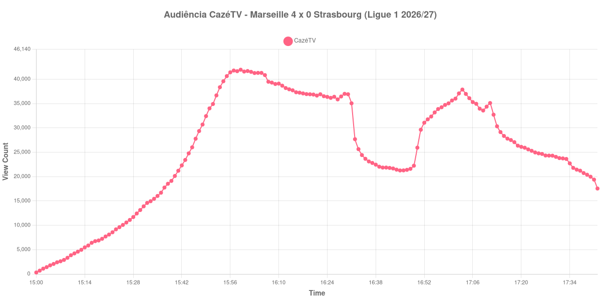

+++
date = 2026-08-24T04:18:00-03:00
draft = false
title = "Confira como foi a audiência de Marseille X Strasbourg na CazéTV - 21-08-2026"
author = 'Instituto Cambacica de Audiência'
summary = "Veja como foi a audiência da abertura da Ligue 1 na CazéTV, numa medição que se encerrou no mesmo minuto do apito final"
tags = ['YouTube', 'Analytics', 'Audiência', 'CazeTV', 'Marseille', 'Strasbourg', 'Ligue 1']
categories = ['Audiência']
campeonatos = ['Ligue 1 2026']
data_evento = 2026-08-21
+++

Neste texto, vamos informar os resultados da audiência em tempo real obtidos pela CazéTV, durante a transmissão de Marseille X Strasbourg, jogo de abertura da 1ª rodada da Ligue 1 de 2026/27, no Orange Vélodrome, em Marselha, em 21/08/2026. O Olympique de Marseille, mandante, venceu por 4 a 0, com dois gols de Amine Gouiri — o segundo de pênalti —, um de Keyliane Abdallah e um de Pierre-Emile Højbjerg nos acréscimos. O Strasbourg terminou com um a menos, por conta da expulsão de Samir El Mourabet aos 59 minutos. O público presente foi de 65.089 pessoas.

A audiência começou a ser medida às 21/08/2026 15:00:55 (Horário de Brasília). Como a coleta começou menos de duas horas antes do apito inicial, o gráfico e os números abaixo partem do primeiro registro disponível; a medição também terminou antes de completar duas horas após o apito final, de modo que o recorte vai até o último dado coletado. Neste caso o recorte é especialmente curto no fim: o último registro coletado veio no minuto seguinte ao gol de Højbjerg, com o jogo ainda nos acréscimos, e por isso não há um marco de apito final na lista abaixo — a medição se encerrou junto com a partida. Os principais pontos da audiência são (em aparelhos conectados):

* **Início da Medição (15:00:55): 312**
* **Início da partida (15:45:55): 26.012**
* Durante o intervalo (16:45:55): 21.262
* **Início do segundo tempo (16:50:55): 25.942**
* Após o gol de Amine Gouiri, do Marseille, aos 46 minutos do segundo tempo (16:51:55): 29.626
* Após o gol de Amine Gouiri (pênalti), do Marseille, aos 68 minutos do segundo tempo (17:13:55): 30.333
* Após o gol de Keyliane Abdallah, do Marseille, aos 89 minutos do segundo tempo (17:34:55): 22.716
* Após o gol de Pierre-Emile Højbjerg, do Marseille, aos 90+6 minutos do segundo tempo (17:41:55): 19.378
* **Final da Medição (17:42:55): 17.552**

O pico de audiência foi às 15:59:55, nos primeiros minutos de jogo, com **41.945** aparelhos conectados simultâneos.

O que esta curva mostra é uma goleada que espantou público em vez de atrair. O máximo aparece quatorze minutos depois do apito inicial, com 41.945 aparelhos conectados, e a partir daí a transmissão só perde audiência: o terceiro gol do Marseille, aos 89 minutos, é registrado com 22.716 aparelhos conectados, e o quarto, nos acréscimos, com 19.378 — menos da metade dos 41.945 do ponto mais alto. Os dois primeiros gols ainda encontram a curva reagindo, com 29.626 e 30.333 aparelhos conectados, mas o placar de 3 a 0 e depois 4 a 0 foi acompanhado por uma saída contínua.

Um detalhe merece registro: o horário do apito inicial que adotamos, 15:45, vem das fontes da competição, e o vale que a nossa curva desenha entre 16:45 e 16:50 é compatível com ele. É esse vale que usamos para posicionar o intervalo e o recomeço. Em escala, os 41.945 aparelhos conectados do pico colocam a partida na 16ª posição entre as 39 do lote e 37% acima dos 30.626 de média das outras oito transmissões da Ligue 1 que acompanhamos — a 3ª maior das 9 partidas da competição no conjunto. No mesmo canal e no mesmo dia, ficou bem atrás de [Real Betis X Real Sociedad](/posts/2026-08-21-real-betis-x-real-sociedad-cazetv/), que chegou a 212.232 aparelhos conectados.

No gráfico a seguir, mostramos a evolução da audiência entre o primeiro registro da medição e o último registro coletado:

Para você verificar os metadados desta medição, você pode consultar o [repositório contendo o CSV com os dados e com os prints do minuto a minuto da medição](https://github.com/institutocambacica/audiencias_20_23_08_2026/tree/main/2026-08-21_marseille-x-strasbourg_z9tBGyFpiCY).

---

*Para mais informações sobre nossa metodologia, visite nossa página [Sobre](/sobre).*
