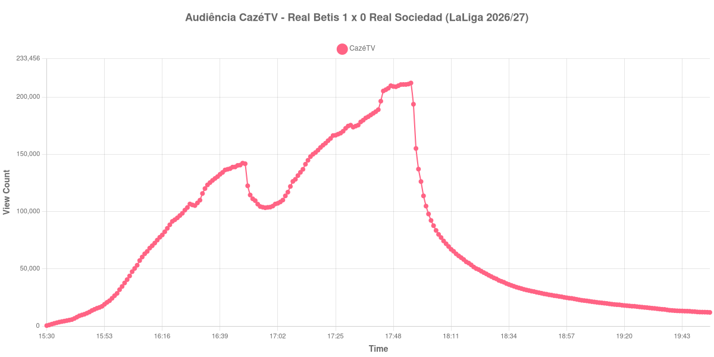

+++
date = 2026-08-24T04:20:00-03:00
draft = false
title = "Confira como foi a audiência de Real Betis X Real Sociedad na CazéTV - 21-08-2026"
author = 'Instituto Cambacica de Audiência'
summary = "Veja como foi a audiência de um 1 a 0 da LaLiga na CazéTV, com a audiência dobrando no segundo tempo e o pico no apito final"
tags = ['YouTube', 'Analytics', 'Audiência', 'CazeTV', 'Real Betis', 'Real Sociedad', 'LaLiga']
categories = ['Audiência']
canais = ['CazeTV']
campeonatos = ['LaLiga 2026']
data_evento = 2026-08-21
+++

Neste texto, vamos informar os resultados da audiência em tempo real obtidos pela CazéTV, durante a transmissão de Real Betis X Real Sociedad, jogo da 2ª rodada de LaLiga de 2026/27, no Estádio de La Cartuja, em Sevilha, em 21/08/2026. O Real Betis, mandante, venceu por 1 a 0, com gol de Rodrigo Riquelme aos 63 minutos. O público presente foi de 59.490 pessoas.

A audiência começou a ser medida às 21/08/2026 15:30:55 (Horário de Brasília). Como a coleta começou menos de duas horas antes do apito inicial, o gráfico e os números abaixo partem do primeiro registro disponível. Os principais pontos da audiência são (em aparelhos conectados):

* **Início da Medição (15:30:55): 407**
* **Início da partida (16:00:55): 34.560**
* Durante o intervalo (16:57:55): 103.304
* **Início do segundo tempo (17:02:55): 107.196**
* Após o gol de Rodrigo Riquelme, do Real Betis, aos 63 minutos do segundo tempo (17:20:55): 157.908
* **Final da partida (17:54:55): 211.282**
* **Final da Medição (19:54:55): 11.927**

O pico de audiência foi às 17:55:55, no minuto seguinte ao apito final, com **212.232** aparelhos conectados simultâneos.

Esta curva é o oposto exato da que Marseille x Strasbourg desenhou horas antes no mesmo canal. Aqui a audiência cresce do começo ao fim, sem que o intervalo interrompa o movimento: 34.560 aparelhos conectados no apito inicial e 103.304 no ponto mais baixo da pausa. Do recomeço ao apito final, a transmissão praticamente dobrou de tamanho, saindo de 107.196 para 211.282 aparelhos conectados, uma alta de 97%, e o máximo só apareceu depois de o árbitro apitar.

O gol único de Riquelme, aos 63 minutos, é registrado com 157.908 aparelhos conectados, e o que vem depois dele é o trecho mais revelador: um jogo de 1 a 0 nos últimos trinta minutos manteve o público chegando, e não saindo. O esvaziamento veio todo depois: trinta minutos após o apito final restavam 46.703 aparelhos conectados, ou 22% dos 211.282 do encerramento, e uma hora depois, 25.858. Em escala, os 212.232 do pico colocam esta medição na 7ª posição entre as 39 do lote, embora ainda 39% abaixo dos 347.365 aparelhos conectados de média das outras seis transmissões de LaLiga que acompanhamos.

No gráfico a seguir, mostramos a evolução da audiência entre duas horas antes do início da partida e duas horas após o seu encerramento:

Para você verificar os metadados desta medição, você pode consultar o [repositório contendo o CSV com os dados e com os prints do minuto a minuto da medição](https://github.com/institutocambacica/audiencias_20_23_08_2026/tree/main/2026-08-21_real-betis-x-real-sociedad_kEc4rrndpqU).

---

*Para mais informações sobre nossa metodologia, visite nossa página [Sobre](/sobre).*
