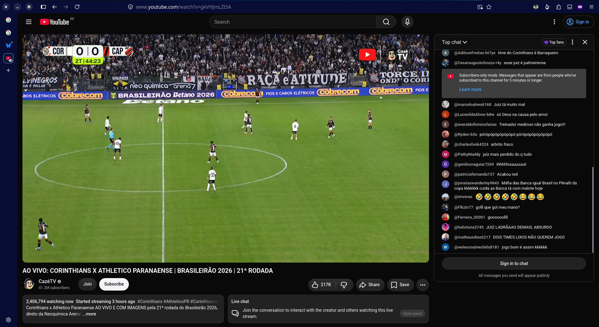

+++
date = 2026-08-21T08:32:00-03:00
draft = false
title = "Confira como foi a audiência de Corinthians X Athletico Paranaense na CazéTV (30/07/2026)"
author = 'Instituto Cambacica de Audiência'
summary = "Veja como foi a audiência do jogo da CazéTV"
tags = ['YouTube', 'Analytics', 'Audiência', 'CazéTV', 'Corinthians', 'Athletico Paranaense', 'Brasileirao']
categories = ['Audiência']
canais = ['CazeTV']
campeonatos = ['Brasileirao 2026']
data_evento = 2026-07-30
+++

Por questões técnicas, não pudemos medir o jogo Corinthians X Athletico Paranaense, ocorrido em 30/07/2026.

Contudo, registramos a audiência às 21h22, perto do final do jogo, como pode ser visto no print abaixo, registrando a marca de **2.406.794** usuários simultâneos naquele momento.

---

*Para mais informações sobre nossa metodologia, visite nossa página [Sobre](/sobre).*
