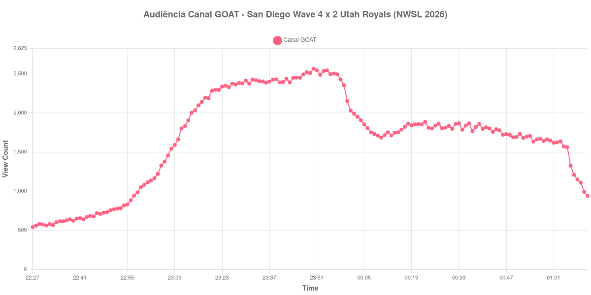

+++
date = 2026-08-24T04:22:00-03:00
draft = false
title = "Confira como foi a audiência de San Diego Wave X Utah Royals no Canal GOAT - 21-08-2026"
author = 'Instituto Cambacica de Audiência'
summary = "Veja como foi a audiência de um jogo da NWSL no Canal GOAT, numa curva pequena demais para desenhar o vale do intervalo"
tags = ['YouTube', 'Analytics', 'Audiência', 'Canal-GOAT', 'San Diego Wave', 'Utah Royals', 'NWSL']
categories = ['Audiência']
campeonatos = ['NWSL 2026']
data_evento = 2026-08-21
+++

Neste texto, vamos informar os resultados da audiência em tempo real obtidos pelo Canal GOAT, durante a transmissão de San Diego Wave X Utah Royals, jogo da 17ª rodada da NWSL de 2026, no Snapdragon Stadium, em San Diego, em 21/08/2026. O San Diego Wave, mandante, venceu por 4 a 2, com dois gols de Trinity Byars, um de Melanie Barcenas e um de Ludmila, contra dois de Mina Tanaka pelo Utah Royals. O público presente foi de 11.210 pessoas.

A audiência começou a ser medida às 21/08/2026 22:27:55 (Horário de Brasília). Como a coleta começou menos de duas horas antes do apito inicial, o gráfico e os números abaixo partem do primeiro registro disponível; a medição também terminou antes de completar duas horas após o apito final, de modo que o recorte vai até o último dado coletado. Nesta transmissão, o intervalo não deixou assinatura identificável na curva: a queda que se observa a partir do fim do primeiro tempo é gradual e contínua, sem o degrau de dois minutos que marca o apito nas demais medições do lote, e por isso não listamos um marco de intervalo — preferimos não posicionar o que os dados não sustentam. Os principais pontos da audiência são (em aparelhos conectados):

* **Início da Medição (22:27:55): 541**
* **Início da partida (23:00:55): 1.083**
* Após o gol de Trinity Byars, do San Diego Wave, aos 4 minutos do primeiro tempo (23:04:55): 1.223
* Após o gol de Mina Tanaka, do Utah Royals, aos 29 minutos do primeiro tempo (23:29:55): 2.379
* Após o gol de Melanie Barcenas, do San Diego Wave, aos 40 minutos do primeiro tempo (23:40:55): 2.393
* Após o gol de Mina Tanaka, do Utah Royals, aos 47 minutos do segundo tempo (00:04:55): 1.908
* Após o gol de Trinity Byars, do San Diego Wave, aos 63 minutos do segundo tempo (00:20:55): 1.856
* Após o gol de Ludmila, do San Diego Wave, aos 70 minutos do segundo tempo (00:27:55): 1.864
* **Final da partida (00:56:55): 1.663**
* **Final da Medição (01:11:55): 941**

O pico de audiência foi às 23:50:55, na reta final do primeiro tempo, com **2.568** aparelhos conectados simultâneos.

Seis gols e a audiência mal se mexe: é isso que esta curva mostra. Do terceiro gol em diante, todos os registros ficam numa faixa entre 1.663 e 1.908 aparelhos conectados, e nem os dois gols que fecharam o placar em 4 a 2 alteraram o patamar. O ponto mais alto, 2.568 aparelhos conectados, acontece no fim da primeira etapa e não é retomado em nenhum momento do segundo tempo.

É essa mesma pequenez que explica por que não conseguimos marcar o intervalo. Numa transmissão que oscila entre mil e dois mil e quinhentos aparelhos conectados, a variação minuto a minuto do próprio contador tem magnitude parecida com a do efeito que procuramos, e forçar um marco ali seria apresentar ruído como evento. Em escala, os 2.568 do pico colocam a partida na 30ª posição entre as 39 do lote e 89% abaixo dos 23.002 aparelhos conectados de média das outras oito medições do Canal GOAT. Foi, ainda assim, a maior das duas transmissões da NWSL que acompanhamos: [Portland Thorns X Denver Summit](/posts/2026-08-22-portland-thorns-x-denver-summit-canal-goat/), no dia seguinte, chegou a 1.937 aparelhos conectados.

No gráfico a seguir, mostramos a evolução da audiência entre o primeiro registro da medição e o último registro coletado:

Para você verificar os metadados desta medição, você pode consultar o [repositório contendo o CSV com os dados e com os prints do minuto a minuto da medição](https://github.com/institutocambacica/audiencias_20_23_08_2026/tree/main/2026-08-21_san-diego-wave-x-utah-royals_zsqO7gLYSJU).

---

*Para mais informações sobre nossa metodologia, visite nossa página [Sobre](/sobre).*
