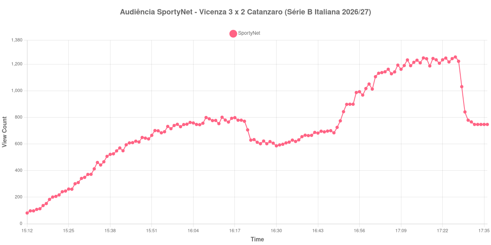

+++
date = 2026-08-24T04:16:00-03:00
draft = false
title = "Confira como foi a audiência de Vicenza X Catanzaro na SportyNet - 21-08-2026"
author = 'Instituto Cambacica de Audiência'
summary = "Veja como foi a audiência da estreia da Série B italiana na SportyNet, numa virada que dobrou a audiência do segundo tempo"
tags = ['YouTube', 'Analytics', 'Audiência', 'SportyNet', 'Vicenza', 'Catanzaro', 'Serie B Italiana']
categories = ['Audiência']
canais = ['SportyNet']
campeonatos = ['Serie B Italiana 2026']
data_evento = 2026-08-21
+++

Neste texto, vamos informar os resultados da audiência em tempo real obtidos pela SportyNet, durante a transmissão de Vicenza X Catanzaro, jogo da 1ª rodada da Série B Italiana de 2026/27, no Stadio Romeo Menti, em Vicenza, em 21/08/2026. O Vicenza, mandante e recém-promovido de volta à divisão, venceu por 3 a 2 de virada, com gols de Giuseppe Cuomo, Alessandro Pietrelli e Claudio Morra, contra os de Marco D'Alessandro e Bruno Verrengia pelo Catanzaro. O público presente foi de 10.960 pessoas.

A audiência começou a ser medida às 21/08/2026 15:12:55 (Horário de Brasília). Como a coleta começou menos de duas horas antes do apito inicial, o gráfico e os números abaixo partem do primeiro registro disponível; a medição também terminou antes de completar duas horas após o apito final, de modo que o recorte vai até o último dado coletado. Os principais pontos da audiência são (em aparelhos conectados):

* **Início da Medição (15:12:55): 81**
* **Início da partida (15:30:55): 349**
* Após o gol de Marco D'Alessandro, do Catanzaro, aos 17 minutos do primeiro tempo (15:47:55): 615
* Após o gol de Giuseppe Cuomo, do Vicenza, aos 39 minutos do primeiro tempo (16:09:55): 789
* Durante o intervalo (16:30:55): 586
* **Início do segundo tempo (16:31:55): 593**
* Após o gol de Bruno Verrengia, do Catanzaro, aos 51 minutos do segundo tempo (16:37:55): 631
* Após o gol de Alessandro Pietrelli, do Vicenza, aos 80 minutos do segundo tempo (17:06:55): 1.128
* Após o gol de Claudio Morra, do Vicenza, aos 89 minutos do segundo tempo (17:15:55): 1.210
* **Final da partida (17:24:55): 1.217**
* **Final da Medição (17:36:55): 747**

O pico de audiência foi às 17:26:55, logo após o apito final, com **1.254** aparelhos conectados simultâneos.

Esta é uma das poucas curvas do lote em que o segundo tempo vale mais que o primeiro, e o motivo está no roteiro do jogo. O Vicenza estava perdendo por 2 a 1 aos 51 minutos, quando a transmissão marcava 631 aparelhos conectados; virou com Pietrelli aos 80, já com 1.128, e fechou com Morra aos 89, com 1.210. Entre o recomeço e o apito final a audiência mais que dobrou, de 593 para 1.217 aparelhos conectados, uma alta de 105% — praticamente toda ela concentrada na meia hora final, quando a virada se desenhou.

Vale registrar também que o ponto mais alto da medição vem depois do fim da partida, às 17:26:55, o que sugere que uma parte do público chegou tarde, atraída pelo desfecho, e ficou para os minutos seguintes ao apito. Em escala, os 1.254 aparelhos conectados do pico deixam esta medição na 34ª posição entre as 39 do lote e 98% abaixo dos 54.038 aparelhos conectados de média das outras seis transmissões da SportyNet que acompanhamos — a menor audiência do canal no conjunto, o que não surpreende para uma estreia de segunda divisão estrangeira.

No gráfico a seguir, mostramos a evolução da audiência entre o primeiro registro da medição e o último registro coletado:

Para você verificar os metadados desta medição, você pode consultar o [repositório contendo o CSV com os dados e com os prints do minuto a minuto da medição](https://github.com/institutocambacica/audiencias_20_23_08_2026/tree/main/2026-08-21_vicenza-x-catanzaro_k08KKJKJvpQ).

---

*Para mais informações sobre nossa metodologia, visite nossa página [Sobre](/sobre).*
