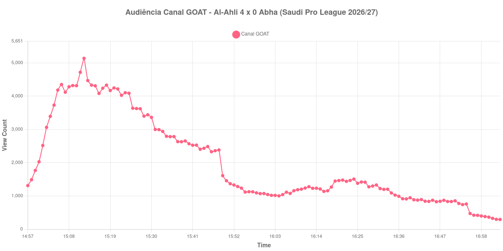

+++
date = 2026-08-24T04:32:00-03:00
draft = false
title = "Confira como foi a audiência de Al-Ahli X Abha no Canal GOAT - 22-08-2026"
author = 'Instituto Cambacica de Audiência'
summary = "Veja como foi a audiência de uma goleada saudita no Canal GOAT, com um pico nos primeiros minutos que o resto do jogo não chegou perto de igualar"
tags = ['YouTube', 'Analytics', 'Audiência', 'Canal-GOAT', 'Al-Ahli', 'Abha', 'Saudi Pro League']
categories = ['Audiência']
campeonatos = ['Saudi Pro League 2026']
data_evento = 2026-08-22
+++

Neste texto, vamos informar os resultados da audiência em tempo real obtidos pelo Canal GOAT, durante a transmissão de Al-Ahli X Abha, jogo da 2ª rodada da Saudi Pro League de 2026/27, no King Abdullah Sports City, em Jeddah, em 22/08/2026. O Al-Ahli, mandante, venceu por 4 a 0, com três gols de Ivan Toney — um deles de pênalti — e um de Francisco Trincão. O público presente não foi divulgado por nenhuma das fontes que consultamos.

A audiência começou a ser medida às 22/08/2026 14:57:55 (Horário de Brasília), com a transmissão já no ar e a poucos minutos do apito inicial. Como a coleta começou menos de duas horas antes do apito inicial, o gráfico e os números abaixo partem do primeiro registro disponível; a medição também terminou antes de completar duas horas após o apito final, de modo que o recorte vai até o último dado coletado. Os principais pontos da audiência são (em aparelhos conectados):

* **Início da Medição (14:57:55): 1.312**
* **Início da partida (15:00:55): 2.029**
* Após o gol de Ivan Toney, do Al-Ahli, aos 5 minutos do primeiro tempo (15:05:55): 4.184
* Após o gol de Ivan Toney (pênalti), do Al-Ahli, aos 13 minutos do primeiro tempo (15:13:55): 4.470
* Durante o intervalo (16:04:55): 1.003
* **Início do segundo tempo (16:06:55): 1.114**
* Após o gol de Francisco Trincão, do Al-Ahli, aos 51 minutos do segundo tempo (16:12:55): 1.279
* Após o gol de Ivan Toney, do Al-Ahli, aos 57 minutos do segundo tempo (16:18:55): 1.268
* **Final da partida (16:49:55): 834**
* **Final da Medição (17:03:55): 294**

O pico de audiência foi às 15:12:55, aos doze minutos de jogo, com **5.137** aparelhos conectados simultâneos.

O formato desta curva é o de um pico precoce seguido de esvaziamento contínuo, e o 2 a 0 aberto nos primeiros treze minutos é a explicação mais direta. O máximo da medição, 5.137 aparelhos conectados, acontece antes mesmo do segundo gol de Toney; a partir dali a transmissão perde público sem interrupção, e no intervalo já está em 1.003 aparelhos conectados, menos de um quinto do topo. O segundo tempo não recupera: sai de 1.114 e termina em 834, uma queda de 25%, e os dois gols que fecharam o 4 a 0 são registrados com 1.279 e 1.268 aparelhos conectados — cerca de um quarto do que a partida reunia aos doze minutos.

O caso ilustra bem um padrão que aparece em várias medições deste lote: goleada precoce não sustenta audiência. Em escala, os 5.137 do pico deixam esta transmissão na 28ª posição entre as 39 do conjunto e 83% abaixo dos 29.845 aparelhos conectados de média das outras cinco partidas da Saudi Pro League. No mesmo canal e no mesmo dia, ficou acima de [Al-Kholood X Al-Taawoun](/posts/2026-08-22-al-kholood-x-al-taawoun-canal-goat/), que chegou a 1.090 aparelhos conectados, e de [Portland Thorns X Denver Summit](/posts/2026-08-22-portland-thorns-x-denver-summit-canal-goat/), com 1.937.

No gráfico a seguir, mostramos a evolução da audiência entre o primeiro registro da medição e o último registro coletado:

Para você verificar os metadados desta medição, você pode consultar o [repositório contendo o CSV com os dados e com os prints do minuto a minuto da medição](https://github.com/institutocambacica/audiencias_20_23_08_2026/tree/main/2026-08-22_al-ahli-x-abha_n3M3zF7xhio).

---

*Para mais informações sobre nossa metodologia, visite nossa página [Sobre](/sobre).*
