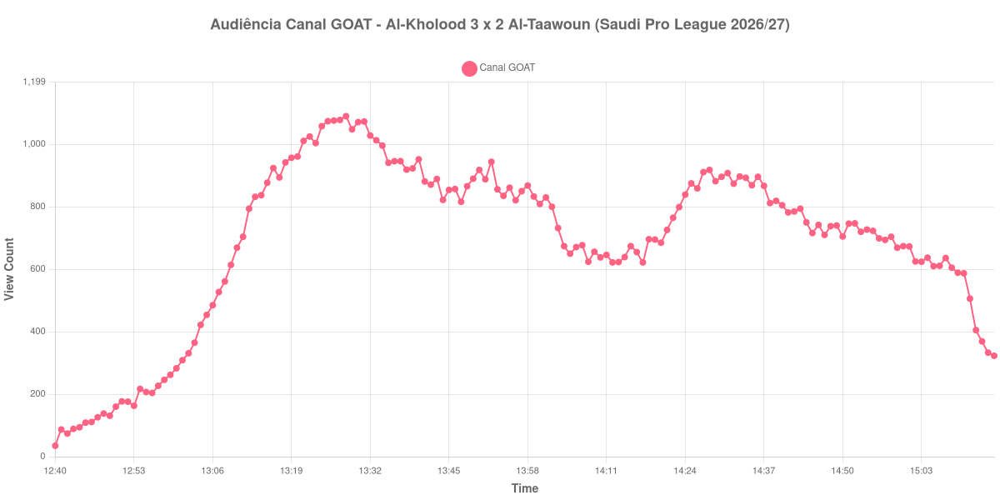

+++
date = 2026-08-24T04:30:00-03:00
draft = false
title = "Confira como foi a audiência de Al-Kholood X Al-Taawoun no Canal GOAT - 22-08-2026"
author = 'Instituto Cambacica de Audiência'
summary = "Veja como foi a audiência da menor transmissão da Saudi Pro League no lote, num segundo tempo que terminou exatamente onde começou"
tags = ['YouTube', 'Analytics', 'Audiência', 'Canal-GOAT', 'Al-Kholood', 'Al-Taawoun', 'Saudi Pro League']
categories = ['Audiência']
campeonatos = ['Saudi Pro League 2026']
data_evento = 2026-08-22
+++

Neste texto, vamos informar os resultados da audiência em tempo real obtidos pelo Canal GOAT, durante a transmissão de Al-Kholood X Al-Taawoun, jogo da 2ª rodada da Saudi Pro League de 2026/27, no estádio do Al-Hazem Club, em Ar Rass, em 22/08/2026. O Al-Kholood, mandante, venceu por 3 a 2, com gols de Edgaras Utkus, Iker Kortajarena e Shaquille Pinas, este nos acréscimos do primeiro tempo; Abderrazak Hamdallah marcou os dois do Al-Taawoun, o segundo já nos acréscimos finais. O público presente não foi divulgado por nenhuma das fontes que consultamos.

A audiência começou a ser medida às 22/08/2026 12:40:55 (Horário de Brasília). Como a coleta começou menos de duas horas antes do apito inicial, o gráfico e os números abaixo partem do primeiro registro disponível; a medição também terminou antes de completar duas horas após o apito final, de modo que o recorte vai até o último dado coletado. Os principais pontos da audiência são (em aparelhos conectados):

* **Início da Medição (12:40:55): 35**
* **Início da partida (13:10:55): 669**
* Após o gol de Edgaras Utkus, do Al-Kholood, aos 21 minutos do primeiro tempo (13:31:55): 1.073
* Após o gol de Iker Kortajarena, do Al-Kholood, aos 30 minutos do primeiro tempo (13:40:55): 952
* Após o gol de Shaquille Pinas, do Al-Kholood, aos 45+3 minutos do primeiro tempo (13:58:55): 868
* Durante o intervalo (14:12:55): 622
* **Início do segundo tempo (14:13:55): 623**
* Após o gol de Abderrazak Hamdallah, do Al-Taawoun, aos 52 minutos do segundo tempo (14:20:55): 685
* Após o gol de Abderrazak Hamdallah, do Al-Taawoun, aos 90+2 minutos do segundo tempo (15:00:55): 674
* **Final da partida (15:02:55): 625**
* **Final da Medição (15:15:55): 323**

O pico de audiência foi às 13:28:55, ainda no primeiro tempo, com **1.090** aparelhos conectados simultâneos.

O segundo tempo desta transmissão é uma linha quase reta: 623 aparelhos conectados no recomeço, 625 no apito final. Entre um ponto e outro houve dois gols do Al-Taawoun, uma reação que levou o placar de 3 a 0 a 3 a 2 e um jogo que só se decidiu nos acréscimos — e a audiência não registrou nada disso. O gol que reabriu a partida, aos 52 minutos, foi acompanhado por 685 aparelhos conectados; o que a fechou, aos 90+2, por 674.

O que se move nesta medição, move-se no primeiro tempo, e para baixo apesar dos gols: o pico de 1.090 aparelhos conectados acontece aos dezoito minutos de jogo, e cada gol seguinte do Al-Kholood é registrado com menos gente que o anterior — 1.073, depois 952, depois 868. Em escala, esta é a menor das seis transmissões da Saudi Pro League do lote e a 9ª das 9 medições do Canal GOAT, com os 1.090 do pico ficando 96% abaixo dos 30.654 aparelhos conectados de média das outras cinco partidas sauditas.

No gráfico a seguir, mostramos a evolução da audiência entre o primeiro registro da medição e o último registro coletado:

Para você verificar os metadados desta medição, você pode consultar o [repositório contendo o CSV com os dados e com os prints do minuto a minuto da medição](https://github.com/institutocambacica/audiencias_20_23_08_2026/tree/main/2026-08-22_al-kholood-x-al-taawoun_t9IQKbbXdVE).

---

*Para mais informações sobre nossa metodologia, visite nossa página [Sobre](/sobre).*
