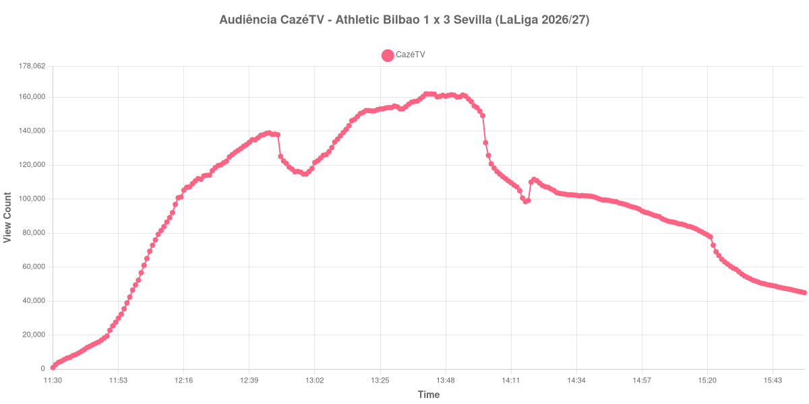

+++
date = 2026-08-24T04:26:00-03:00
draft = false
title = "Confira como foi a audiência de Athletic Bilbao X Sevilla na CazéTV - 22-08-2026"
author = 'Instituto Cambacica de Audiência'
summary = "Veja como foi a audiência de um jogo com expulsão aos 11 minutos na CazéTV, com a maior retenção pós-jogo de todo o lote"
tags = ['YouTube', 'Analytics', 'Audiência', 'CazeTV', 'Athletic Bilbao', 'Sevilla', 'LaLiga']
categories = ['Audiência']
campeonatos = ['LaLiga 2026']
data_evento = 2026-08-22
+++

Neste texto, vamos informar os resultados da audiência em tempo real obtidos pela CazéTV, durante a transmissão de Athletic Bilbao X Sevilla, jogo da 2ª rodada de LaLiga de 2026/27, no Estádio San Mamés, em Bilbao, em 22/08/2026. O Athletic Club, mandante, perdeu por 3 a 1 depois de ficar com um jogador a menos logo aos 11 minutos, com a expulsão de Yuri Berchiche. Marcaram Oso, Chidera Ejuke e Isaac Romero para o Sevilla, e Aitor Paredes descontou. O público presente foi de 49.416 pessoas.

A audiência começou a ser medida às 22/08/2026 11:30:55 (Horário de Brasília). Como a coleta começou menos de duas horas antes do apito inicial, o gráfico e os números abaixo partem do primeiro registro disponível. Os principais pontos da audiência são (em aparelhos conectados):

* **Início da Medição (11:30:55): 819**
* **Início da partida (12:00:55): 52.211**
* Após o gol de Oso, do Sevilla FC, aos 15 minutos do primeiro tempo (12:15:55): 101.194
* Durante o intervalo (12:58:55): 114.712
* **Início do segundo tempo (13:01:55): 117.977**
* Após o gol de Chidera Ejuke, do Sevilla FC, aos 50 minutos do segundo tempo (13:06:55): 126.175
* Após o gol de Isaac Romero, do Sevilla FC, aos 57 minutos do segundo tempo (13:13:55): 141.000
* Após o gol de Aitor Paredes, do Athletic Club, aos 70 minutos do segundo tempo (13:26:55): 153.130
* **Final da partida (13:59:55): 153.785**
* **Final da Medição (15:54:55): 44.901**

O pico de audiência foi às 13:41:55, na reta final do segundo tempo, com **161.874** aparelhos conectados simultâneos.

Uma expulsão aos 11 minutos costuma matar a competitividade de um jogo, e com ela a audiência. Não foi o que aconteceu aqui. A curva sobe de forma quase ininterrupta do apito inicial ao apito final, de 52.211 para 153.785 aparelhos conectados, e o intervalo mal a interrompe: os 114.712 do ponto mais baixo da pausa são superiores ao que a transmissão tinha em qualquer momento antes dos quinze minutos de jogo. Cada gol do Sevilla encontra a curva mais alta que o anterior — 126.175 aos 50 minutos, 141.000 aos 57 —, e o gol de honra do Athletic, aos 70, é registrado com 153.130.

O traço mais incomum desta medição, porém, está no que vem depois. Trinta minutos após o apito final ainda havia 103.089 aparelhos conectados, ou 67% dos 153.785 do encerramento, e uma hora depois, 91.858. Das oito medições deste lote cuja janela alcança uma hora após o fim do jogo, esta é a de maior retenção, seguida de perto por Manchester City x Bournemouth, também da CazéTV. Nas outras seis, uma hora após o apito final restava menos de um quinto do público do encerramento; aqui os 91.858 aparelhos conectados equivalem a 60% dos 153.785 do apito final. Em escala, os 161.874 do pico colocam a partida na 9ª posição entre as 39 medições do lote, ainda 54% abaixo dos 355.758 aparelhos conectados de média das outras seis transmissões de LaLiga.

No gráfico a seguir, mostramos a evolução da audiência entre o primeiro registro da medição e duas horas após o encerramento da partida:

Para você verificar os metadados desta medição, você pode consultar o [repositório contendo o CSV com os dados e com os prints do minuto a minuto da medição](https://github.com/institutocambacica/audiencias_20_23_08_2026/tree/main/2026-08-22_athletic-bilbao-x-sevilla_dVpdjMuKAtc).

---

*Para mais informações sobre nossa metodologia, visite nossa página [Sobre](/sobre).*
