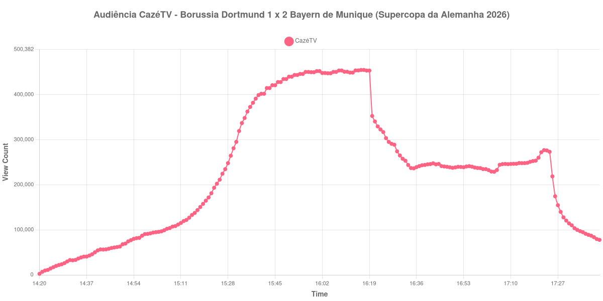

+++
date = 2026-08-24T04:34:00-03:00
draft = false
title = "Confira como foi a audiência de Borussia Dortmund X Bayern de Munique na CazéTV - 22-08-2026"
author = 'Instituto Cambacica de Audiência'
summary = "Veja como foi a audiência da final da Supercopa da Alemanha na CazéTV, em que o intervalo levou quase metade do público de uma vez"
tags = ['YouTube', 'Analytics', 'Audiência', 'CazeTV', 'Borussia Dortmund', 'Bayern de Munique', 'Supercopa da Alemanha']
categories = ['Audiência']
canais = ['CazeTV']
campeonatos = ['Supercopa da Alemanha 2026']
data_evento = 2026-08-22
+++

Neste texto, vamos informar os resultados da audiência em tempo real obtidos pela CazéTV, durante a transmissão de Borussia Dortmund X Bayern de Munique, final da Supercopa da Alemanha de 2026, no Signal Iduna Park, em Dortmund, em 22/08/2026. A decisão é em jogo único, e coube ao Dortmund receber; quem levantou a taça, porém, foi o visitante, que venceu por 2 a 1, com gols de Nathaniel Brown e Michael Olise, este nos acréscimos do primeiro tempo. Fábio Silva descontou aos 75 minutos, e o Dortmund ainda terminou com um a menos, com a expulsão de Ramy Bensebaini aos 90. O público presente foi de 81.365 pessoas.

A audiência começou a ser medida às 22/08/2026 14:20:55 (Horário de Brasília). Como a coleta começou menos de duas horas antes do apito inicial, o gráfico e os números abaixo partem do primeiro registro disponível; a medição também terminou antes de completar duas horas após o apito final, de modo que o recorte vai até o último dado coletado. Os principais pontos da audiência são (em aparelhos conectados):

* **Início da Medição (14:20:55): 2.442**
* **Início da partida (15:30:55): 281.141**
* Após o gol de Nathaniel Brown, do Bayern de Munique, aos 28 minutos do primeiro tempo (15:58:55): 449.910
* Após o gol de Michael Olise, do Bayern de Munique, aos 45+2 minutos do primeiro tempo (16:17:55): 454.892
* Durante o intervalo (16:35:55): 236.546
* **Início do segundo tempo (16:36:55): 239.269**
* Após o gol de Fábio Silva, do Borussia Dortmund, aos 75 minutos do segundo tempo (17:06:55): 244.413
* **Final da partida (17:22:55): 276.951**
* **Final da Medição (17:42:55): 77.781**

O pico de audiência foi às 16:16:55, ainda no primeiro tempo, com **454.892** aparelhos conectados simultâneos.

O intervalo desta final custou caro. A transmissão vinha de 454.892 aparelhos conectados no ponto mais alto, com o Bayern acabando de fazer 2 a 0 nos acréscimos, e o ponto mais baixo da pausa registra 236.546 — quase metade do público foi embora entre o apito do árbitro e o recomeço. A queda de 48% é a 7ª mais acentuada entre as 34 medições do lote em que conseguimos marcar o intervalo, bem acima da mediana de 30% do conjunto.

O segundo tempo nunca recuperou o patamar perdido, mas também não desmoronou: de 239.269 aparelhos conectados no recomeço a 276.951 no apito final, uma alta de 16%, com o gol de Fábio Silva registrado a meio caminho, com 244.413. É uma curva de duas metades quase independentes, e a segunda vale pouco mais da metade da primeira. Em escala, esta é a 6ª maior das 39 medições do lote e a 5ª das 19 transmissões da CazéTV, com os 454.892 do pico ficando 84% acima dos 246.743 aparelhos conectados de média das outras dezoito medições do canal.

No gráfico a seguir, mostramos a evolução da audiência entre o primeiro registro da medição e o último registro coletado:

Para você verificar os metadados desta medição, você pode consultar o [repositório contendo o CSV com os dados e com os prints do minuto a minuto da medição](https://github.com/institutocambacica/audiencias_20_23_08_2026/tree/main/2026-08-22_borussia-dortmund-x-bayern-de-munique_BtxN65z-K3Y).

---

*Para mais informações sobre nossa metodologia, visite nossa página [Sobre](/sobre).*
