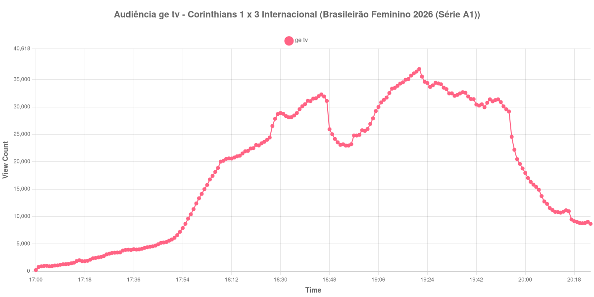

+++
date = 2026-08-24T04:46:00-03:00
draft = false
title = "Confira como foi a audiência de Corinthians X Internacional na ge tv - 22-08-2026"
author = 'Instituto Cambacica de Audiência'
summary = "Veja como foi a audiência da última rodada da primeira fase do Brasileirão Feminino na ge tv, com pico depois do intervalo e sem gol para explicá-lo"
tags = ['YouTube', 'Analytics', 'Audiência', 'GETV', 'Corinthians', 'Internacional', 'Brasileirão Feminino']
categories = ['Audiência']
campeonatos = ['Brasileirao Feminino 2026']
data_evento = 2026-08-22
+++

Neste texto, vamos informar os resultados da audiência em tempo real obtidos pela ge tv, durante a transmissão de Corinthians X Internacional, jogo da 17ª e última rodada da primeira fase do Brasileirão Feminino de 2026, no Estádio Alfredo Schürig, em São Paulo, em 22/08/2026. O Corinthians, mandante, perdeu por 3 a 1, com dois gols de Sole Jaimes, aos 14 e aos 30 minutos do primeiro tempo, e um de Valéria, cujo minuto não conseguimos confirmar em fonte confiável e que por isso não aparece na lista abaixo. Vic Albuquerque descontou de pênalti aos 87 minutos. O público pagante foi de 3.916 pessoas.

A audiência começou a ser medida às 22/08/2026 17:00:55 (Horário de Brasília). Como a coleta começou menos de duas horas antes do apito inicial, o gráfico e os números abaixo partem do primeiro registro disponível; a medição também terminou antes de completar duas horas após o apito final, de modo que o recorte vai até o último dado coletado. Os principais pontos da audiência são (em aparelhos conectados):

* **Início da Medição (17:00:55): 217**
* **Início da partida (18:00:55): 13.326**
* Após o gol de Sole Jaimes, do Internacional, aos 14 minutos do primeiro tempo (18:14:55): 20.987
* Após o gol de Sole Jaimes, do Internacional, aos 30 minutos do primeiro tempo (18:30:55): 28.897
* Durante o intervalo (18:54:55): 22.947
* **Início do segundo tempo (19:02:55): 25.972**
* Após o gol de Vic Albuquerque (pênalti), do Corinthians, aos 87 minutos do segundo tempo (19:44:55): 30.484
* **Final da partida (19:53:55): 29.567**
* **Final da Medição (20:24:55): 8.670**

O pico de audiência foi às 19:21:55, no meio do segundo tempo, com **36.925** aparelhos conectados simultâneos.

O ponto mais alto desta medição não tem gol para explicá-lo. Ele acontece por volta dos vinte minutos da etapa final, com 36.925 aparelhos conectados, num trecho em que o placar estava parado em 3 a 0 — entre o segundo gol de Sole Jaimes, ainda no primeiro tempo, e o pênalti convertido por Vic Albuquerque aos 87 minutos. É um comportamento que aparece com frequência nas transmissões de futebol feminino que acompanhamos: o público chega ao longo da partida, e não em resposta a lances específicos.

O resto da curva é regular. O intervalo custa pouco, com 22.947 aparelhos conectados no ponto mais baixo, e o segundo tempo termina 14% acima de onde começou, de 25.972 para 29.567. O desmonte vem depois do apito: meia hora após o fim restavam 9.036 aparelhos conectados, 31% do encerramento. Em escala, os 36.925 do pico colocam esta medição na 21ª posição entre as 39 do lote — a segunda maior das três transmissões da ge tv no conjunto, atrás apenas de [Palmeiras X Vasco](/posts/2026-08-23-palmeiras-x-vasco-getv/), que chegou a 1.229.213 aparelhos conectados no dia seguinte.

No gráfico a seguir, mostramos a evolução da audiência entre o primeiro registro da medição e o último registro coletado:

Para você verificar os metadados desta medição, você pode consultar o [repositório contendo o CSV com os dados e com os prints do minuto a minuto da medição](https://github.com/institutocambacica/audiencias_20_23_08_2026/tree/main/2026-08-22_corinthians-x-internacional_udtKEbbFCFc).

---

*Para mais informações sobre nossa metodologia, visite nossa página [Sobre](/sobre).*
