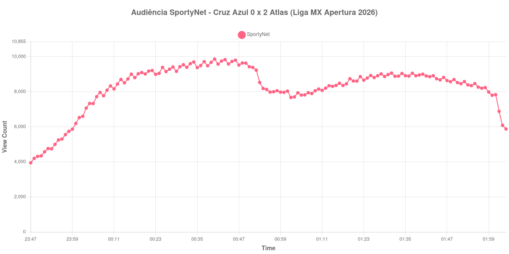

+++
date = 2026-08-24T04:52:00-03:00
draft = false
title = "Confira como foi a audiência de Cruz Azul X Atlas na SportyNet - 22-08-2026"
author = 'Instituto Cambacica de Audiência'
summary = "Veja como foi a audiência de um jogo da Liga MX que virou madrugada no Brasil, com os dois gols concentrados no primeiro tempo"
tags = ['YouTube', 'Analytics', 'Audiência', 'SportyNet', 'Cruz Azul', 'Atlas', 'Campeonato Mexicano']
categories = ['Audiência']
canais = ['SportyNet']
campeonatos = ['Campeonato Mexicano 2026']
data_evento = 2026-08-22
+++

Neste texto, vamos informar os resultados da audiência em tempo real obtidos pela SportyNet, durante a transmissão de Cruz Azul X Atlas, jogo da 5ª rodada do Apertura 2026 da Liga MX, no Estádio Banorte, na Cidade do México, em 22/08/2026. O Cruz Azul, mandante, perdeu por 2 a 0, com gols de Edgar Zaldívar aos 30 minutos e de Florián Monzón aos 45. O público presente não foi divulgado por nenhuma das fontes que consultamos. Pelo fuso, a partida começou à meia-noite no horário de Brasília, o que faz desta uma das duas medições do lote que atravessam a madrugada.

A audiência começou a ser medida às 22/08/2026 23:47:55 (Horário de Brasília). Como a coleta começou menos de duas horas antes do apito inicial, o gráfico e os números abaixo partem do primeiro registro disponível; a medição também terminou antes de completar duas horas após o apito final, de modo que o recorte vai até o último dado coletado. Os principais pontos da audiência são (em aparelhos conectados):

* **Início da Medição (23:47:55): 3.948**
* **Início da partida (00:00:55): 6.193**
* Após o gol de Edgar Zaldívar, do Atlas, aos 30 minutos do primeiro tempo (00:30:55): 9.429
* Após o gol de Florián Monzón, do Atlas, aos 45 minutos do primeiro tempo (00:45:55): 9.730
* Durante o intervalo (01:02:55): 7.676
* **Início do segundo tempo (01:03:55): 7.705**
* **Final da partida (01:49:55): 8.700**
* **Final da Medição (02:04:55): 5.876**

O pico de audiência foi às 00:40:55, ainda no primeiro tempo, com **9.868** aparelhos conectados simultâneos.

Todo o movimento desta medição está na primeira etapa, e é ali que estão os dois gols. A audiência sai de 6.193 aparelhos conectados no apito inicial, passa por 9.429 depois do gol de Zaldívar e alcança o máximo, 9.868, aos quarenta minutos de jogo. O segundo tempo, com o placar já definido em 2 a 0 e sem gols, é uma linha quase reta: 7.705 aparelhos conectados no recomeço, 8.700 no apito final, uma variação de 13% ao longo de quarenta e cinco minutos.

Considerando o horário, os números não são desprezíveis: manter perto de oito mil aparelhos conectados entre uma e duas da manhã é resultado de um público específico, que se organiza para acompanhar o futebol mexicano. Em escala, é a 26ª entre as 39 medições do lote, e os 9.868 do pico ficam 25% abaixo dos 13.244 aparelhos conectados de [Pumas X Necaxa](/posts/2026-08-23-pumas-x-necaxa-sportynet/), a outra partida da Liga MX que acompanhamos, no dia seguinte e no mesmo canal.

No gráfico a seguir, mostramos a evolução da audiência entre o primeiro registro da medição e o último registro coletado:

Para você verificar os metadados desta medição, você pode consultar o [repositório contendo o CSV com os dados e com os prints do minuto a minuto da medição](https://github.com/institutocambacica/audiencias_20_23_08_2026/tree/main/2026-08-22_cruz-azul-x-atlas_EbKzRUlrVtw).

---

*Para mais informações sobre nossa metodologia, visite nossa página [Sobre](/sobre).*
