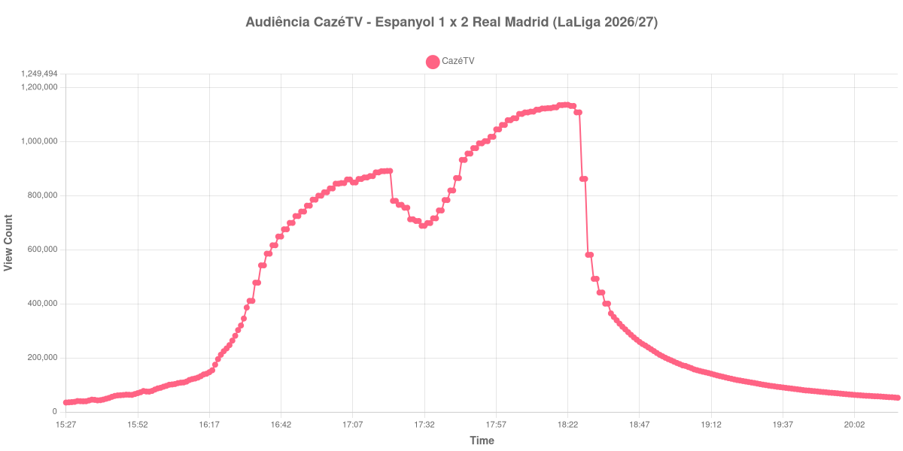

+++
date = 2026-08-24T04:44:00-03:00
draft = false
title = "Confira como foi a audiência de Espanyol X Real Madrid na CazéTV - 22-08-2026"
author = 'Instituto Cambacica de Audiência'
summary = "Veja como foi a audiência da maior transmissão da CazéTV no lote, decidida por um gol aos 90 minutos que levou a curva ao topo"
tags = ['YouTube', 'Analytics', 'Audiência', 'CazeTV', 'Espanyol', 'Real Madrid', 'LaLiga']
categories = ['Audiência']
campeonatos = ['LaLiga 2026']
data_evento = 2026-08-22
+++

Neste texto, vamos informar os resultados da audiência em tempo real obtidos pela CazéTV, durante a transmissão de Espanyol X Real Madrid, jogo da 2ª rodada de LaLiga de 2026/27, no RCDE Stadium, em Cornellà de Llobregat, em 22/08/2026. O Espanyol, mandante, perdeu por 2 a 1, num jogo decidido no fim: Jude Bellingham abriu o placar aos 9 minutos, Álex Calatrava empatou aos 30, e Carlos Espí marcou o gol da vitória do Real Madrid aos 90. O público presente foi de 33.304 pessoas.

A audiência começou a ser medida às 22/08/2026 15:27:55 (Horário de Brasília). Como a coleta começou menos de duas horas antes do apito inicial, o gráfico e os números abaixo partem do primeiro registro disponível; a medição também terminou antes de completar duas horas após o apito final, de modo que o recorte vai até o último dado coletado. Os principais pontos da audiência são (em aparelhos conectados):

* **Início da Medição (15:27:55): 34.716**
* **Início da partida (16:30:55): 385.926**
* Após o gol de Jude Bellingham, do Real Madrid, aos 9 minutos do primeiro tempo (16:39:55): 616.347
* Após o gol de Álex Calatrava, do RCD Espanyol, aos 30 minutos do primeiro tempo (17:00:55): 826.637
* Durante o intervalo (17:31:55): 688.445
* **Início do segundo tempo (17:33:55): 698.543**
* Após o gol de Carlos Espí, do Real Madrid, aos 90 minutos do segundo tempo (18:18:55): 1.126.510
* **Final da partida (18:24:55): 1.131.807**
* **Final da Medição (20:17:55): 52.331**

O pico de audiência foi às 18:21:55, entre o gol da vitória e o apito final, com **1.135.903** aparelhos conectados simultâneos.

Esta é a maior audiência da CazéTV em todo o lote, a 1ª das 19 medições do canal, e a segunda maior do conjunto inteiro. A curva conta uma história simples: um jogo empatado até os 90 minutos segurou público de forma crescente do começo ao fim. Já no primeiro tempo, o empate de Calatrava foi acompanhado por 826.637 aparelhos conectados; o segundo tempo saiu de 698.543 no recomeço para 1.131.807 no apito final, uma alta de 62%, e o milhão foi ultrapassado justamente na sequência do gol de Espí, aos 90.

O que vem depois do apito é tão característico quanto: trinta minutos após o fim restavam 211.323 aparelhos conectados, ou 19% dos 1.131.807 do encerramento, e uma hora depois, 112.378. O esvaziamento é rápido, como costuma ser nas transmissões grandes. Em escala, os 1.135.903 do pico ficam 487% acima dos 193.420 aparelhos conectados de média das outras seis transmissões de LaLiga que acompanhamos — no mesmo canal e no mesmo dia, a segunda colocada foi [Borussia Dortmund X Bayern de Munique](/posts/2026-08-22-borussia-dortmund-x-bayern-de-munique-cazetv/), com 454.892 aparelhos conectados.

No gráfico a seguir, mostramos a evolução da audiência entre o primeiro registro da medição e o último registro coletado:

Para você verificar os metadados desta medição, você pode consultar o [repositório contendo o CSV com os dados e com os prints do minuto a minuto da medição](https://github.com/institutocambacica/audiencias_20_23_08_2026/tree/main/2026-08-22_espanyol-x-real-madrid_dgqUKFUS1NE).

---

*Para mais informações sobre nossa metodologia, visite nossa página [Sobre](/sobre).*
