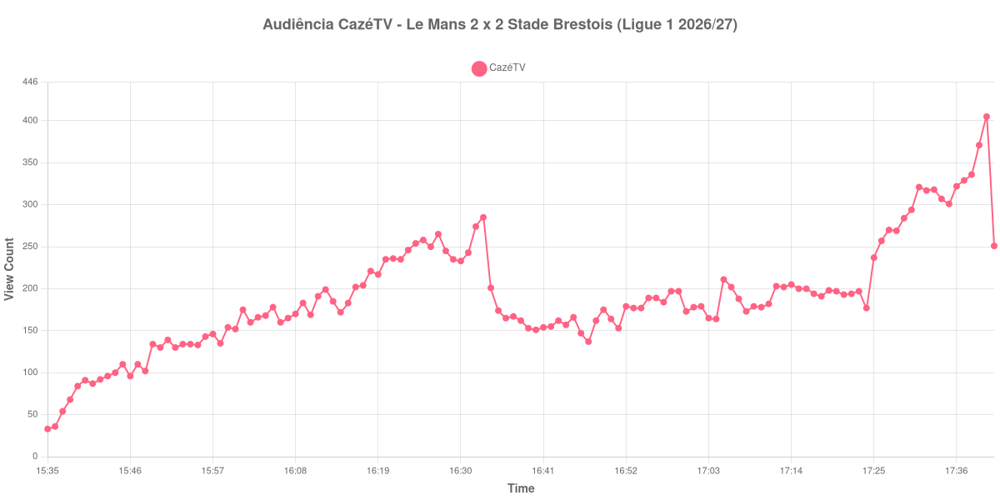

+++
date = 2026-08-24T04:36:00-03:00
draft = false
title = "Confira como foi a audiência de Le Mans X Stade Brestois na CazéTV - 22-08-2026"
author = 'Instituto Cambacica de Audiência'
summary = "Veja como foi a audiência da menor transmissão da CazéTV no lote, um dos quatro jogos em som ambiente que a Ligue 1 exibiu em paralelo"
tags = ['YouTube', 'Analytics', 'Audiência', 'CazeTV', 'Le Mans', 'Stade Brestois', 'Ligue 1']
categories = ['Audiência']
campeonatos = ['Ligue 1 2026']
data_evento = 2026-08-22
+++

Neste texto, vamos informar os resultados da audiência em tempo real obtidos pela CazéTV, durante a transmissão de Le Mans X Stade Brestois, jogo da 1ª rodada da Ligue 1 de 2026/27, no Stade Marie-Marvingt, em Le Mans, em 22/08/2026. O Le Mans, recém-promovido e mandante, empatou em 2 a 2, com gols de Dame Gueye nos acréscimos do primeiro tempo e de Louis Mafouta, contra os de Romain Del Castillo e Kamory Doumbia pelo Brest. O público presente foi de 19.809 pessoas. Esta foi uma das quatro partidas que a CazéTV exibiu simultaneamente naquela tarde, em transmissões sem narração, apenas com som ambiente — o que explica a escala reduzida dos números abaixo.

A audiência começou a ser medida às 22/08/2026 15:35:55 (Horário de Brasília). Como a coleta começou menos de duas horas antes do apito inicial, o gráfico e os números abaixo partem do primeiro registro disponível; a medição também terminou antes de completar duas horas após o apito final, de modo que o recorte vai até o último dado coletado. Os principais pontos da audiência são (em aparelhos conectados):

* **Início da Medição (15:35:55): 33**
* **Início da partida (15:45:55): 110**
* Após o gol de Romain Del Castillo, do Stade Brestois, aos 31 minutos do primeiro tempo (16:16:55): 202
* Após o gol de Dame Gueye, do Le Mans, aos 45+2 minutos do primeiro tempo (16:32:55): 274
* Durante o intervalo (16:47:55): 137
* **Início do segundo tempo (16:48:55): 162**
* Após o gol de Louis Mafouta, do Le Mans, aos 55 minutos do segundo tempo (16:58:55): 197
* Após o gol de Kamory Doumbia, do Stade Brestois, aos 62 minutos do segundo tempo (17:05:55): 211
* **Final da partida (17:40:55): 405**
* **Final da Medição (17:41:55): 251**

O pico de audiência foi às 17:40:55, no minuto do apito final, com **405** aparelhos conectados simultâneos.

O traço mais curioso desta curva se repete nas quatro transmissões em som ambiente daquela tarde: o ponto mais alto acontece no fim do jogo, não durante ele. Aqui a audiência mais que dobra entre o recomeço e o apito final, de 162 para 405 aparelhos conectados, um crescimento de 150% concentrado sobretudo na última meia hora — depois que os dois gols do segundo tempo já haviam saído. Como as quatro partidas começaram e terminaram quase juntas, o mais provável é que se trate de público circulando entre elas conforme cada jogo se aproximava do desfecho, e não de gente chegando para assistir a este jogo especificamente.

Em números absolutos, esta é a menor das 19 medições da CazéTV no lote e a menor das 9 partidas da Ligue 1 que acompanhamos, na 38ª posição entre as 39 medições do conjunto. Os 405 aparelhos conectados do pico ficam 99% abaixo dos 35.819 de média das outras oito transmissões da Ligue 1 — mas a comparação mistura jogos narrados e não narrados, e diz mais sobre o formato da transmissão do que sobre o interesse pela partida. A comparação justa é com as outras três do mesmo lote e da mesma tarde: [Nice X Lorient](/posts/2026-08-22-nice-x-lorient-cazetv/), com 797 aparelhos conectados, [Troyes X Paris FC](/posts/2026-08-22-troyes-x-paris-fc-cazetv/), com 906, e [Toulouse X Lyon](/posts/2026-08-22-toulouse-x-lyon-cazetv/), com 4.127.

No gráfico a seguir, mostramos a evolução da audiência entre o primeiro registro da medição e o último registro coletado:

Para você verificar os metadados desta medição, você pode consultar o [repositório contendo o CSV com os dados e com os prints do minuto a minuto da medição](https://github.com/institutocambacica/audiencias_20_23_08_2026/tree/main/2026-08-22_le-mans-x-stade-brestois_EEDufeV7ZuU).

---

*Para mais informações sobre nossa metodologia, visite nossa página [Sobre](/sobre).*
