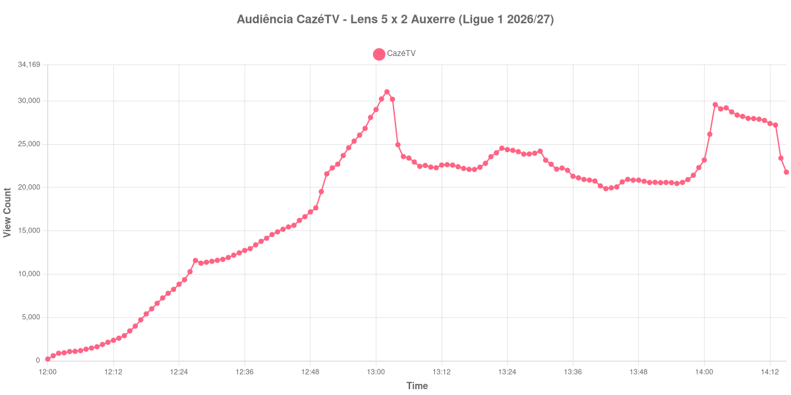

+++
date = 2026-08-24T04:28:00-03:00
draft = false
title = "Confira como foi a audiência de Lens X Auxerre na CazéTV - 22-08-2026"
author = 'Instituto Cambacica de Audiência'
summary = "Veja como foi a audiência do jogo de sete gols da Ligue 1 na CazéTV, em que a audiência caiu justamente enquanto o placar se movia"
tags = ['YouTube', 'Analytics', 'Audiência', 'CazeTV', 'Lens', 'Auxerre', 'Ligue 1']
categories = ['Audiência']
campeonatos = ['Ligue 1 2026']
data_evento = 2026-08-22
+++

Neste texto, vamos informar os resultados da audiência em tempo real obtidos pela CazéTV, durante a transmissão de Lens X Auxerre, jogo da 1ª rodada da Ligue 1 de 2026/27, no Stade Bollaert-Delelis, em Lens, em 22/08/2026. O RC Lens, mandante, venceu por 5 a 2, com dois gols de pênalti de Florian Thauvin e um de Franjo Ivanović, Saud Abdulhamid e Ismaëlo Ganiou, contra os de Danny Namaso Loader, também de pênalti, e Lamine Sy. O Auxerre jogou com um a menos desde os 35 minutos, após a expulsão de Christ Makosso. O público presente foi de 38.115 pessoas.

A audiência começou a ser medida às 22/08/2026 12:00:55 (Horário de Brasília). Como a coleta começou menos de duas horas antes do apito inicial, o gráfico e os números abaixo partem do primeiro registro disponível; a medição também terminou antes de completar duas horas após o apito final, de modo que o recorte vai até o último dado coletado. Os principais pontos da audiência são (em aparelhos conectados):

* **Início da Medição (12:00:55): 199**
* **Início da partida (12:15:55): 3.446**
* Após o gol de Florian Thauvin (pênalti), do Lens, aos 12 minutos do primeiro tempo (12:27:55): 11.580
* Durante o intervalo (13:18:55): 22.095
* **Início do segundo tempo (13:19:55): 22.355**
* Após o gol de Franjo Ivanović, do Lens, aos 49 minutos do segundo tempo (13:23:55): 24.551
* Após o gol de Saud Abdulhamid, do Lens, aos 54 minutos do segundo tempo (13:28:55): 23.880
* Após o gol de Danny Namaso Loader (pênalti), do Auxerre, aos 61 minutos do segundo tempo (13:35:55): 21.994
* Após o gol de Ismaëlo Ganiou, do Lens, aos 66 minutos do segundo tempo (13:40:55): 20.761
* Após o gol de Lamine Sy, do Auxerre, aos 69 minutos do segundo tempo (13:43:55): 19.972
* Após o gol de Florian Thauvin (pênalti), do Lens, aos 88 minutos do segundo tempo (14:02:55): 29.579
* **Final da partida (14:04:55): 29.204**
* **Final da Medição (14:15:55): 21.782**

O pico de audiência foi às 13:02:55, ainda no primeiro tempo, com **31.062** aparelhos conectados simultâneos.

Há um paradoxo nesta curva que vale isolar. Entre os 49 e os 69 minutos saíram cinco dos sete gols da partida, e é exatamente nesse intervalo que a audiência mais cai: de 24.551 aparelhos conectados após o gol de Ivanović para 19.972 após o de Lamine Sy, vinte minutos de placar mudando sem parar e a transmissão perdendo público a cada um deles. A explicação mais econômica é que a goleada já estava definida — o Lens abriu 4 a 1 aos 66 minutos, e o que veio depois foi disputa por saldo, não por resultado.

O sétimo gol, aos 88 minutos, coincide com uma recuperação: 29.579 aparelhos conectados, o maior número do segundo tempo, e a partida termina com 29.204. Mas o pico da medição segue sendo do primeiro tempo, 31.062, alcançado quando o placar ainda era de 1 a 0. Em escala, esta é uma medição exatamente na média da competição: os 31.062 do pico ficam 3% abaixo dos 31.987 aparelhos conectados de média das outras oito transmissões da Ligue 1 do lote, e na 22ª posição entre as 39 medições do conjunto.

No gráfico a seguir, mostramos a evolução da audiência entre o primeiro registro da medição e o último registro coletado:

Para você verificar os metadados desta medição, você pode consultar o [repositório contendo o CSV com os dados e com os prints do minuto a minuto da medição](https://github.com/institutocambacica/audiencias_20_23_08_2026/tree/main/2026-08-22_lens-x-auxerre_VR2qJrtUD_k).

---

*Para mais informações sobre nossa metodologia, visite nossa página [Sobre](/sobre).*
