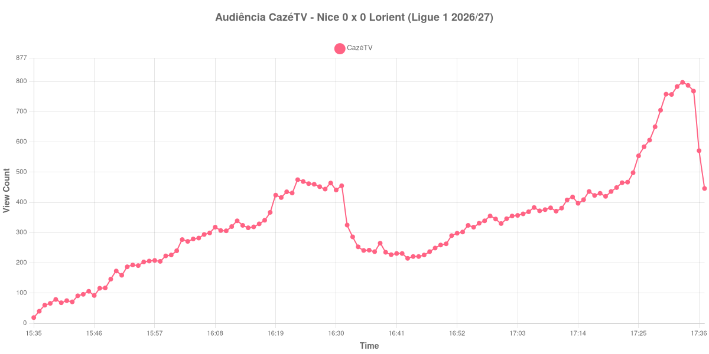

+++
date = 2026-08-24T04:38:00-03:00
draft = false
title = "Confira como foi a audiência de Nice X Lorient na CazéTV - 22-08-2026"
author = 'Instituto Cambacica de Audiência'
summary = "Veja como foi a audiência de um 0 a 0 disputado de portões fechados na CazéTV, com mais gente no YouTube do que no estádio — que estava vazio por punição"
tags = ['YouTube', 'Analytics', 'Audiência', 'CazeTV', 'Nice', 'Lorient', 'Ligue 1']
categories = ['Audiência']
canais = ['CazeTV']
campeonatos = ['Ligue 1 2026']
data_evento = 2026-08-22
+++

Neste texto, vamos informar os resultados da audiência em tempo real obtidos pela CazéTV, durante a transmissão de Nice X Lorient, jogo da 1ª rodada da Ligue 1 de 2026/27, no Allianz Riviera, em Nice, em 22/08/2026. A partida terminou empatada em 0 a 0 e tem uma particularidade que merece registro: o público presente foi de exatamente 0 pessoas. O jogo foi disputado de portões fechados, cumprindo a segunda partida de uma punição imposta ao Nice, mandante. Esta foi uma das quatro partidas que a CazéTV exibiu em paralelo naquela tarde, em transmissões sem narração, apenas com som ambiente.

A audiência começou a ser medida às 22/08/2026 15:35:55 (Horário de Brasília). Como a coleta começou menos de duas horas antes do apito inicial, o gráfico e os números abaixo partem do primeiro registro disponível; a medição também terminou antes de completar duas horas após o apito final, de modo que o recorte vai até o último dado coletado. Os principais pontos da audiência são (em aparelhos conectados):

* **Início da Medição (15:35:55): 19**
* **Início da partida (15:45:55): 106**
* Durante o intervalo (16:43:55): 215
* **Início do segundo tempo (16:46:55): 226**
* **Final da partida (17:33:55): 797**
* **Final da Medição (17:37:55): 446**

O pico de audiência foi às 17:33:55, no minuto do apito final, com **797** aparelhos conectados simultâneos.

Um empate sem gols, sem narração e sem torcida no estádio produz a curva que se esperaria: números baixos e nenhum sobressalto. O que ela tem de notável é a direção. A audiência cresce do início ao fim, e cresce mais no segundo tempo, quando o jogo já se arrastava para o 0 a 0: de 226 aparelhos conectados no recomeço para 797 no apito final, uma alta de 253%. O pico da medição é o próprio minuto final da partida.

Esse formato se repete nas quatro transmissões em som ambiente daquela tarde, todas começando e terminando quase juntas, e a leitura mais econômica é que o público circulava entre elas conforme os jogos se aproximavam do fim — não que este 0 a 0 tenha ficado mais interessante nos últimos minutos. Vale a nota de que, num estádio oficialmente vazio, os 797 aparelhos conectados do pico foram o único público que a partida teve. Em escala, é a 37ª entre as 39 medições do lote e a 18ª das 19 da CazéTV, com o pico 98% abaixo dos 35.770 aparelhos conectados de média das outras oito transmissões da Ligue 1.

No gráfico a seguir, mostramos a evolução da audiência entre o primeiro registro da medição e o último registro coletado:

Para você verificar os metadados desta medição, você pode consultar o [repositório contendo o CSV com os dados e com os prints do minuto a minuto da medição](https://github.com/institutocambacica/audiencias_20_23_08_2026/tree/main/2026-08-22_nice-x-lorient_nri8Dl2c3aE).

---

*Para mais informações sobre nossa metodologia, visite nossa página [Sobre](/sobre).*
