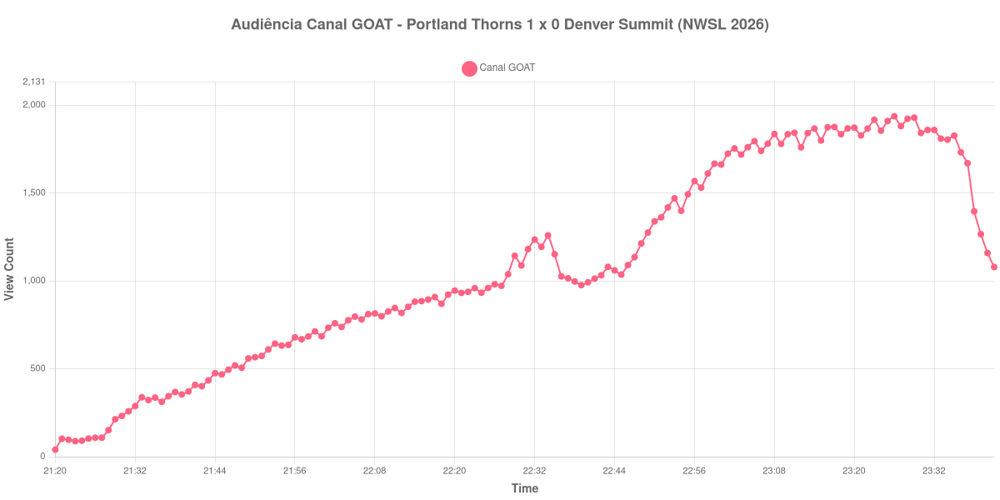

+++
date = 2026-08-24T04:50:00-03:00
draft = false
title = "Confira como foi a audiência de Portland Thorns X Denver Summit no Canal GOAT - 22-08-2026"
author = 'Instituto Cambacica de Audiência'
summary = "Veja como foi a audiência da visita do clube de expansão da NWSL a Portland no Canal GOAT, com pico no minuto do apito final"
tags = ['YouTube', 'Analytics', 'Audiência', 'Canal-GOAT', 'Portland Thorns', 'Denver Summit', 'NWSL']
categories = ['Audiência']
campeonatos = ['NWSL 2026']
data_evento = 2026-08-22
+++

Neste texto, vamos informar os resultados da audiência em tempo real obtidos pelo Canal GOAT, durante a transmissão de Portland Thorns X Denver Summit, jogo da 17ª rodada da NWSL de 2026, no Providence Park, em Portland, em 22/08/2026. O Portland Thorns, mandante, venceu por 1 a 0, com gol de Sophia Wilson aos 44 minutos do primeiro tempo. O Denver Summit é clube de expansão e disputava sua temporada inaugural na liga. O público presente foi de 22.017 pessoas, o maior do Thorns na temporada.

A audiência começou a ser medida às 22/08/2026 21:20:55 (Horário de Brasília). Como a coleta começou menos de duas horas antes do apito inicial, o gráfico e os números abaixo partem do primeiro registro disponível; a medição também terminou antes de completar duas horas após o apito final, de modo que o recorte vai até o último dado coletado. Os principais pontos da audiência são (em aparelhos conectados):

* **Início da Medição (21:20:55): 40**
* **Início da partida (21:45:55): 468**
* Após o gol de Sophia Wilson, do Portland Thorns, aos 44 minutos do primeiro tempo (22:29:55): 1.143
* Durante o intervalo (22:39:55): 976
* **Início do segundo tempo (22:48:55): 1.213**
* **Final da partida (23:27:55): 1.881**
* **Final da Medição (23:41:55): 1.079**

O pico de audiência foi às 23:26:55, no minuto anterior ao apito final, com **1.937** aparelhos conectados simultâneos.

A curva desta transmissão é toda ascendente e o ponto mais alto é o último minuto de jogo. Do recomeço ao apito final a audiência sobe de 1.213 para 1.881 aparelhos conectados, uma alta de 55%, numa etapa em que o placar não se moveu — o único gol da partida saiu ainda no primeiro tempo, e foi acompanhado por 1.143 aparelhos conectados. É o comportamento de um público que se acumula ao longo da transmissão, e não de um que responde a lances.

Vale notar o contraste com o estádio: 22.017 pessoas em Providence Park, recorde do Portland Thorns na temporada, e menos de dois mil aparelhos conectados acompanhando pelo Brasil no pico. Em escala, esta é a 31ª entre as 39 medições do lote e a menor das duas transmissões da NWSL que acompanhamos: os 1.937 do pico ficam 25% abaixo dos 2.568 aparelhos conectados de [San Diego Wave X Utah Royals](/posts/2026-08-21-san-diego-wave-x-utah-royals-canal-goat/), na véspera e no mesmo canal.

No gráfico a seguir, mostramos a evolução da audiência entre o primeiro registro da medição e o último registro coletado:

Para você verificar os metadados desta medição, você pode consultar o [repositório contendo o CSV com os dados e com os prints do minuto a minuto da medição](https://github.com/institutocambacica/audiencias_20_23_08_2026/tree/main/2026-08-22_portland-thorns-x-denver-summit_C7MUj35VihQ).

---

*Para mais informações sobre nossa metodologia, visite nossa página [Sobre](/sobre).*
