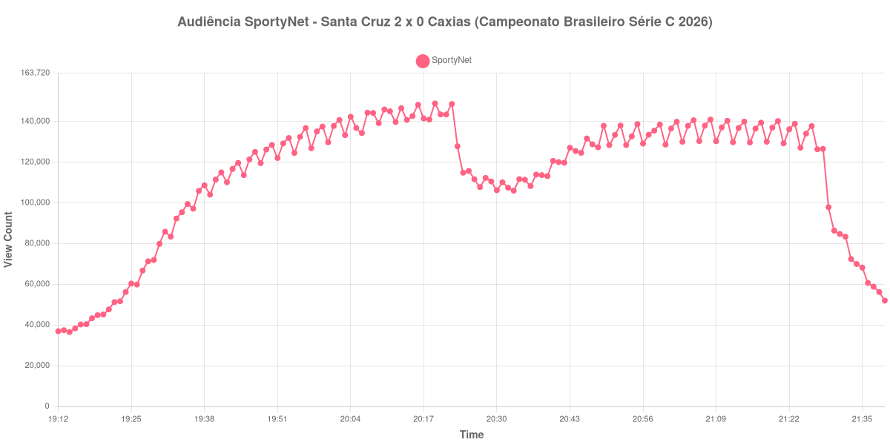

+++
date = 2026-08-24T04:48:00-03:00
draft = false
title = "Confira como foi a audiência de Santa Cruz X Caxias na SportyNet - 22-08-2026"
author = 'Instituto Cambacica de Audiência'
summary = "Veja como foi a audiência da maior transmissão da SportyNet no lote, uma partida da Série C que reuniu mais gente que muitos jogos de primeira divisão europeia"
tags = ['YouTube', 'Analytics', 'Audiência', 'SportyNet', 'Santa Cruz', 'Caxias', 'Serie-C']
categories = ['Audiência']
canais = ['SportyNet']
campeonatos = ['Serie C 2026']
data_evento = 2026-08-22
+++

Neste texto, vamos informar os resultados da audiência em tempo real obtidos pela SportyNet, durante a transmissão de Santa Cruz X Caxias, jogo da 18ª rodada do Campeonato Brasileiro Série C de 2026, na Arena de Pernambuco, em São Lourenço da Mata, em 22/08/2026. O Santa Cruz, mandante, venceu por 2 a 0, com gols de Eron aos 41 minutos do primeiro tempo e de Matheus Vinícius aos 55. O Caxias terminou com um a menos, após a expulsão de Breno Santos aos 45 minutos. O público pagante foi de 13.774 pessoas.

A audiência começou a ser medida às 22/08/2026 19:12:55 (Horário de Brasília). Como a coleta começou menos de duas horas antes do apito inicial, o gráfico e os números abaixo partem do primeiro registro disponível; a medição também terminou antes de completar duas horas após o apito final, de modo que o recorte vai até o último dado coletado. Os principais pontos da audiência são (em aparelhos conectados):

* **Início da Medição (19:12:55): 36.929**
* **Início da partida (19:30:55): 79.868**
* Após o gol de Eron, do Santa Cruz, aos 41 minutos do primeiro tempo (20:11:55): 144.965
* Durante o intervalo (20:33:55): 105.980
* **Início do segundo tempo (20:35:55): 111.330**
* Após o gol de Matheus Vinícius, do Santa Cruz, aos 55 minutos do segundo tempo (20:45:55): 124.583
* **Final da partida (21:24:55): 127.085**
* **Final da Medição (21:39:55): 51.986**

O pico de audiência foi às 20:19:55, ainda no primeiro tempo, com **148.836** aparelhos conectados simultâneos.

O dado que salta aqui é de escala, não de formato. Uma partida da terceira divisão brasileira reuniu 148.836 aparelhos conectados no pico, marca que nenhum jogo da Ligue 1, da Saudi Pro League ou da Série B italiana alcançou nesta semana de medições. Foi a maior das 7 transmissões da SportyNet no lote e a 10ª entre as 39 do conjunto, com os 148.836 do pico ficando 406% acima dos 29.441 aparelhos conectados de média das outras seis medições do canal e 676% acima dos 19.182 da outra partida de Série C que acompanhamos.

A curva em si é convencional e bem-comportada: sobe até o máximo, alcançado no minuto seguinte ao gol de Eron, cai no intervalo para 105.980 aparelhos conectados e recupera parte disso no segundo tempo, terminando em 127.085. A expulsão de Breno Santos, nos acréscimos do primeiro tempo, não produz efeito visível na medição. Vale registrar também que a coleta pegou a transmissão já com 36.929 aparelhos conectados no primeiro registro, dezoito minutos antes da bola rolar — sinal de que o público chegou cedo.

No gráfico a seguir, mostramos a evolução da audiência entre o primeiro registro da medição e o último registro coletado:

Para você verificar os metadados desta medição, você pode consultar o [repositório contendo o CSV com os dados e com os prints do minuto a minuto da medição](https://github.com/institutocambacica/audiencias_20_23_08_2026/tree/main/2026-08-22_santa-cruz-x-caxias_U1C2LbGbIuM).

---

*Para mais informações sobre nossa metodologia, visite nossa página [Sobre](/sobre).*
