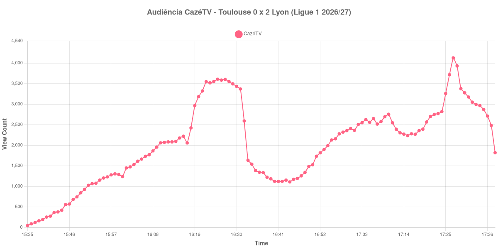

+++
date = 2026-08-24T04:40:00-03:00
draft = false
title = "Confira como foi a audiência de Toulouse X Lyon na CazéTV - 22-08-2026"
author = 'Instituto Cambacica de Audiência'
summary = "Veja como foi a audiência da maior das quatro transmissões em som ambiente da CazéTV, a única em que os gols moveram a curva"
tags = ['YouTube', 'Analytics', 'Audiência', 'CazeTV', 'Toulouse', 'Lyon', 'Ligue 1']
categories = ['Audiência']
canais = ['CazeTV']
campeonatos = ['Ligue 1 2026']
data_evento = 2026-08-22
+++

Neste texto, vamos informar os resultados da audiência em tempo real obtidos pela CazéTV, durante a transmissão de Toulouse X Lyon, jogo da 1ª rodada da Ligue 1 de 2026/27, no Stadium de Toulouse, em 22/08/2026. O Toulouse, mandante, perdeu por 2 a 0, com gols de Noah Nartey aos 68 minutos e de Malick Fofana aos 85. O público presente foi de 25.837 pessoas. Esta foi uma das quatro partidas exibidas em paralelo pela CazéTV naquela tarde, todas sem narração, apenas com som ambiente.

A audiência começou a ser medida às 22/08/2026 15:35:55 (Horário de Brasília). Como a coleta começou menos de duas horas antes do apito inicial, o gráfico e os números abaixo partem do primeiro registro disponível; a medição também terminou antes de completar duas horas após o apito final, de modo que o recorte vai até o último dado coletado. Os principais pontos da audiência são (em aparelhos conectados):

* **Início da Medição (15:35:55): 46**
* **Início da partida (15:45:55): 555**
* Durante o intervalo (16:44:55): 1.108
* **Início do segundo tempo (16:47:55): 1.255**
* Após o gol de Noah Nartey, do Lyon, aos 68 minutos do segundo tempo (17:10:55): 2.755
* Após o gol de Malick Fofana, do Lyon, aos 85 minutos do segundo tempo (17:27:55): 4.127
* **Final da partida (17:30:55): 3.276**
* **Final da Medição (17:38:55): 1.819**

O pico de audiência foi às 17:27:55, no minuto do segundo gol do Lyon, com **4.127** aparelhos conectados simultâneos.

Entre as quatro transmissões em som ambiente daquela tarde, esta é a única em que os gols aparecem na curva com clareza. O primeiro deles, aos 68 minutos, é registrado com 2.755 aparelhos conectados, mais que o dobro dos 1.255 do recomeço; o segundo, aos 85, coincide exatamente com o máximo da medição, 4.127. Não é uma quantidade grande em termos absolutos, mas o desenho é o de um jogo cuja audiência responde ao que acontece em campo — algo que não se vê nas outras três partidas do mesmo bloco.

Ainda assim, o padrão comum às quatro se mantém no fundo: o crescimento se concentra na etapa final, de 1.255 para 3.276 aparelhos conectados entre o recomeço e o apito, uma alta de 161%. Em escala, esta é a maior das quatro transmissões simultâneas e a 5ª das 9 partidas da Ligue 1 no lote, na 29ª posição entre as 39 medições do conjunto. As outras três daquela tarde foram [Troyes X Paris FC](/posts/2026-08-22-troyes-x-paris-fc-cazetv/), com 906 aparelhos conectados no pico, [Nice X Lorient](/posts/2026-08-22-nice-x-lorient-cazetv/), com 797, e [Le Mans X Stade Brestois](/posts/2026-08-22-le-mans-x-stade-brestois-cazetv/), com 405.

No gráfico a seguir, mostramos a evolução da audiência entre o primeiro registro da medição e o último registro coletado:

Para você verificar os metadados desta medição, você pode consultar o [repositório contendo o CSV com os dados e com os prints do minuto a minuto da medição](https://github.com/institutocambacica/audiencias_20_23_08_2026/tree/main/2026-08-22_toulouse-x-lyon_dViWumhVwUs).

---

*Para mais informações sobre nossa metodologia, visite nossa página [Sobre](/sobre).*
