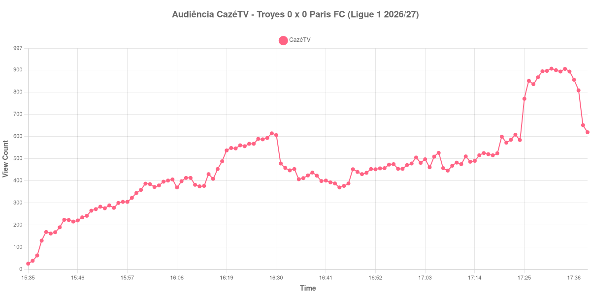

+++
date = 2026-08-24T04:42:00-03:00
draft = false
title = "Confira como foi a audiência de Troyes X Paris FC na CazéTV - 22-08-2026"
author = 'Instituto Cambacica de Audiência'
summary = "Veja como foi a audiência do retorno do Troyes à elite francesa na CazéTV, num 0 a 0 em que a audiência quadruplicou depois do intervalo"
tags = ['YouTube', 'Analytics', 'Audiência', 'CazeTV', 'Troyes', 'Paris FC', 'Ligue 1']
categories = ['Audiência']
canais = ['CazeTV']
campeonatos = ['Ligue 1 2026']
data_evento = 2026-08-22
+++

Neste texto, vamos informar os resultados da audiência em tempo real obtidos pela CazéTV, durante a transmissão de Troyes X Paris FC, jogo da 1ª rodada da Ligue 1 de 2026/27, no Stade de l'Aube, em Troyes, em 22/08/2026. A partida marcou o retorno do Troyes à primeira divisão francesa e terminou empatada em 0 a 0, sem gols a registrar. O público presente foi de 11.655 pessoas. Como as outras três partidas exibidas em paralelo pela CazéTV naquela tarde, esta transmissão não teve narração, apenas som ambiente.

A audiência começou a ser medida às 22/08/2026 15:35:55 (Horário de Brasília). Como a coleta começou menos de duas horas antes do apito inicial, o gráfico e os números abaixo partem do primeiro registro disponível; a medição também terminou antes de completar duas horas após o apito final, de modo que o recorte vai até o último dado coletado. Os principais pontos da audiência são (em aparelhos conectados):

* **Início da Medição (15:35:55): 26**
* **Início da partida (15:45:55): 216**
* Durante o intervalo (16:44:55): 370
* **Início do segundo tempo (16:45:55): 377**
* **Final da partida (17:32:55): 899**
* **Final da Medição (17:39:55): 619**

O pico de audiência foi às 17:31:55, no minuto anterior ao apito final, com **906** aparelhos conectados simultâneos.

Sem gols para marcar a curva, esta medição mostra o padrão do bloco de som ambiente na forma mais limpa possível. Do apito inicial ao intervalo, a audiência praticamente dobra, de 216 para 370 aparelhos conectados; do recomeço ao apito final, ela mais que dobra de novo, de 377 para 899, uma alta de 138%. Tudo isso num jogo que terminou sem que a bola entrasse.

Isso reforça a leitura que fizemos das outras três transmissões simultâneas: o que a curva registra não parece ser interesse crescente pelo jogo em si, e sim o público circulando entre as quatro partidas conforme elas se aproximavam do fim. O detalhe de que o máximo desta medição, 906 aparelhos conectados, aconteceu no minuto anterior ao apito final é consistente com isso. Em escala, esta é a 36ª entre as 39 medições do lote e a 7ª das 9 transmissões da Ligue 1, com o pico 97% abaixo dos 35.756 aparelhos conectados de média das outras oito partidas da competição.

No gráfico a seguir, mostramos a evolução da audiência entre o primeiro registro da medição e o último registro coletado:

Para você verificar os metadados desta medição, você pode consultar o [repositório contendo o CSV com os dados e com os prints do minuto a minuto da medição](https://github.com/institutocambacica/audiencias_20_23_08_2026/tree/main/2026-08-22_troyes-x-paris-fc_CetqZZvAy14).

---

*Para mais informações sobre nossa metodologia, visite nossa página [Sobre](/sobre).*
